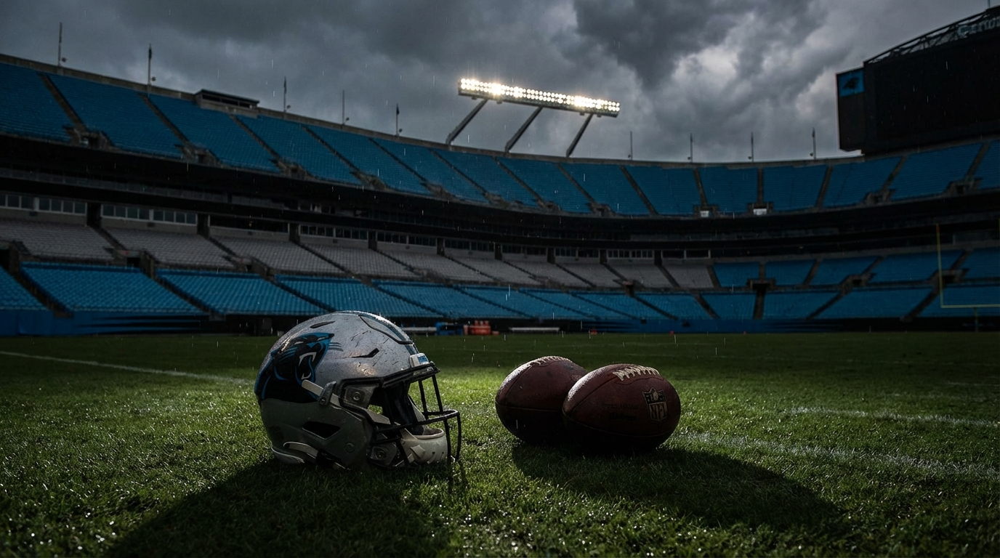
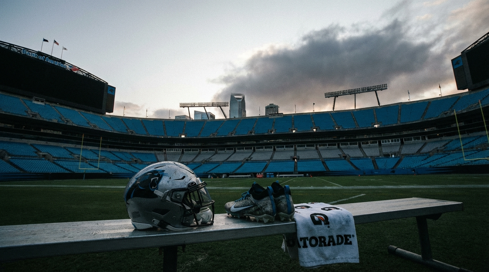
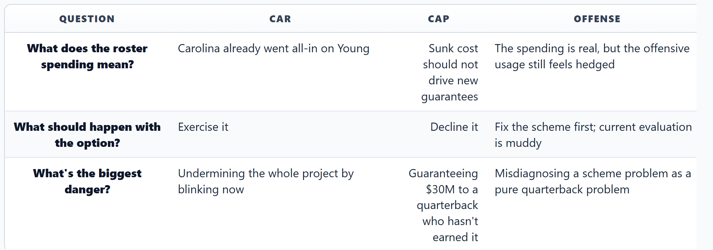

# The Panthers Built a $300M Roster Around Bryce Young. That's Exactly Why the Fifth-Year Option Feels So Dangerous.

*Our Panthers, cap, and offensive experts agree Carolina's window is real right now. They disagree on whether that urgency demands faith in **Bryce Young** — or protection from him.*

---

**By: The NFL Lab Expert Panel**  
*CAR · Cap · Offense*

> **📋 TLDR**
> - Carolina spent this offseason like **Bryce Young** is already the answer: roughly $165M guaranteed on defense and nearly $80M in cap hits across four offensive line starters.
> - The panel agrees the NFC South is unusually soft. That makes 2026 urgent — but it doesn't make Young solved.
> - **CAR** says the infrastructure is too expensive and too fragile to decline the option now. **Cap** says the tape is too inconsistent to guarantee ~$30M for 2027. **Offense** says the scheme has made the evaluation murkier than it should be.
> - Our verdict: decline the option, then spend 2026 proving whether Young can win the job for real in a quicker, more QB-centered offense.

---

The Carolina Panthers have reached the worst kind of quarterback decision: the one where every fact points in a different direction, and every dollar already spent makes the next choice feel more emotional than rational.

On one hand, the front office has behaved like this is a live playoff window. **Jaelan Phillips** got $80M guaranteed. **Devin Lloyd** got $25M guaranteed. Four of Carolina's top seven cap hits sit on the offensive line, which is the sort of roster-building choice teams make when they believe the quarterback is worth protecting at all costs. **Tetairoa McMillan** looks like a real WR1. The division is weak. The infrastructure is not theoretical anymore.

On the other hand, Young's 2025 season still reads like a split-screen. There was the 448-yard overtime masterpiece in Atlanta that made the whole No. 1-pick story feel salvageable. There was also the 54-yard Seattle collapse that looked less like a bad day and more like a warning label. Carolina went 8-9, backed into the playoffs, and exited immediately. That's not the profile of a team that found certainty at quarterback. That's the profile of a team trying to decide whether urgency should be mistaken for proof.

And that is why the fifth-year option deadline matters more here than it would for most teams. Declining it does not mean giving up on Young. Exercising it does not guarantee stability. The Panthers have built a win-now middle around a maybe-quarterback. The question is whether that should make them more willing to bet on him — or more careful about doubling down.

---

## Carolina Already Chose Urgency. It Hasn't Chosen Certainty.

The easiest mistake to make with the Panthers is to talk about this like a normal Year 3 quarterback evaluation. It isn't. Carolina already tilted the board.

| Carolina bet | 2026 signal | What it says about the plan |
|--------------|-------------|-----------------------------|
| **Jaelan Phillips**: 4 years, $120M | $80M guaranteed | The Panthers are paying for impact defense right now, not a slow build |
| **Devin Lloyd**: 3 years, $45M | $25M guaranteed | Carolina wants speed and range in a defense built to shorten games |
| OL investment across 4 starters | ~$79.6M in cap hits | Young's environment has been protected aggressively |
| **Tetairoa McMillan** as WR1 | Rookie contract, featured role | The offense has a real alpha target, but not enough proven depth behind him |

That combination is what makes the roster feel both smart and unstable. Smart, because Carolina finally looks like a professional franchise around the quarterback: real protection, real defensive ambition, a real No. 1 receiver. Unstable, because the roster only cashes out if Young is at least good enough to steer it.

The CAR panelist described the build in one brutal sentence:

> *"Carolina built a $300M roster that only makes sense if Bryce Young is a franchise quarterback — but the tape says he's a 50/50 bet."* — **CAR**

That's not writerly exaggeration. It's the actual tension. The Panthers did not build a roster to find out whether Young is a backup. They built one to compete while he is cheap. If he becomes a top-12 quarterback, this all looks coherent in hindsight: protect him, let the defense win its share of Sundays, own a winnable division, and force the rest of the NFC South to chase you.

If he doesn't, the whole structure starts to look like premium architecture on a shaky foundation.

The weapons room is the giveaway. **McMillan** looks like the piece Carolina needed, but beyond him the room still feels unfinished. **Chuba Hubbard** is useful. **Jalen Coker** is functional. **Xavier Legette** is still more idea than answer. **Ja'Tavion Sanders** is intriguing but not yet bankable. That's not a reckless offense. It's an offense trying to make quarterback life manageable without fully trusting the quarterback to carry volume.

And that, more than any headline number, is what makes the option decision so uncomfortable. Carolina has invested like a team that believes in Young while still surrounding him like a team that is hedging.

---

## The Tape Is the Problem, Not the Highlight Reel

The pro-Young case is easy to sell in montage form. The anti-Young case is harder because it requires watching the whole season.

| Bryce Young 2025 split | What it suggests |
|------------------------|------------------|
| 448 yards, 3 TDs at Atlanta in a 30-27 OT win | The high-end processing and placement still flash like a No. 1 pick |
| Three 300-yard games | He can produce explosive output when script and rhythm cooperate |
| Four games under 200 yards | The floor remains far too low for a franchise decision |
| 54 total yards vs. Seattle in Week 17 | Pressure still collapses the operation in a way good defenses can reproduce |
| 8-9 team record, playoff back-in | Carolina was competitive without ever looking fully solved |

CAR's evaluation is the most balanced version of the Young question because it refuses to do the usual thing NFL discourse does with struggling first-round quarterbacks. It doesn't call him broken. It also doesn't pretend "just give him more reps" is an argument.

Young's strengths still matter. When the pocket is clean, he processes quickly, throws with anticipation, and gets the ball to **McMillan** in stride. There is still enough timing and placement here to understand why Carolina wants this to work.

But the failure mode isn't random. Under pressure, the offense changes shape. Feet get hurried. Reads get shorter. Third-and-medium turns into a checkdown contest. Seattle didn't have to conjure some exotic answer in Week 17. The Seahawks rushed four and let the panic arrive on schedule. That matters because it means the low end is reproducible.

CAR's summary of the football problem is the cleanest one in the entire panel:

> *"Young is not broken, but he's not fixed."* — **CAR**

That's exactly right. And it is a far more dangerous sentence than "he's bad," because bad quarterbacks make the option decision easy. Unfinished ones tempt teams into paying for the version they hope is coming.

<!-- IMAGE: Bryce Young standing in the pocket behind a heavily invested Panthers offensive line, split visually between a bright clean-pocket side and a dark pressure-collapsing side.
     Placement: inline
     Tone: dramatic editorial football photo
     Key elements: Panthers blue and black, Bryce Young, hints of Tetairoa McMillan, visual contrast between clean processing and pressure chaos
-->

That is why the best pro-option argument from Carolina is not really about the tape at all. It's about organizational coherence. If you already built the defense, already built the line, already declared the division window open, then declining the option can feel like yanking the emotional floor out from under the entire project.

But that cuts both ways. If the tape still requires this much context, then maybe the roster build is the reason to be *more* disciplined, not less.

---

## The Cap Case for Declining Is Colder — and Probably Stronger

This is where the panel breaks hard.

CAR sees the option as a necessary extension of the roster bet. Cap sees it as the moment Carolina has to stop confusing previous spending with future logic.

The financial picture is not as clean as the headline cap-space numbers suggest. Carolina may have looked like it was entering the offseason with breathing room, but the Phillips and Lloyd deals are expected to pull that room down sharply once fully processed. In Cap's view, the Panthers are effectively spending 2026 from a near-empty wallet even before the Young decision becomes a 2027 issue.

| Option path | 2026 effect | 2027 effect | Hidden risk |
|-------------|-------------|-------------|-------------|
| **Exercise** | No immediate cap hit | ~$29-32M fully guaranteed for Young | Paying bridge-QB money if 2026 doesn't settle the question |
| **Decline** | Preserves flexibility | No guaranteed 2027 commitment | If Young breaks out, Carolina negotiates from weakness |

Cap's recommendation is blunt:

> *"Decline the option, let Young prove it in 2026, and preserve the cap flexibility to pivot if he doesn't."* — **Cap**

There are two reasons that argument lands harder than the usual spreadsheet nihilism.

First, the option number is not some cute rookie-deal extension. For quarterbacks, this is real money. Roughly $30M guaranteed for 2027 is not "let's buy another look." It's a real commitment to a player whose season still needs subtitles.

Second, Cap's core point is forward-looking, not punitive. The Panthers have already spent the Phillips and Lloyd money. That is done. The option should not be treated like a loyalty award for surviving the rest of the roster build. It should answer a narrower question: does guaranteeing Young 2027 money increase Carolina's odds of winning between 2026 and 2028?

Cap says no. And the logic is difficult to dismiss.

If Young breaks out in 2026, Carolina still has options. Teams solve "our quarterback got good and now we have to pay him" every year. That is a rich-person problem. If Young plateaus or regresses, though, the option becomes exactly the kind of expensive half-measure teams regret: too much money to ignore, not enough certainty to build around.

CAR's pushback is that declining sends a corrosive signal to the locker room and to Young himself. There's truth in that. Quarterback messaging matters, especially after you've spent the offseason screaming faith through your roster decisions.

But this is where the cap case stops sounding cold and starts sounding honest. If Carolina's confidence in Young is real, it should survive one season without a ceremonial guarantee. And if it doesn't, then the team was paying for reassurance, not performance.

---

## The Scheme May Be Making the Evaluation Worse

The most useful contribution from the Offense panelist is that they refuse to let this become a fake binary between "Young is the answer" and "Young is the problem."

Their diagnosis is harsher than either of those.

> *"Carolina built Young the perfect offensive line, then asked him to hand the ball off."* — **Offense**

That line explains why Young's season felt so contradictory. The bones of Dave Canales' offense fit him: timing, progression reads, quick-game concepts, defined answers. But the identity leaned so far into run-first football that Carolina often manufactured the exact down-and-distance situations where Young gets worst.

| Offensive identity question | 2025 Panthers | What Offense wants in 2026 |
|----------------------------|---------------|-----------------------------|
| Early-down tendency | Too run-heavy | Pass first often enough to create rhythm |
| RPO usage | Too limited | Increase it meaningfully to fit Young's quick release and mobility |
| **McMillan** deployment | More field-stretcher than chain-mover | More intermediate volume and possession work |
| Run game role | Identity driver | Useful complement |

This matters because it complicates the option debate in a very Carolina-specific way. If Young's evaluation happened in a system built to maximize him and he still looked like this, declining would feel even cleaner. But Offense argues that Carolina has spent like it believes in Young while calling games like it doesn't.

That's an important distinction.

The Atlanta eruption happened when script forced Carolina away from comfort and into a more aggressive passing posture. The Seattle collapse happened when the offense stayed trapped in predictable structure, inviting pressure and never letting Young settle into rhythm. Offense's point is not that scheme absolves the quarterback. It's that the Panthers have not yet truly run the experiment they claim to be evaluating.

Which is why the article's cleanest synthesis isn't "exercise because the scheme might help him" or "decline because the scheme shouldn't matter." It's this: Carolina should refuse to guarantee the 2027 money *and* refuse to run back the same offensive identity.

Young does not need more excuses. He needs a cleaner test.

That means:

- leaning harder into quick game on early downs  
- letting **McMillan** become a true intermediate-volume target  
- using the run game as support, not camouflage  
- adding one more credible middle-of-the-field weapon so defenses can't erase the offense by crowding the WR1  

If the Panthers do all that and Young still plays like a coin flip, the answer becomes obvious without the option attached. If they don't, then Carolina will spend 2026 arguing about whether it learned anything at all.

---

## The NFC South Window Is Real Enough to Make This Hurt

The cruelest part of the Panthers' timing is that CAR is right about the division.

Atlanta is rebooting under a new leadership structure. New Orleans is still trying to breathe through cap compression. Tampa Bay just lost **Mike Evans** and looks more annoying than authoritative. This is not some imaginary window fans create to feel better in March. Carolina has a plausible shot to matter immediately.

| NFC South rival | 2026 reality | Carolina implication |
|-----------------|--------------|----------------------|
| **Falcons** | Regime reset under new leadership | Transition years are opportunities if Carolina is stable |
| **Saints** | Dead-money burden and roster leakage | New Orleans is still paying for old decisions |
| **Buccaneers** | Lost **Mike Evans**, tighter margin around **Baker Mayfield** | Tampa no longer feels like the inevitable division adult |

CAR's strongest argument lives here. The team expert is basically saying: if the division is this open, how can Carolina afford to wobble publicly on the quarterback it has already built around?

That is emotionally compelling. It is also exactly the sort of logic that gets franchises into trouble.

Because the open division window should shape how the Panthers attack 2026. It should not force them to buy 2027 certainty they have not earned. In fact, you can flip CAR's argument around pretty easily: if the NFC South is this available *right now*, then the Panthers should be desperate to protect their ability to pivot quickly if Young doesn't take the job by force.

That is the hidden difference between the 2026 question and the 2027 question.

Carolina can absolutely compete in 2026 with Young on the fourth year of his rookie deal, a better-tuned offense, and a defense built to steal games. The option does nothing to help that team. It only speaks to what Carolina owes Young after the season. And right now, the panel gave us more reasons to demand a verdict from 2026 than to pre-pay one for 2027.

<!-- IMAGE: A Panthers-themed NFC South race graphic with Carolina centered between Atlanta's rebuild, New Orleans' cap burden, and Tampa Bay's post-Mike-Evans transition.
     Placement: inline
     Tone: analytical infographic
     Key elements: Panthers blue, division logos, an open 2026 window theme, Bryce Young and defensive-investment cues
-->

---

## Where the Panel Actually Splits

This isn't a fake disagreement built for content. The experts are genuinely arguing from different priorities.

That last row is the article.

CAR is worried about coherence. Cap is worried about leverage and optionality. Offense is worried Carolina still hasn't set up the exam correctly. All three are reasonable fears. Only one of them requires a guaranteed $30M answer in May.

---

## The Verdict: Decline the Option, Then Finally Give Young the Right Test

Here is the cleanest beat-level answer after sitting with all three positions: **the Panthers should decline Bryce Young's fifth-year option.**

Not because he is finished. Not because the roster around him was a mistake. And not because Carolina should start preparing the goodbye video.

They should decline it because the only convincing pro-option case in this panel is about symbolism, not certainty.

The tape is too volatile. The current scheme has not earned enough trust to justify a blind guarantee. The division window is open now, which makes 2026 the year to push the roster and the coaching staff toward a real answer — not the year to buy emotional protection against an uncomfortable outcome.

That answer needs to come with action, not just restraint.

| Carolina must... | Why |
|------------------|-----|
| **Decline the option** | Avoid guaranteeing 2027 money before the evaluation is settled |
| **Rebuild the offensive identity around Young's actual strengths** | Quick game, RPOs, and more early-down passing create a cleaner verdict |
| **Add one more credible intermediate target** | The current offense is too easy to shrink around **McMillan** |
| **Treat 2026 like a live referendum, not a holding pattern** | The Panthers need clarity, not another year of vibes |

This is the important distinction: declining the option is not the same thing as pulling the plug. It is refusing to confuse the cost of the roster with the quality of the quarterback.

If Young breaks out in 2026, Carolina can pay him and feel great about it. That scenario is expensive, but healthy. If he plateaus, the Panthers preserved flexibility. If he bottoms out again under pressure, they didn't compound uncertainty with obligation.

The Panthers' offseason spending tells us they believe the NFC South can be taken right now. Fine. Then take it the smart way. Build the defense. Fix the offense. Make Young throw his way into a true answer. Just don't guarantee the answer before he gives it to you.

The dangerous move here isn't declining the option. The dangerous move is pretending the existence of the roster means the quarterback verdict has already been delivered.

It hasn't. Carolina still has one season to find out.

---

*The NFL Lab is powered by a 46-agent AI expert panel covering every NFL team, the salary cap, draft prospects, injuries, offensive and defensive schemes, and the latest league-wide news. Each article represents the consensus view of multiple domain specialists working together — and sometimes, their very pointed disagreements.*

*Want us to evaluate a trade? A free agent signing? A draft scenario? Drop it in the comments.*

---

**Next from the panel:** If Carolina declines Young's option, the next question gets even sharper: should pick #19 be spent on a receiver who can live in the intermediate game, or on the defender who makes this win-now roster viable regardless of quarterback variance?
