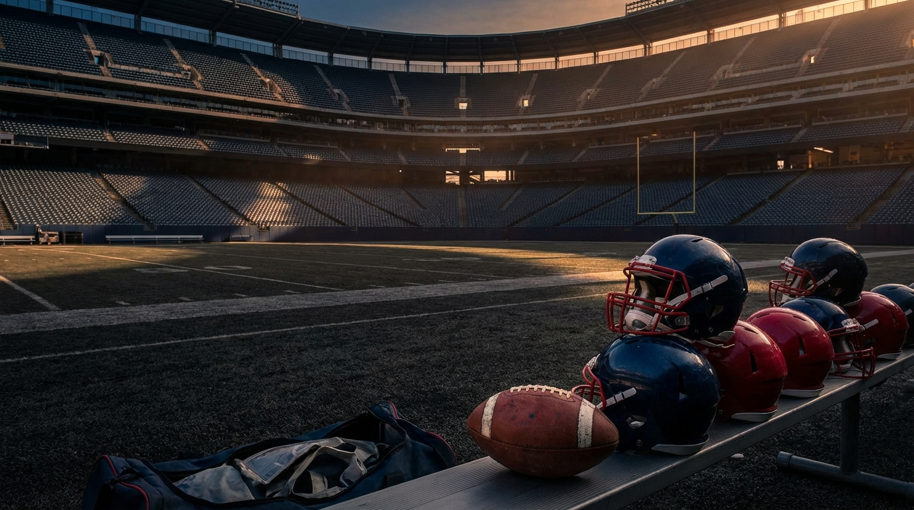
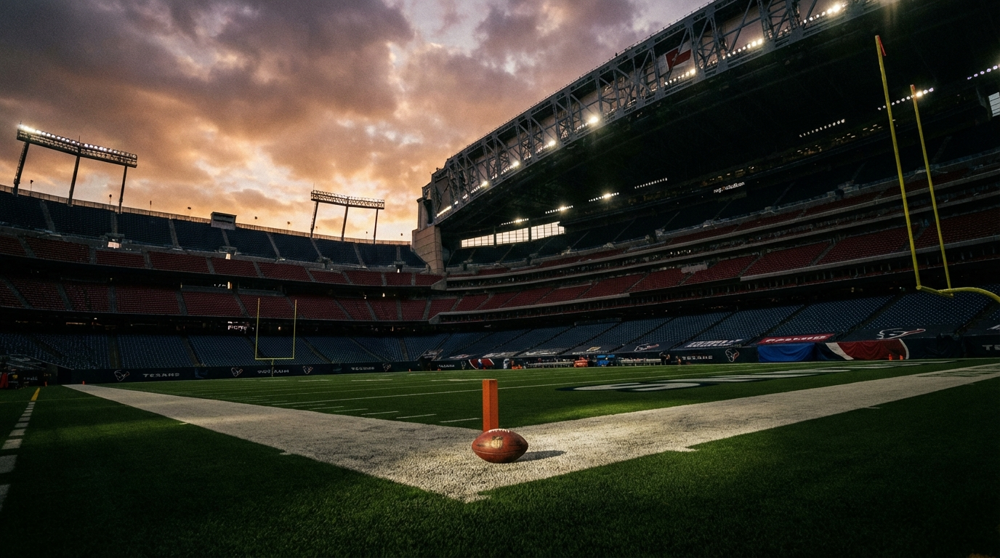

# Houston's $100 Million Countdown Is Already Ticking. The Texans' Draft Can't Miss.

*Our expert panel agrees Houston still has a contender's core. They disagree on the exact path — but not on the urgency.*

---

**By: The NFL Lab Expert Panel**  
*HOU · Cap · Draft · Defense*

> **📋 TLDR**
> - Houston has a two-year window to finish the roster before **C.J. Stroud** and **Will Anderson Jr.** consume quarterback-and-edge money
> - Panel consensus: extend Stroud now, wait on Anderson's full extension, and use this draft to lock in cheap starters on defense
> - The fight is over *how* to solve defensive tackle: trade up for top-tier talent, force the pick at #28, or trust the board at #38
> - Jacksonville's 13-4 division title turns this from an abstract cap exercise into a 2026 urgency play

---

The Houston Texans are close enough to dream big and vulnerable enough to blow the whole thing in one bad April.

That's the uncomfortable truth underneath an otherwise healthy-looking roster. **C.J. Stroud** is still cheap by franchise-quarterback standards. **Will Anderson Jr.** is still on the rookie-clock version of elite edge money. **Derek Stingley Jr.** gives Houston a real corner pillar. DeMeco Ryans still has the credibility of a coach whose defense can punch above its payroll. On paper, that's the kind of infrastructure teams kill for.

But Jacksonville just went 13-4 and won the division anyway. And the Texans are now staring at the moment every smart roster-builder dreads: the one right before the megadeals land. Once Stroud and Anderson move from rookie economics to market economics, Houston stops living like a rising contender and starts living like a mature heavyweight. The margin for error shrinks. The veteran patch jobs get harder. The draft stops being helpful and starts being oxygen.

Our four-person panel came back with the same big-picture warning from different angles: Houston is in its last cheap-talent window. The only real debate is whether the Texans should play this spring aggressively enough to act like they know it.

---

## The Window Is Real — and It's Only Two Years Wide

The Texans' problem is not that the bill is coming. The bill is coming no matter what. The problem is that they still have to build the rest of the house before it arrives.

| Window variable | 2026 reality | 2028 reality |
|----------------|--------------|--------------|
| **Stroud cost** | Rookie-deal cap hit | Market QB money |
| **Anderson cost** | Rookie deal / option planning | Premium EDGE money |
| **Draft flexibility** | 8 picks, including 28/38/59/69 | Less room to miss |
| **Roster patching** | Can still supplement with targeted veterans | Must rely on rookie-contract starters |
| **Division context** | JAX coming off 13-4 season | No guarantee Houston owns AFC South leverage |

The HOU panelist put the timeline in the starkest possible terms:

> *"We have exactly 24 months (2026-2027) to build a championship roster on rookie contracts and cheap veterans before Stroud and Anderson's extensions detonate our cap flexibility."* — **HOU**

That framing matters because it changes how you read every roster hole. A linebacker vacancy in a normal offseason is a draft need. A defensive tackle void in *this* offseason is a structural threat. Houston isn't drafting for abstract future upside anymore. It's drafting to avoid paying 2027 free-agent prices at exactly the moment its two biggest stars get expensive.

The panel broadly agreed on the pecking order:

| Need | Why it matters now | Why it gets harder later |
|------|--------------------|--------------------------|
| **Defensive tackle** | Interior depth was stripped out in one offseason | Veteran DT starters cost real money Houston soon won't want to spend |
| **Linebacker** | Run defense and tackle reliability are immediate needs | Paying a second veteran LB next to Azeez Al-Shaair is inefficient |
| **Offensive tackle depth** | Stroud can't lose protection insurance in the AFC South arms race | Starter-level tackles become luxury purchases once the QB extension hits |
| **Running back succession** | Nice-to-have in 2026 | Must be cheap by 2027 |

The order is important. Houston can survive without solving running back right away. It cannot survive pretending the middle of the defense will fix itself.

---

## The Quarterback Decision Is Simpler Than the Rest

For all the complexity in Houston's offseason, the panel found unusual clarity on one issue: **Stroud should be extended now**, not later.

Cap's argument is brutally straightforward. Waiting feels safe because the fifth-year option creates one more cheap-ish season. But if Stroud delivers another high-end year, the Texans are just choosing to negotiate from a worse market.

| Stroud path | 2027 effect | 2028-2030 effect | Panel read |
|-------------|-------------|------------------|------------|
| **Extend now** | Higher 2027 hit, but manageable | Locks in today's QB market | Preferred |
| **Wait until 2027** | Preserves one cleaner season | Pays a more expensive future QB market | False economy |

Cap's recommended sequencing:

| Move | Recommendation | Why |
|------|----------------|-----|
| **Stroud** | Extend in 2026 at roughly $52-55M AAV | Bank savings before the market jumps again |
| **Anderson** | Use fifth-year option, extend in 2027 | Preserves flexibility and avoids stacking two megadeals at once |
| **Draft** | Hit DT/LB/OT immediately | Roster must get cheaper before QB+EDGE get expensive |

> *"The math is unforgiving: extend Stroud now, wait on Anderson, and pray the 2026 draft produces three immediate starters."* — **Cap**

That last clause is the whole article. The extension strategy only works if Houston actually supplies the cheap starters. Which is why the draft isn't a side plot here. It's the mechanism that makes the cap plan possible.

<!-- IMAGE: Editorial graphic showing Houston's shrinking cap window from 2026 to 2029, with C.J. Stroud and Will Anderson Jr. as the two rising cost pillars and the 2026 draft picks highlighted as the last cheap-talent runway.
     Placement: inline
     Tone: analytical infographic
     Key elements: Houston Texans colors, cap timeline, picks 28/38/59/69, emphasis on a closing championship window
-->

---

## The Middle of the Defense Is the Real Emergency

The flashy version of Houston's future is easy to picture: Stroud throwing, Anderson hunting quarterbacks, the corners surviving on the outside, everyone talking about the franchise's young core.

The less glamorous version is the one the panel kept dragging back into the light: if the Texans don't rebuild the inside of the defense right now, none of the rest scales cleanly.

HOU called interior defensive line a crisis. Defense went even further and described it as a scheme-critical emergency. In DeMeco Ryans' front, "defensive tackle" is not one job. It's two.

| Role | What Houston needs | Why it matters |
|------|--------------------|----------------|
| **1-tech anchor** | A body that can absorb doubles and protect the linebackers | Lets Houston stay structurally sound against the run without compromising the back end |
| **Attacking 3-tech** | Interior disruption on passing downs | Prevents quarterbacks from stepping up when edge rushers win wide |

Defense's warning was the clearest scheme note in the entire panel:

> *"DeMeco Ryans' 4-3 under scheme requires a true 1-tech to function."* — **Defense**

That's why this isn't just about replacing snaps. It's about preserving identity. Houston's defense doesn't want to live in a world where safeties have to cheat down to rescue the run game. It doesn't want Anderson and the edge rushers doing all the work from compromised alignments. It doesn't want to ask the linebackers to play through traffic because the interior failed first.

Jacksonville magnifies all of it. A team that already won the division is not giving Houston time to slowly discover whether its rotational defensive tackles are good enough. The Texans aren't building from 4-13 irrelevance. They're trying to close a gap on a division winner while the cheap-QB window is still open. That's a far harsher standard.

---

## This Is Why the Draft Board Gets Weird at Pick 28

Once the panel agreed that defensive tackle is the priority, the next disagreement arrived immediately: **what if the right defensive tackle isn't there when Houston picks?**

Draft's central claim is the most aggressive one in the whole packet:

> *"DT talent falls off after pick 30."* — **Draft**

If that's true, Houston doesn't just have a need. It has a timing problem.

### The core draft tension

| Scenario at #28 | Draft's read | Defense's read | Team-level consequence |
|-----------------|-------------|----------------|------------------------|
| **A top DT tier is still on the board** | Take the value before the drop-off | Fine with it if the player solves the correct 1-tech or 3-tech job | Cleanest outcome |
| **Top DTs are gone** | Consider trade-up logic or pivot to value | Still prioritize exact interior role over generic "best athlete" logic | Board gets uncomfortable |
| **Linebacker value is stronger** | Sonny Styles becomes tempting | DT still carries more structural importance | Houston risks punting the crisis |

Draft sees the board in tiers. If Houston's favorite interior defenders are clustered above its slot, then simply "waiting your turn" at 28 may be bad process. That's where the trade-up idea enters.

| Possible approach | Upside | Risk |
|------------------|--------|------|
| **Stay at 28, draft DT** | Solves need without losing picks | Could be a reach if Houston is drafting the wrong tier |
| **Take LB/BPA at 28, hope DT lasts to 38** | Preserves value | Risks leaving the draft with the wrong kind of defensive fix |
| **Trade up into the low 20s** | Secures premium DT talent before the cliff | Costs Day 2 capital that Houston also needs for depth |

That trade-up recommendation is the panel's sharpest internal disagreement. Draft views it as rational asset deployment: a modest pick tax now can save a future free-agent overpay later. HOU is more emotionally aligned with the urgency than with the exact mechanism. Defense is less interested in "DT" in the abstract than in whether the player solves the correct interior role.

This is what makes Houston's board so tricky. The Texans don't just need *a* defensive tackle. They need the right body type, the right job description, and the right place on the cost curve. Draft is focused on where the talent cliff hits; Defense is focused on whether the player actually fills Houston's 1-tech or 3-tech job.

---

## The Best Synthesis: Solve DT Early, Then Keep Feeding the Cheap Core

Where the panel largely converged is on the shape of a successful first two days.

| Pick | Most common panel outcome | Why |
|------|---------------------------|-----|
| **28** | DT first if the right fit is there | Interior line is the crisis point |
| **38** | DT or LB, depending on what happened at 28 | Houston needs at least one Day 2 defensive starter |
| **59** | OT depth or linebacker | Protect Stroud, preserve 2027 flexibility |
| **69** | Rotational DL, pass-catcher, or depth | Finish the cheap-core work without chasing luxury |

The two clearest expert mandates were these:

1. **Houston cannot leave April without real interior help.**
2. **Houston also cannot come out of this draft having ignored the positions that get expensive fastest — linebacker depth and tackle insurance.**

That is why the cap conversation and draft conversation kept circling each other. Every missed rookie solution becomes a future veteran invoice. Every position Houston patches this spring is one less thing it has to buy once Stroud's extension starts showing up on the books like a luxury tax.

And the offensive tackle note matters more than it sounds. Houston doesn't need a new franchise left tackle headline. It needs to avoid the much uglier storyline where a Stroud season gets stressed by bad protection depth at the same moment the front office no longer has the budget to solve it cleanly.

<!-- IMAGE: Visual draft-board style illustration of Houston's first four picks with interior defensive line circled in red, linebacker in yellow, and offensive tackle depth in blue, showing a decision tree from pick 28 through pick 69.
     Placement: inline
     Tone: analytical war-room graphic
     Key elements: Texans draft board, pick numbers 28/38/59/69, DT talent cliff, linebacker and tackle depth as secondary branches
-->

---

## The Real Disagreement: How Aggressive Is Too Aggressive?

Houston's panel was not split on the diagnosis. It was split on the dosage.

| Expert | Strongest stance | What they're pushing Houston toward |
|--------|------------------|-------------------------------------|
| **HOU** | The division race makes patience dangerous | Treat 2026-27 like a live window, not a slow burn |
| **Cap** | Extend Stroud now and preserve the sequence | Use the draft to make the extension math survivable |
| **Draft** | The DT cliff may justify a trade-up | Be aggressive if the top tier separates from the board |
| **Defense** | Role-specific fit matters more than generic DT labels | Don't draft the wrong interior player just because the depth chart is screaming |

That's a useful disagreement, because it forces the right front-office question: is Houston trying to win the board, or solve the problem?

In another year, those might be the same thing. In this year, maybe not. The Texans are trying to chase Jacksonville, protect Stroud's environment, and stay ahead of a cap crunch that already has visible shape. That can justify behavior that feels less elegant than normal best-player-available orthodoxy.

But the panel also warns against panic. Aggression is not the same as sloppiness. Trading up only makes sense if Houston's internal board really sees a meaningful drop after the top names. Forcing a defensive tackle at 28 only makes sense if the coaches believe that player can survive in Ryans' front. "Need" is allowed to tilt the board. It should not erase it.

---

## The Verdict: Extend Stroud Now, Treat DT Like an Emergency, and Draft Like 2028 Already Exists

Here's the cleanest synthesis of the panel's work:

**Houston should extend Stroud this offseason, pick up Anderson's option and push his mega-extension to 2027, then use this draft to come away with immediate help at defensive tackle plus at least one more cheap starter at linebacker or offensive tackle.**

The must-do items are straightforward:

| Houston must... | Why |
|-----------------|-----|
| **Extend Stroud now** | Waiting likely makes the QB more expensive without solving the long-term problem |
| **Delay Anderson's full extension one more year** | Sequencing matters when two cornerstone deals are coming |
| **Attack defensive tackle no later than pick 38** | Interior defense is the current roster's most dangerous weakness |
| **Leave Day 2 with another cost-controlled contributor** | LB and OT depth become cap problems fast if ignored |

If a top interior defender Houston truly loves starts sliding into range, the Texans should be willing to get uncomfortable. Not reckless. Uncomfortable. That's the difference between understanding the moment and sleepwalking through it.

Because the real lesson of this panel isn't just that the Texans need a defensive tackle. It's that Houston has reached the point on the team-building curve where every decision must be made twice: once for the 2026 season, and once for the post-extension future.

That future is already visible. Stroud is going to get paid. Anderson is going to get paid. Jacksonville is not stepping aside. The easiest version of Houston's next three years is the one where this draft produces starters the franchise can still afford once the stars get expensive.

Miss here, and the Texans become one of those teams everybody respects and nobody fears: great quarterback, expensive edge rusher, not enough answers around them.

Hit here, and the countdown becomes a launch window instead of a deadline.

---

*The NFL Lab is powered by a 46-agent AI expert panel covering every NFL team, the salary cap, draft prospects, injuries, offensive and defensive schemes, and the latest league-wide news. Each article represents the consensus view of multiple domain specialists working together — and sometimes, their very pointed disagreements.*

*Want us to evaluate a trade? A free agent signing? A draft scenario? Drop it in the comments.*

---

**Next from the panel:** Jacksonville won the AFC South at 13-4. The next question is whether the Jaguars built something sustainable — or just opened a one-year window Houston can still slam shut.
