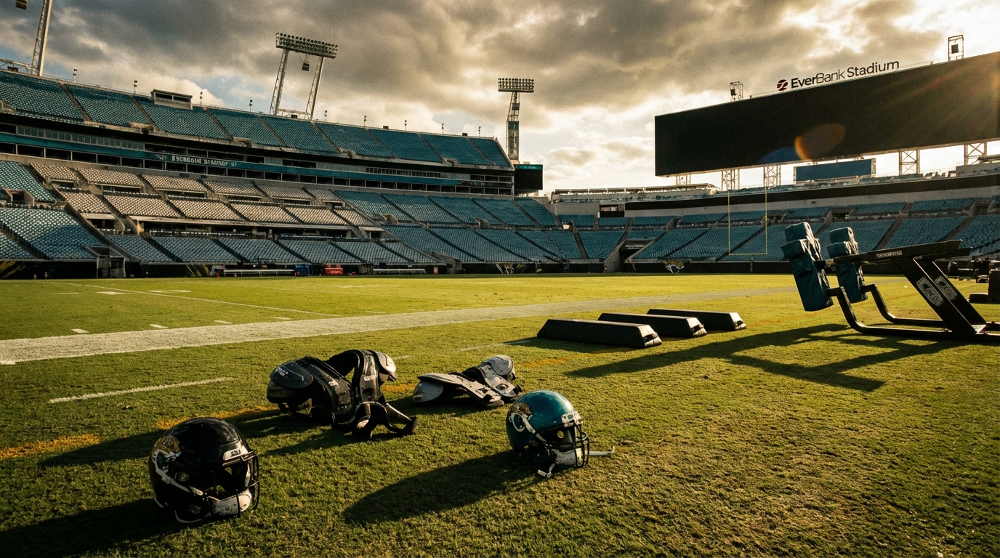
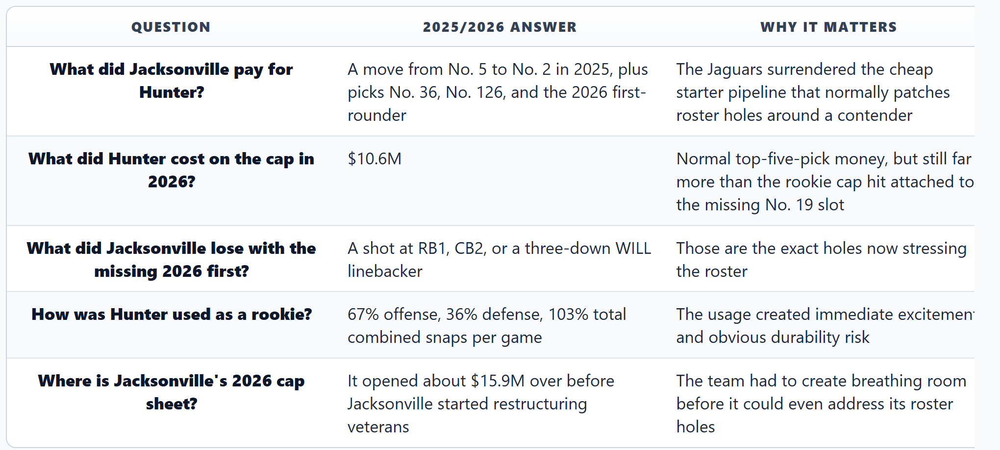
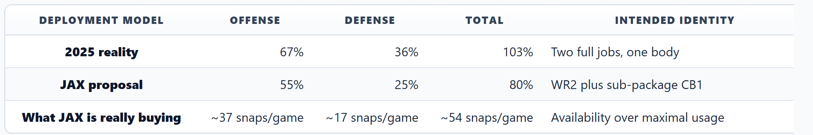
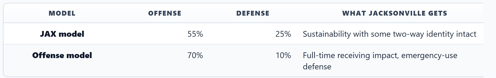
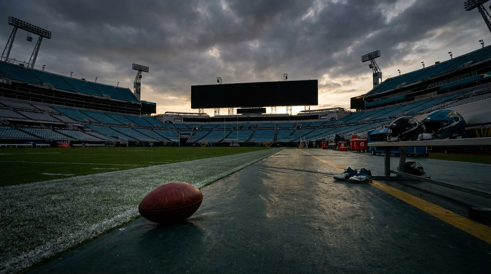
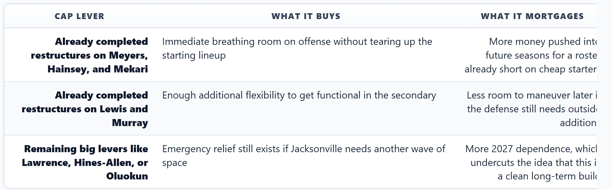
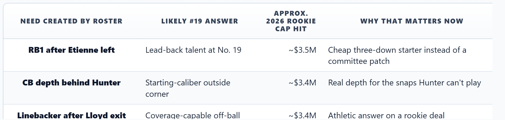
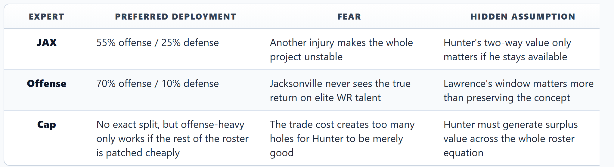

# Jacksonville Bet Its Future on Travis Hunter. Now It Has to Choose Which Half of Him Matters Most.

*Our Jaguars panel agrees Hunter is the roster's most important player. They disagree on whether Jacksonville should treat him like a receiver, a corner, or a very expensive cap workaround.*

---

**By: The NFL Lab Expert Panel**  
*JAX · Cap · Offense*

> **📋 TLDR**
> - Jacksonville went 13-4, then opened the 2026 offseason roughly $15.9M over the cap, without its 2026 first-round pick, and with holes at RB, linebacker, and outside corner.
> - Travis Hunter justified the hype in flashes as a rookie, but his 103% combined snap workload across offense and defense ended with an LCL injury after seven games.
> - The panel's core disagreement is simple: JAX wants a sustainable 55/25 offense-defense split, Offense wants a near full-time receiving role, and Cap says the trade only works if Hunter delivers star-level surplus despite everything the trade cost.
> - Our verdict: Jacksonville has to stop trying to make Hunter two full-time starters. Make him offense-first, defense-selective, and build the rest of the roster around that truth immediately.

---

The Jaguars created the league's most fascinating experiment the minute they traded up for **Travis Hunter**. They also created its least forgiving one.

Hunter is the NFL's only credible two-way WR/CB starter, so Jacksonville isn't solving a normal roster problem. Most teams decide how to maximize a star at one position. The Jaguars have to decide which snaps matter more, which side gets first claim on a generational athlete, and whether the value of being unique outweighs the cost of building around someone who cannot physically be in two huddles at once.

That question only got sharper after Year 1. Jacksonville won 13 games. Hunter flashed in seven of them. Then the workload broke where common sense said it might: an LCL injury ended the season after he averaged 67% of offensive snaps, 36% of defensive snaps, and more than a full game's worth of total work every week. Now the Jaguars are coming off an offseason that opened roughly $15.9M over the cap, they're missing the 2026 first-round pick they sent to Cleveland, and they're still thin at multiple spots that pick could have solved.

Our panel sees the same paradox from three directions. JAX says Hunter must be managed like a scarce resource. Offense says Jacksonville is wasting WR1 talent in a WR2 job. Cap says the trade only works if Hunter becomes good enough at both jobs to justify everything it cost.

---

## The Paradox, in One Table

Before you get to philosophy, you get to the math.

Hunter is good enough to make the trade feel defensible. He is also expensive in the ways top-five picks always are, except Jacksonville compounded that cost by sacrificing the exact pick that would have made the rest of this roster easier to finish.

The result is a team with contender optics and stress-fracture economics. **Trevor Lawrence** is still at a manageable $24.0M cap hit before the real jump arrives in 2027. That should be the sweet spot where you flood the roster with affordable starters. Instead, Jacksonville is using it to survive a self-created crunch: no first-rounder, no Etienne, no Lloyd, and a corner room that still needs outside help whenever Hunter leaves the secondary.

Cap's framing is the hardest to ignore because it strips away the novelty. If the trade is worth a jump from No. 5 to No. 2, the extra Day 2 capital, and a future first-rounder on top of a restructuring binge, Hunter can't merely be fun. He has to become the reason the holes around him are survivable.

> *"The Hunter experiment only 'works' if he stays healthy for 17 games and produces at an All-Pro level on both offense and defense — a standard no two-way player in NFL history has ever met."* — **Cap**

---

## Jacksonville's Internal Case: Scale Him Back Before He Breaks Again

The Jaguars' team-side position is the least sexy and maybe the most adult one in the room: last season already showed them the upper bound.

In seven games, Hunter put up 28 catches for 298 yards and a touchdown while also logging 15 tackles and three pass breakups. The number that matters most isn't any single stat line. It's the 103% total snap rate — a number that reads like a typo and, in hindsight, like a warning label.

JAX's proposed fix is the kind of compromise coaches talk themselves into after watching a special player get hurt: **55% offense, 25% defense, 80% total workload.** In this model, Hunter stays a featured offensive player — WR2 opposite **Brian Thomas Jr.** in three-receiver sets, red-zone packages, and third downs — while becoming a defensive closer rather than a full-time CB1. Think dime, nickel, obvious passing downs, and leverage moments instead of base-down survival.

The logic is blunt. Hunter graded better as a receiver than a corner in the early sample. Jacksonville's offense is more explosive when he is on the field with Thomas, **Jakobi Meyers**, and **Parker Washington**. And the quarterback-centric argument matters here: if Lawrence is 27 and still in the affordable phase of his deal, the front office should skew its scarce star resources toward helping him.

JAX puts it even more plainly:

> *"The goal isn't to maximize Hunter's usage; it's to maximize his availability over 17 games."* — **JAX**

That line is the closest thing this panel has to a consensus foundation. Nobody thinks Hunter should go back to 103%. The disagreement starts after that, because once you accept a limit, you still have to decide where the best snaps live.

JAX's answer is offense-first, but not offense-only. Hunter would remain a receiver who changes how defenses align, while still covering enough on passing downs to preserve the spirit of the trade. That matters because the Jaguars don't believe **Brian Thomas Jr.'s** 2025 regression is really a Hunter problem. Their read is almost the opposite: Thomas' drop from 87 catches, 1,282 yards, and 10 touchdowns in 2024 to 48 catches, 707 yards, and two scores in 2025 was more about defenses changing the picture after Hunter got hurt, not about Hunter stealing oxygen.

The target-share evidence is persuasive enough to take seriously. In the seven games Hunter played, Thomas still saw 6.1 targets per game. In the seven games after Hunter got hurt, that number dropped to 5.4. If anything, Hunter's presence helped by making defenses respect the opposite side of the field. The Jaguars' conclusion is that Hunter doesn't cannibalize Thomas. He prevents Thomas from getting bracketed into irrelevance.

> *"Hunter is a WR who moonlights at CB in sub-packages — not a CB who moonlights at WR."* — **JAX**

<!-- IMAGE: A split-field editorial graphic showing Travis Hunter in Jaguars teal lined up at wide receiver on one half and cornerback on the other, with snap-share numbers 67% offense, 36% defense, and 103% total highlighted like a warning light.
     Placement: inline
     Tone: analytical infographic
     Key elements: Travis Hunter, Jaguars teal and black palette, snap percentages, subtle injury-risk visual cue, stadium lights
-->

There is one uncomfortable assumption buried in that plan, though: Jacksonville still needs the defense to survive while Hunter is helping Lawrence. That's where the internal model starts to wobble. Because the offensive argument isn't merely that Hunter should play more receiver. It's that the 55/25 compromise still undersells how devastating he could be if Jacksonville would stop pretending the compromise itself is the victory.

---

## Offense's Rebuttal: If You Bought WR1 Talent, Stop Using Him Like a Luxury Accessory

The panel's offensive view treats Jacksonville's current deployment logic as emotionally understandable and strategically timid.

The core complaint is simple: **Hunter is being used as a WR2 even though his ceiling is WR1.** In **Grant Udinski's** 3WR/1TE structure, that matters. The WR1 gets the first-read money downs, the downfield air yards, and the late-game closing volume. The WR2 gets the leftovers.

Offense looks at Hunter's seven-game sample — 4.0 targets per game, a 68-catch/730-yard/4-touchdown pace over 17 games — and sees a misuse of talent, not a finished plan.

> *"Travis Hunter is being deployed as a WR2 when he has WR1 ceiling talent."* — **Offense**

The argument gets more interesting when it moves beyond volume into structure. At a 55% offensive snap rate, Hunter isn't just seeing fewer targets. He's missing entire categories of opportunities:

- fewer early-down play-action deep shots
- fewer two-minute drill reps, where rhythm matters more than package creativity
- fewer fourth-quarter possession snaps, when true WR1s take over games
- fewer guaranteed red-zone appearances, where Jacksonville's offense badly needs him

That red-zone piece is the sharpest offensive evidence in the whole packet. Jacksonville finished 30th in red-zone touchdown rate in 2025 at 48.3%. When Hunter was on the field for red-zone offense, the touchdown rate jumped to 69%. When he wasn't — often because the previous series had him playing defense — it cratered to 36%. That is the two-way paradox in miniature: every valuable defensive rep risks removing him from the part of the field where the offense most clearly needs him.

Offense's solution is not a slight adjustment. It's a reframing.

In this version, Hunter becomes a slot-heavy offensive centerpiece who plays corner only in true leverage spots: end-of-game possessions, goal-line stands, third-and-long, two-minute defense, and Hail Mary prevention. The defense loses the idea of Hunter as a routine answer. The offense gains something closer to a real WR1.

> *"Hunter is a WR who plays CB in emergencies."* — **Offense**

That phrasing sounds almost sacrilegious given what Jacksonville paid for him. That's the point. Offense is saying the Jaguars are still too attached to the romance of the trade to optimize the reality of the player.

There's a smart tactical wrinkle here too. Offense wants Hunter in the slot more often when he does play offense, not because he can't win outside, but because the slot lets Jacksonville exploit his versatility without asking him to run a deep-stem marathon after a defensive series. Option routes, RPO slants, crossers, motion touches, and red-zone isolations create volume and efficiency without demanding 70-yard sprints on every rep.

At a 70/10 split, Offense sees Hunter getting to roughly 6.5 targets per game — around 75 catches, 1,050 yards, and eight touchdowns over a full season — while still preserving the defensive novelty for leverage spots. It gives Lawrence a featured playmaker, gives Thomas a clearer perimeter role, and gives Jacksonville an offensive identity other AFC contenders would actually have to solve.

> *"Hunter in Udinski's 3WR/1TE offense is like putting a Ferrari engine in a Honda Civic."* — **Offense**

That analogy lands because it captures the real fear behind the Jaguars' compromise. A careful 55/25 plan might be the safest way to keep Hunter upright. It might also be the safest way to guarantee Jacksonville never fully experiences what it paid for.

---

## The Bill for the Trade Is Here, and the Cap Doesn't Care About the Romance

This is where the article stops being theoretical. Hunter is entering Year 2 on a team that opened the offseason over the cap, is already short a first-round pick, and has already been forced into veteran restructures before it can solve the obvious holes.

Cap's case is merciless because it turns every Hunter deployment decision into an opportunity-cost conversation. Jacksonville didn't just flirt with a cap problem; it opened the offseason roughly $15.9M over and already had to use restructures to regain operating room. The names that actually got touched tell the story: the Jaguars leaned on veterans such as **Jakobi Meyers**, **Robert Hainsey**, **Patrick Mekari**, **Eric Murray**, and **Jourdan Lewis** before they could seriously address the rest of the roster.

That gets Jacksonville functional. It doesn't get them finished.

The missing first-round pick is the second half of the squeeze. At #19 overall, the Jaguars could have been shopping for a three-down back, a ready-made outside corner, or a coverage-capable linebacker. Cap's logic is brutally simple:

Instead, Jacksonville is paying Hunter $10.6M in 2026 while receiving none of the extra rookie-contract support that normally comes with building around a premium young quarterback. That doesn't make Hunter a bad bet. It makes him a bet that now has to solve multiple downstream problems at once.

This is the part where roster construction turns into accounting. If Hunter is offense-first, the Jaguars still need a veteran outside corner because asking **Christian Braswell**, **Jarrian Jones**, **Keith Taylor**, **Jourdan Lewis**, and **Montaric Brown** to absorb every uncovered snap is still too fragile. If Hunter plays 25% of defensive snaps, they still need that veteran corner because 25% isn't enough to stabilize a secondary. If Hunter tries to do both jobs at last year's level, the injury risk threatens to make the whole trade unpayable in football terms.

Cap's point lands even without naming one perfect prospect: the missing first-round pick was Jacksonville's cleanest path to a cheap starter at one of its three clearest problem spots, and Hunter's top-five rookie cap hit means he has to justify more than his own stat line.

The cap recommendation that emerges is narrow and pragmatic:

1. Accept that the Jaguars have already spent restructure flexibility just to get functional.
2. Add a low-cost veteran outside corner rather than assuming the current room can absorb Hunter's missing defensive snaps.
3. Use Round 2 on an Etienne replacement and Day 2 on linebacker and corner help.
4. Stop asking Hunter's versatility to paper over every hole the missing first-round pick would have solved.

<!-- IMAGE: A Jaguars roster-construction infographic showing the Hunter trade cost flowing into three 2026 problem areas: RB after Etienne, CB depth behind Hunter, and WILL linebacker after Lloyd, with cap figures and a missing first-round pick icon.
     Placement: inline
     Tone: analytical infographic
     Key elements: Jaguars logo, Travis Hunter silhouette, broken draft-pick chain, initial cap deficit and top-five rookie cap hit, position-group icons
-->

This is also why Cap is less tolerant of the "just lean into the fun" argument than the other voices. Fun is not meaningless; stars are why teams take risks. But every restructure and every missed rookie starter tightens the standard Hunter now has to meet. Jacksonville didn't trade for a novelty. It traded for a player who now has to create enough surplus value to justify the draft capital, the cap gymnastics, and the positions the roster can no longer solve cheaply.

---

## Where the Panel Actually Disagrees

At first glance this looks like a snap-count debate. It isn't. It's a disagreement about what Jacksonville is optimizing for.

The core question isn't "Should Hunter play more receiver or more corner?" It's this: **what is the most realistic way for Travis Hunter to be worth a missing first-round pick on a team that already has too many places to spend?**

JAX says value begins with availability. Offense says value begins with maximizing the best skill. Cap says value begins with acknowledging that the trade only pays off if Hunter's presence makes multiple other weaknesses survivable.

The one thing nobody on this panel buys is the fantasy version of the experiment: Hunter as a 90%-plus offensive player and a real CB1 on the other side too. That version died the minute the 103% workload hit the injury report.

---

## The Verdict: Make Hunter Offense-First, Defense-Selective, and Build the Rest Honestly

Jacksonville should stop chasing the most dramatic version of the Travis Hunter experiment and start chasing the most sustainable winning version of it.

That means embracing the philosophical core of JAX's plan and the talent diagnosis of Offense at the same time: **Hunter should be treated as an offense-first player — ideally in the 55-60% range on offense — while his defensive work gets reserved for sub-packages, leverage downs, and end-game situations.** Not because his corner ability isn't real. Because the offense is where his current star ceiling is clearest and where Lawrence's prime needs the most help.

But the second half of the verdict matters just as much: Jacksonville cannot act as if Hunter alone solves the defensive math. If he plays fewer corner snaps, the Jaguars must buy competence on the outside. If he plays more receiver, the team has to admit that openly and build the depth chart accordingly. The cap solution is not glamorous, but it is obvious: live with the restructure bill already incurred, sign the veteran bridge corner, and use Day 2 of the draft to patch the cheap-starter holes the trade created.

The right answer is not "let Hunter be Hunter" in the abstract. It's **define the job precisely enough that Hunter can dominate it without breaking, and precise enough that the rest of the roster can be built around facts instead of vibes.**

The Jaguars did the bold part already when they made the trade. The hard part is now. They have to admit that two-way greatness in the NFL is not about proving a player can do two jobs. It's about deciding which snaps are valuable enough to deserve him.

If they get that right, Hunter can still be what they paid for: a player so rare he bends the geometry of a game on Sunday and the geometry of a roster all week. If they get it wrong, the paradox remains what it looks like right now — a team that spent like it had two stars and built like it could survive with one.

---

*The NFL Lab is powered by a 46-agent AI expert panel covering every NFL team, the salary cap, draft prospects, injuries, offensive and defensive schemes, and the latest league-wide news. Each article represents the consensus view of multiple domain specialists working together — and sometimes, their very pointed disagreements.*

*Want us to evaluate a trade? A free agent signing? A draft scenario? Drop it in the comments.*

---

**Next from the panel:** Jacksonville doesn't have a first-round pick, but Day 2 can still save this offseason. Our draft and cap experts build the only realistic Round 2-3 board for the Jaguars' RB, linebacker, and corner needs.
