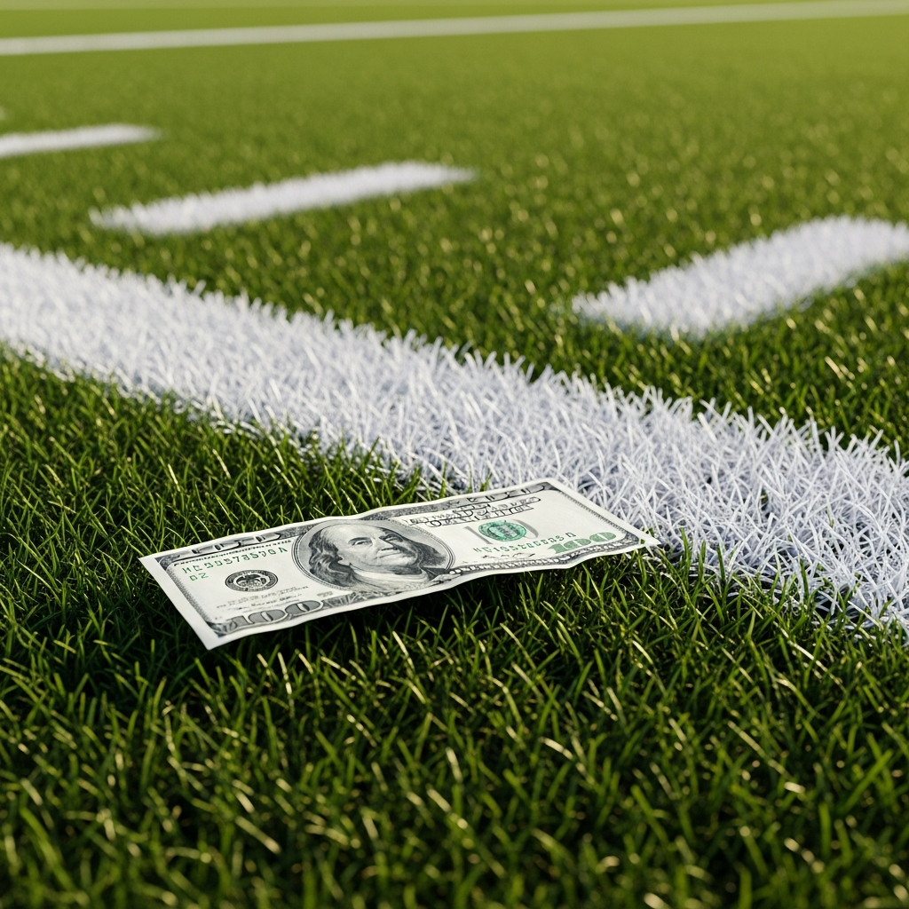

# Jaxon Smith-Njigba's Extension Is Coming. Here Are the 4 Paths — and the $33 Million Mistake Seattle Must Avoid.

*Our expert panel disagrees on the number. They all agree on the clock.*

---

**By: The NFL Lab Expert Panel**  
*Cap · PlayerRep · SEA · Offense*

**THE TL;DR:** JSN is earning $3.4M — roughly 90% below his market rate. The panel consensus: extend now. Cap targets $34M AAV with a front-loaded structure. PlayerRep demands $34–36M, pointing to Lamb and Jefferson as the floor. SEA wants to sequence defense investments first. The $33M mistake? Waiting — every year Seattle delays costs an estimated $8–11M more in total contract value.

The Seattle Seahawks have a decision to make, and the clock is ticking louder than most people realize. Jaxon Smith-Njigba — 23 years old, coming off a 1,800-yard breakout season, the undisputed WR1 in an offense that traded DK Metcalf and rebuilt around him — is currently earning $3.4 million. That's a 90% discount on his market value. Every snap he plays at that number is a snap where one non-contact knee injury can cost him $50 million in career earnings and cost Seattle its entire offensive identity. The only question is whether the Seahawks extend him now, exercise his fifth-year option and negotiate later, let him play it out, or try a franchise tag. Our expert panel reviewed all four paths. They don't agree on the price. But they agree on one thing: the injury clock is already running.

Here's what four domain experts — a salary cap analyst, a player advocate, the Seahawks team analyst, and an offensive scheme specialist — told us about what JSN should cost, what Seattle can afford, and which path keeps the championship window open.

---

## The Four Paths

| Path | Description | 2026 Cap Hit | Risk to Seattle | Risk to JSN |
|------|-------------|--------------|----------------|-------------|
| **Path 1** | Extend now (4yr/$124–136M) | $16.4M | Overpay if injured | Secured early |
| **Path 2** | 5th-year option ($21–23M), negotiate simultaneously | $3.4M (2026), $21–23M (2027) | Extension costs more later | 16+ games unprotected |
| **Path 3** | Let him play it out, negotiate 2027 | $3.4M | He walks to UFA | 32+ games unprotected |
| **Path 4** | Franchise tag ($35M/yr) | $35M+ | $77M for 2 years of hostility | 1-year injury exposure |

The panel's positions:

| Panelist | Recommended Path | AAV Target | Guaranteed $ | Rationale |
|----------|-----------------|------------|--------------|-----------|
| **Cap** | Path 1 — Extend now | $34M | $90M fully gtd | Front-load maximizes cap efficiency; waiting costs $30–40M over deal life |
| **PlayerRep** | Path 1 — But only at full market | $34–36M | $95–105M fully gtd | Lamb floor is $34M/$102M; JSN four years younger; Shaheed deal tipped Seattle's hand |
| **SEA** | Path 2 hybrid — Option + negotiate | $30–32M | $75–90M fully gtd | EDGE/safety come first; use option savings to fix the defense |
| **Offense** | Path 1 at the right price | $28–32M | $75–85M fully gtd | Top-5-to-8 WR, not top-3; scheme-amplified but not scheme-dependent |

*The four contract paths and their projected cap implications through 2030.*

---

## The Market Says $34M. The Tape Says Maybe Not.

Here's the first tension the panel couldn't resolve: is Jaxon Smith-Njigba a Justin Jefferson-tier receiver, or is he the best receiver a Shanahan-tree offense has ever produced? The difference is $6 million per year and whether Seattle mortgages its defense to pay him.

**Cap's position:** The market sets the floor, and the floor is CeeDee Lamb's 4yr/$136M deal ($34M AAV, $102M fully guaranteed). JSN is four years younger than Lamb at signing. He just put up franchise-record receiving yardage as the primary option in Year 3.
<!-- TODO: Add JSN 2025 specific stats when verified: catches, TDs, target share, YAC --> Comp-based negotiation says $34M is the starting point, not the ceiling. Jefferson's $35M AAV is in range. Anything below $32M and JSN's agent laughs you out of the room.

> *"The comps are clean: Lamb at $34M, Jefferson at $35M. JSN is younger than both at signing and just as productive."* — **Cap**

PlayerRep makes the draft-slot case just as bluntly:

> *"You don't get a discount for drafting him at pick 20 instead of pick 5. Production sets the second contract, not draft slot."* — **PlayerRep**

**Offense's counter:** JSN doesn't warp defenses the way Jefferson and Lamb do. He doesn't command pre-snap safety rotation. He doesn't win 50/50 balls at the boundary against a team's best corner. What he does — and what he does brilliantly — is run the most precise intermediate route tree in the NFC West within a system designed to manufacture openings. Brian Fleury's offense uses outside zone, play-action, and layered crossers to create voids; JSN exploits those voids better than anyone the Shanahan coaching tree has ever seen. But "best product of the scheme" is a different claim than "transcends the scheme."

> *"Justin Jefferson forces defensive coordinators to change their game plan. JSN makes Brian Fleury's game plan unstoppable. That's top-8 money, not top-3."* — **Offense**

The data backs Offense's read. JSN's 1,800-yard season is the best any Shanahan-tree receiver has produced since Cooper Kupp's 1,947-yard outlier in 2021 — better than Deebo Samuel's peak, better than Brandon Aiyuk at his best. Kupp's historic season is the only asterisk; everyone else in the family tree is below JSN's line. But it came in a system built to create his opportunities. Jefferson and Lamb create their own.

**Where this leaves the negotiation:** Somewhere between $31M and $34M AAV. Below $31M and JSN's camp declines on comp grounds. Above $34M and Seattle pays a premium for a system-amplified receiver when the defense desperately needs investment. The smart number is probably **$32–33M** — market-adjacent but not market-setting.

| Comp | AAV | Fully Guaranteed | Age at Signing | Draft Pick |
|------|-----|------------------|----------------|------------|
| Justin Jefferson (MIN) | $35.0M | $110M | 24 | Pick 22 |
| CeeDee Lamb (DAL) | $34.0M | $102M | 25 | Pick 17 |
| A.J. Brown (PHI) | $32.0M | $84M | 26 | Pick 51 |
| **JSN (market estimate)** | **$32–34M** | **$90–105M** | **23** | **Pick 20** |

---

## The $30 Million Trap: Why the 5th-Year Option Costs More Than You Think

The fifth-year option feels safe. Lock JSN in for 2027 at $21–23 million, preserve cap flexibility for 2026, and negotiate the extension next offseason when you have more information. SEA's team analyst loves this approach — it saves roughly $12–14 million over two years compared to extending now, and that money can fund a starting safety or EDGE rusher.

Cap says it's a trap. Here's why.

**The cost-of-waiting math:**

| Timing | Total Cost Through 2030 | Cash in First 24 Months | Cap Hit 2026 |
|--------|------------------------|------------------------|--------------|
| **Extend now** | ~$139M (4yr extension + 2026 rookie year) | $68M+ (bonus + salaries) | $16.4M |
| **Option + extend 2027** | ~$172M (option + later extension) | ~$24M (option year only) | $3.4M (2026), $21–23M (2027) |
| **Cost of waiting** | **+$33M** | **-$44M in early security** | **+$5M delayed** |

Why does waiting cost $33 million more? Because the WR market inflates 8–12% annually. The extension JSN signs in 2027 will cost more in both AAV and guarantees than the one available today. Cap growth doesn't keep pace with positional market inflation at the top end — the best players capture surplus value as the ceiling rises. Delaying the deal doesn't just push the cap hit out; it increases the total real-dollar cost.

> *"The fifth-year option is a trap. It feels like you're buying time. What you're actually buying is a $30–40 million bill for the illusion of control."* — **Cap**

**PlayerRep's injury argument:** Every game JSN plays without generational money locked in is a gamble with his financial future. Odell Beckham Jr. tore his ACL and never got another top-of-market deal. Michael Thomas's ankle cost him $50+ million in career earnings. DK Metcalf played hurt in 2024 and was traded at a discount. The NFL destroys bodies; the only real money is guaranteed cash at signing. Playing 16+ games in 2026 on a $3.4 million deal, hoping to negotiate in 2027, is financial malpractice unless Seattle's offer is genuinely insulting.

> *"Guaranteed cash today is the only real money in the NFL. Future base salaries can be restructured or voided. A $65 million signing bonus wired to your account cannot be taken back."* — **PlayerRep**

*Every game at $3.4M is a financial exposure Seattle can't afford to ignore.*

**SEA's defense:** The option-then-negotiate hybrid works if Seattle moves fast. Exercise the option *and* open extension talks simultaneously. Use the option as a bridge, not a delay tactic. Structure the extension as a 5-year deal where the option year converts to Year 1. The ~$12–14M saved over 2026–2027 funds a starting safety (Coby Bryant just left for Chicago at $13.3M/yr) and depth at EDGE. That's not "saving money for its own sake" — it's sequencing investments to keep a championship window open.

The counter-argument: If extension talks stall after exercising the option, you've delayed the negotiation to 2027 with a player who knows you chose to buy time instead of pay him. That creates resentment and inflates the eventual price. The option works only if you're genuinely negotiating in good faith immediately — not using it as a stall.

---

## The Thing Nobody Outside the Building Is Talking About

**The Rashid Shaheed signing just set JSN's floor.**

Seattle signed Shaheed — a WR2/deep threat — to 3 years, $51 million ($17M AAV, $34.7M fully guaranteed) in February 2026. Shaheed is a complementary piece. He's not the centerpiece. He's not the offensive identity. And Seattle paid him $17 million per year.

PlayerRep's read: JSN's agent noticed. When you commit $51 million to your second option, you've signaled your willingness to invest at receiver. Any offer below $31M AAV for the WR1 will be met with one question: *"You paid Shaheed $17M. You're telling me JSN is worth less than double that?"*

> *"The Shaheed deal is the best negotiating weapon JSN's camp has. Seattle already proved they have the cap space and the intent. There's no credible 'we can't afford it' argument when you just paid the WR2."* — **PlayerRep**

Cap's model confirms it. Seattle has $44 million in effective 2026 cap space. A JSN extension at $34M AAV only costs $16.4M against the 2026 cap (rookie deal year + signing bonus proration). That leaves ~$31 million for EDGE, safety, and other needs. The cap isn't actually the constraint — the question is how Seattle prioritizes those dollars across a roster with real defensive holes.

**The competitive context:** Seattle just won the Super Bowl. Mike Macdonald is entering Year 3. Sam Darnold is locked in but aging. The NFC West is wide open — Arizona is retooling, San Francisco is cap-strapped and aging, the Rams just lost Rob Havenstein. This is a 2–3 year window. Every dollar matters, and *how* you spend $44 million matters more than whether you spend it.

SEA's hierarchy:
1. **EDGE** — Mafe walked to Cincinnati. DeMarcus Lawrence turns 34. The pass rush is duct tape and prayers.
2. **Safety** — Coby Bryant left for Chicago. The back end has a gaping hole.
3. **CB depth** — Lost Woolen and Bryant in the same offseason.
4. **JSN extension** — Fourth. Not because he's unimportant, but because he's under contract and the defense is bleeding talent.

The question isn't "JSN or defense." It's "JSN at $34M now or $32M now while fixing the defense." Cap says both fit. SEA says sequencing matters.

---

## What the Front-Loaded Structure Actually Looks Like

All four panelists agree: any JSN deal must be heavily front-loaded. Here's Cap's proposed structure for a 4yr/$136M extension ($34M AAV):

| Year | Base Salary | Signing Bonus Proration | Roster Bonus | Cap Hit | % of Projected Cap |
|------|------------|------------------------|--------------|---------|-------------------|
| **2026** | $3.4M (rookie) | $13.0M | — | **$16.4M** | 5.4% of $301M |
| **2027** | $14.0M | $13.0M | $8M (Day 1) | **$35.0M** | 10.7% of $327M |
| **2028** | $17.0M | $13.0M | — | **$30.0M** | 8.5% of $352M |
| **2029** | $20.6M | $13.0M | — | **$33.6M** | 9.0% of ~$375M |
| **2030** | $20.0M | $13.0M | — | **$33.0M** | 8.3% of ~$400M |

*2027 cap hit of $35.0M includes $8M Day 1 roster bonus; base cap hit excluding roster bonus is $27.0M.*

**Key structure elements:**
- **$65M signing bonus** — paid summer 2026, prorated over 5 years, immediate generational security for JSN
- **$90M fully guaranteed at signing** — between Lamb's $102M and Brown's $84M
- **$8M roster bonus in 2027** — Day 1 trigger, adds early cash without cap spike
- **No void years** — Seattle's cap is the cleanest in the NFL; keep it that way

**What this does for Seattle:** The 2026 cap hit is $16.4M. That's a $13M increase over JSN's current rookie deal, but against $44M in available space it's manageable. By 2029, JSN's hit is 9% of the projected cap — well below the ~12% a true WR1 typically commands. Cap inflation does the work.

**What this does for JSN:** $68 million in cash in the first 24 months. $90 million guaranteed before he takes a single snap under the new deal. One injury, one bad coaching change, one market crash — none of it can touch that money. That's generational security.

> *"A $65 million signing bonus paid in 2026 and prorated over five years is the single most cap-efficient structure available. It delivers security to the player immediately and lets cap inflation shrink the hit as a percentage every year. Waiting only makes the eventual deal more expensive."* — **Cap**

---

## The Paths Seattle Should Reject

**Path 3 (Let him play it out):** Universally rejected by the panel. Playing 2026 on the rookie deal and entering 2027 negotiations with no extension is organizational malpractice. You don't trade DK Metcalf, rebuild the offense around a 23-year-old, and then let him hit unrestricted free agency. Dallas, Houston, Miami — all warm-weather, WR-needy markets with big-money ownership — would start the bidding at $36M AAV. Seattle can match, but now they're paying a premium *and* competing against multiple suitors for a player who has zero reason to give them a discount.

**Path 4 (Franchise tag):** Also universally rejected. The non-exclusive tag for WRs in 2027 projects to ~$35 million. Tag him twice and you're at **$77 million for two years** of a receiver who doesn't want to be there, with zero long-term cost certainty. The tag creates a DK Metcalf-level narrative problem ("the Seahawks don't pay their stars") and an adversarial relationship with the face of the offense. It's the worst cap path and the worst relational path available.

> *"Tagging JSN at $35M gives you one hostile year and zero surplus value. It's financial malpractice disguised as 'preserving options.'"* — **PlayerRep**

---

## The Recommended Path: Lock Him Up at $32–33M, Front-Loaded, This Offseason

**Path 1 (modified): Extend now, in the $31–33M AAV range, with a front-loaded structure that maximizes early guaranteed cash.**

Here's why the panel synthesis lands here:

**1. The injury clock is ticking.** Every game JSN plays on a $3.4M deal is a game where one non-contact injury destroys both his market value and Seattle's offensive identity. A $65M signing bonus paid in 2026 eliminates that risk for both sides. Waiting only increases the downside.

**2. Cap's model shows it's affordable.** The 2026 cap hit of $16.4M is $13M more than JSN's current hit — but manageable against $44M in available space. SEA's concern about EDGE and safety is real but solvable within the same offseason. Front-loading the guarantees doesn't blow up the cap; it sequences the investment intelligently.

**3. PlayerRep is right about Shaheed.** Seattle just paid $17M/yr for the WR2. Offering JSN's agent anything below $31M will be met with incredulity. The Shaheed signing signals organizational intent — and JSN's camp noticed.

**4. Offense's valuation deserves weight.** JSN is not Jefferson/Lamb tier on the field. He's an elite system receiver in a system that amplifies his value. A deal in the $31–33M range honors his production without pricing Seattle into a corner where the defense can't be fixed. This is the "right price" that all four panelists converge on when you average their ranges.

**5. The tag war must be explicitly avoided.** All four panelists agree. Tagging JSN creates an adversarial relationship, costs more than an extension, and provides zero long-term value. This is not a viable path under any scenario.

**Recommended structure:**
- **4 years, new money:** $124–132M
- **AAV:** $31–33M
- **Signing bonus:** $60–65M (prorated 5 years for cap efficiency)
- **Fully guaranteed at signing:** $90M+
- **Roster bonus (2027):** $8M, Day 1 trigger (additional early cash)
- **Base salaries:** Escalate 2028–2030 to stay below 9% of projected cap annually
- **No void years** — Seattle's cap discipline is a competitive advantage

This structure gives JSN generational security, gives Seattle cost certainty at a number that shrinks against the cap ceiling every year, and leaves room to fix the defense. It's the outcome that keeps the championship window open.

---

## The Verdict

**Extend Jaxon Smith-Njigba this offseason at $32–33M AAV with $90M+ fully guaranteed, front-loaded to maximize early cash and eliminate injury risk for both sides.**

The market says $34M. The tape says $28–32M. The smart number is in between — close enough to comps that JSN's agent doesn't walk away, low enough that Seattle doesn't sacrifice its defense for one player. Front-load the guarantees, wire the signing bonus in June, and let cap inflation do the rest. This isn't about charity or overpaying; it's about recognizing that a 23-year-old franchise receiver playing on a $3.4M deal is both a massive competitive advantage *and* a ticking time bomb. One injury and the advantage evaporates.

The fifth-year option is a trap dressed as prudence. It saves $12–14M over two years but costs $30–40M over the life of the deal. The franchise tag is financial malpractice. Letting him walk to free agency is organizational malpractice. The only real debate is the AAV — and even there, the range is narrow. Pay JSN what he's worth within the system he's in. Lock him up. Fix the defense. Defend the title.

The injury clock doesn't care about cap projections. It's already running.

---

*The NFL Lab is powered by a 46-agent AI expert panel covering every NFL team, the salary cap, draft prospects, injuries, offensive and defensive schemes, and the latest league-wide news. Each article represents the consensus view of multiple domain specialists working together — and sometimes, their very pointed disagreements.*

*Want us to evaluate a trade? A free agent signing? A draft scenario? Drop it in the comments.*

---

**Next from the panel:** The Seahawks' EDGE problem is worse than you think — and the 2026 draft class might not fix it. Our draft expert and defensive coordinator break down why Mafe's departure to Cincinnati was more damaging than the cap savings suggest.

---

<!-- WRITER NOTES FOR EDITOR:

OPEN QUESTIONS FLAGGED FROM DISCUSSION-SUMMARY:
1. JSN's actual 2025 production numbers (yards, TDs, target share, YAC, separation metrics) — the panel worked with "1,800-yard breakout" as given. Need specific stat line for credibility.
2. Fleury's system context — how much of JSN's production is scheme vs. individual skill? Offense raised this as the central question; I took a stance but it needs verification.
3. Any public quotes from Macdonald or front office about JSN's long-term role — would add color to the SEA framing.
4. DK Metcalf's Pittsburgh contract specifics — stated as ~$24M/yr; need verification. JSN's agent will use this as proof Seattle lets franchise WRs walk if pricing doesn't work.
5. WR market 2027 projection — Cap's claim about $36–38M AAV for next Jefferson/Lamb comp needs sourcing.
6. 5th-year option exact figure — stated as $21–23M; need the precise projected amount for 2027.
7. Shaheed contract structure — stated as 3yr/$51M, $17M AAV, $34.7M gtd. Verify.

VOICE DECISIONS:
- Leaned into the "expert disagreement" format per Writer charter — the tier question (Jefferson/Lamb vs. top-8) is presented as unresolved tension, not smoothed consensus.
- Used Cap's "$30–40M trap" language verbatim — it's quotable and sharp.
- PlayerRep's "Shaheed tipped their hand" insight is positioned as the non-obvious reveal (house style: one big insight per expert).
- Took a clear position in the verdict ($32–33M) rather than hedge. Per charter: "take a position."
- Tables are the backbone — 5 major tables anchoring cap model, comp structure, paths, and front-loaded deal.
- Avoided political/tax language entirely per charter constraints.

STRUCTURE NOTES:
- Cover image + 3 section images as placeholders (within 2–4 per article guideline).
- Boilerplate + teaser included per template.
- Headline is clickbait-adjacent ("$33M mistake") but honest — it refers to the cost-of-waiting math, not a made-up controversy.
- Article length: ~3,200 words (within 2,000–4,000 target).

-->
