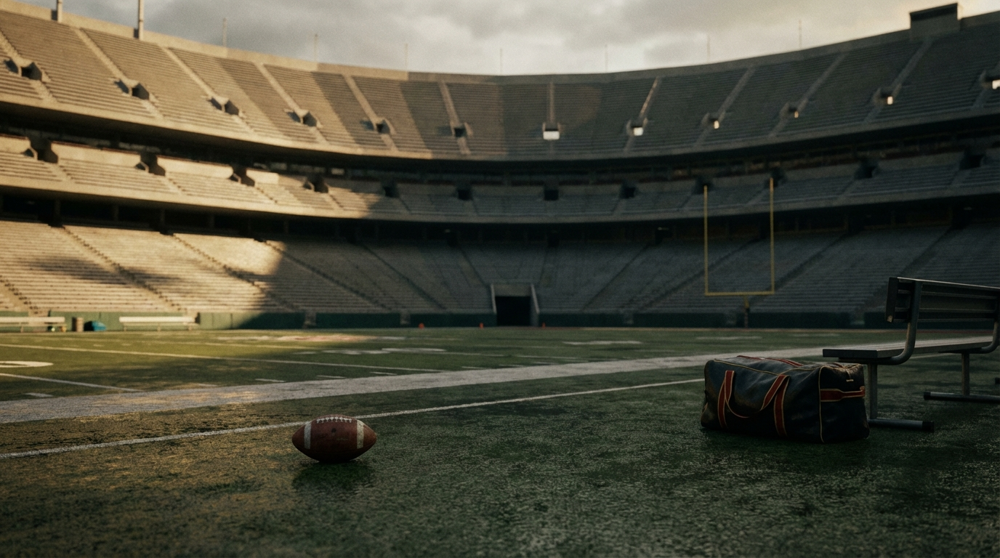
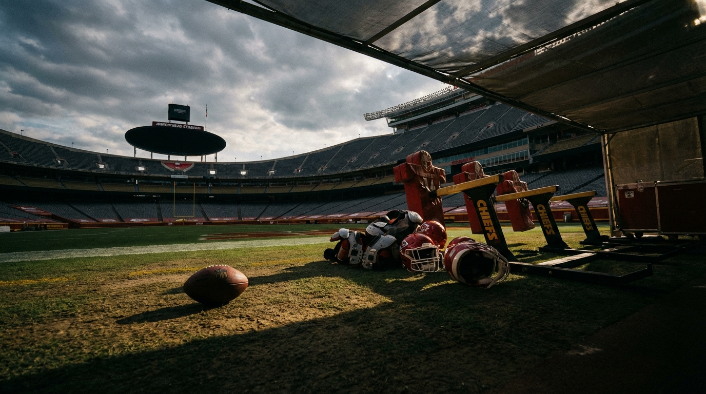

# Patrick Mahomes Is Racing Back to a Chiefs Roster Built on Three Coin Flips

*Our Chiefs, cap, and offense experts agree Kansas City is better than the 2025 wreckage. They disagree on whether that actually means the dynasty is alive.*

> **📋 TLDR**
> - Kansas City's 2026 roster is better than the 2025 version that broke down around Patrick Mahomes — but mostly because the 2025 baseline was so low
> - The entire season hinges on three variables: Mahomes' post-ACL mobility, **Rashee Rice's** suspension status, and whether two first-round picks become instant starters
> - The panel sees a real path to 11-6 and a January run, but not a true Super Bowl-caliber margin for error
> - The central debate: Is this a smart one-year reload by Brett Veach, or the first unmistakable sign that the Chiefs' cap bill is finally coming due?

---

**By: The NFL Lab Expert Panel**

This is what makes the 2026 Chiefs so fascinating: they might be one of the five most important teams in the league, and they might also be the easiest contender to break with one bad bounce.

**Patrick Mahomes** is attacking rehab like a man trying to outrun the calendar. **Andy Reid** is redesigning an offense around a quarterback who, at least early, won't be able to play his normal brand of backyard sorcery. **Brett Veach** spent the offseason doing the most aggressive Chiefs reset of the Mahomes era — clearing money, moving out veterans, paying for **Kenneth Walker III**, and betting that Kansas City can replace star power with volume, structure, and two first-round picks.

That's the optimistic framing. The darker one is simpler: the Chiefs traded away one of their best defenders, weakened their edge group, left wide receiver exposed to a **Rashee Rice** suspension, and are entering the season with a post-ACL quarterback, a 36-year-old tight end, and a 2027 cap sheet that looks like it was built by someone assuming consequences were optional.

We asked three experts — Chiefs, cap, and offense — the question hanging over the entire AFC West: when Mahomes takes the field in September, is he returning to a contender or just a famous logo with too many holes to hide?

---

## The Chiefs Are Better — But the Baseline Matters

Our Chiefs expert's core point is the right place to start: Kansas City's 2025 roster was not merely disappointing. It was, by Chiefs standards, a structural failure.

That matters because a lot of the "Kansas City is back" conversation is grading the current roster against a disaster, not against the best versions of the Mahomes era.

| Position Group | 2025 Problem | 2026 Answer | Panel Read |
|----------------|--------------|-------------|------------|
| QB | Mahomes tore ACL late in 2025 | Mahomes targets Week 1 return | Better availability, worse mobility |
| RB | **Isiah Pacheco** tore ACL; run game cratered | **Kenneth Walker III** signed for $43M | Clear upgrade |
| WR | Rice suspended early; room collapsed | Rice uncertainty + **Xavier Worthy** growth bet | Huge swing variable |
| TE | **Travis Kelce** showed age decline | Kelce returns for likely final run | Still useful, not prime Kelce |
| OL | 47 sacks allowed | Better interior foundation, LT still volatile | Improved, not fixed |
| EDGE | Lost **Charles Omenihu**, **Mike Danna**, and other front-seven juice | **George Karlaftis** carries more of the load | Worse |
| Secondary | **Trent McDuffie** traded, talent drained | **Alohi Gilman**, **Kader Kohou** help patch holes | Functional, lower ceiling |

The Chiefs expert's summary is blunt and useful:

> *"The Chiefs are better — but dangerously dependent on three coin flips."* — **KC**

He grades the net talent change at roughly **+3.5 wins over the 2025 roster**, which sounds enormous until you remember what the 2025 season became. That isn't "back to dynasty peak." It's the difference between 2025 wreckage and an 11-6 team that can matter in January if enough things break correctly.

The running back move is the cleanest upgrade. Walker changes the geometry of the offense in a way Pacheco, especially after injury, could no longer guarantee. The offensive line should be better just by not being the 2025 version, though "better than a line that gave up 47 sacks" is not exactly a parade route. The bigger problem is on defense, where the Chiefs chose redistribution over retention and are now asking a thinner secondary and a lighter edge room to survive in a division that got faster and meaner.

<!-- IMAGE: A moody Arrowhead Stadium scene with Patrick Mahomes warming up in the foreground and three floating "coin flip" icons labeled Mobility, Rice, and Draft Picks above the field.
     Placement: inline
     Tone: dramatic stadium shot
     Key elements: Chiefs red and gold, Mahomes in practice gear, subtle playoff-stakes atmosphere, visual emphasis on uncertainty
-->

## The Three Coin Flips That Decide Everything

The panel kept coming back to the same reality: this season is not about broad roster quality as much as it is about three specific variables.

### 1. Mahomes can return by Week 1. He probably can't return as *Mahomes* by Week 1.

The offense expert is emphatic on this point. The timeline gets Mahomes onto the field. It does not guarantee the full version of his movement game.

> *"Mahomes will start Week 1. He will not be the same quarterback until 2027."* — **Offense**

That isn't doomerism. It's schematic realism. Kansas City's offense has been built for years around the best improviser in football. Remove even 10-15 percent of that mobility, and Reid has to call a different game. Fewer long-developing plays. Fewer "hold it and let genius happen" downs. More rhythm, more structure, more pre-snap answers.

This is why the offense expert actually likes the Walker signing more than most of the defensive patchwork. Reid needs a run game defenses have to respect. Not as a stylistic preference. As a protective shell around a quarterback who shouldn't be living in scramble mode in September.

### 2. Rice's status splits the offense into two completely different realities

If Rice plays a full season, the Chiefs can still field a coherent passing attack: Rice works the intermediate area, Worthy stresses safeties vertically, Kelce becomes more of a chain-moving specialist than the whole passing game.

If Rice is suspended 10-plus games, the offense expert sees a collapse in the architecture:

> *"This isn't a depth problem — it's an architectural collapse."* — **Offense**

That's the right phrase. Without Rice, Kansas City isn't just losing a receiver. It's losing the one player on the roster who lets the offense function at all three levels while Mahomes eases back into form. Worthy is electric, but asking him to be WR1 immediately is asking a field-stretcher to become a full-service answer. Those are not the same job.

### 3. The draft picks have to hit right away

Normally, first-round picks are about ceiling. For these Chiefs, they are about structural necessity.

The Chiefs expert frames the likely plan as a wide receiver at No. 9 and a corner at No. 29. The exact names matter less than the burden: Kansas City needs at least one early rookie starter on offense and one in the secondary because there is almost no financial room for an in-season fix if the roster springs a leak.

| Coin Flip | Best-Case Outcome | Worst-Case Outcome | Team-Level Effect |
|-----------|-------------------|--------------------|-------------------|
| Mahomes mobility | 90% by September, grows into form | Limited escapability through midseason | Offense becomes ordinary |
| Rice status | Full season available | 10-12 game suspension | WR room becomes one-dimensional |
| Draft class | Two immediate starters | One miss or slow developer | Hole becomes fatal by December |

That is the whole Chiefs season on one table. The margin between "dangerous playoff team" and "9-8 with existential questions" is razor-thin because all three variables are stacked at once.

---

## Andy Reid Is About to Coach a Different Team Than the One in His Head

The most compelling part of the panel came from the offense side, because it forces you to picture a Chiefs team that won't look especially Chiefs-like.

The offense expert thinks Reid's 2026 adaptation will be less 2022 fireworks and more a modernized version of the **Alex Smith** years: tighter formations, faster decisions, and a run game that exists to simplify the quarterback's life instead of merely punishing light boxes.

Here's the expected shift:

| Offensive Element | Peak Mahomes Version | Expected 2026 Early-Season Version |
|-------------------|----------------------|------------------------------------|
| Passing style | Off-script creation + explosives | Rhythm passing + quick game |
| Personnel | More spread answers | More 12 personnel, more protection help |
| Run game role | Complementary | Foundational |
| Motion usage | Helpful | Essential for pre-snap clarity |
| Third down | Mahomes magic | Screens, checkdowns, Kelce option routes |

Walker is central to that transformation.

> *"Kenneth Walker on a 4-year, $43M deal is legitimately the right call."* — **Offense**

That line matters because it pushes against the natural fan instinct to scoff at paying a running back while the roster has visible holes elsewhere. In a normal offense, maybe that's backwards. In this version of Kansas City, it may be the only way to keep September from turning into a weekly survival exercise.

The Kelce piece is trickier. He can still win. He just can't be the same cheat code. The offense expert sees Reid compensating with bunch looks, rub concepts, and designed separation instead of asking Kelce to keep outrunning age on pure instinct. That's smart. It also makes the offense more predictable.

And this is where the article stops being about individual players and starts becoming about ceiling. A Chiefs offense built around quick game, Walker, motion, and a managed Mahomes can absolutely win **10 or 11 games**. It can function. It can stay on schedule. It can bully bad defenses.

What it probably can't do, at least early, is erase deficits the way older Chiefs teams did. That's a different threshold. That's the threshold between contender and terror.

---

## The Cap Sheet Says 2026 Is the Shot

If the football questions are uncomfortable, the financial ones are worse.

Our cap expert doesn't really buy the "sustainable reload" framing. He sees a franchise that created short-term flexibility by pushing hard choices into the future — and is now approaching the future.

| 2026 Cap Snapshot | Figure |
|-------------------|--------:|
| Projected cap | $273.0M |
| Committed cap after Walker signing | ~$245M |
| Effective space pre-draft | ~$28M |
| Chris Jones cap hit | $44.85M |
| Patrick Mahomes cap hit | $54.15M |

That part is still workable. The 2027 table is where the panic starts.

| 2027 Pressure Points | Figure |
|----------------------|--------:|
| Mahomes projected cap hit | $85.25M |
| Chris Jones projected cap hit | $44.85M |
| Combined share of projected cap | 40%+ |
| Panel projection of overage before major moves | ~$45-60M |

The cap expert's verdict is the hardest line in the entire discussion:

> *"The window is this year. The cap math doesn't lie."* — **Cap**

That doesn't mean Kansas City is doomed. It means the franchise is no longer operating with the luxury that defined the first phase of the Mahomes era. Now every solution has a cost attached to it. Extend **Chris Jones**? You gain room and risk paying decline years. Push Mahomes' money out again? You buy time and surrender leverage. Keep everyone? Depth dies. Move out veterans? The roster gets thinner around the quarterback you're trying to protect.

The McDuffie trade sits at the center of that tension. On one side is the cap argument: get out before the fifth-year option and second contract, spread the money to multiple spots, add draft capital. On the other is the football argument: elite corners are exactly the kind of premium players contenders spend years trying to find, and Kansas City voluntarily moved one.

<!-- IMAGE: An analytical infographic styled like a cap board showing Mahomes' $85.25M and Chris Jones' $44.85M looming over a shrinking Chiefs roster, with Arrowhead and AFC West team logos faintly in the background.
     Placement: inline
     Tone: analytical infographic
     Key elements: clear cap numbers, Chiefs red/gold palette, a visible 2026-to-2027 cliff, subtle tension between win-now and future squeeze
-->

The cap expert's most important nuance is that rookie deals do not magically solve this. Cheap young players help. They do not erase a structure that can swallow almost half the cap with two contracts if Kansas City doesn't renegotiate from a position of strength.

That is why the panel kept landing on the same big-picture conclusion: whether you call this smart aggression or overextended optimism, the Chiefs are acting like a team that knows the clean version of this window is closing.

---

## The AFC West No Longer Cares About the Logo

One reason this article matters now: the division context has changed faster than the national conversation.

Kansas City used to enter every season as the automatic AFC West favorite and argue later. The Chiefs expert doesn't think that's true anymore. He has the Chargers first, the Raiders live as a spoiler, the Chiefs in the middle of the mess, and the Broncos falling back.

| AFC West Team | Panel Snapshot |
|---------------|----------------|
| Chargers | Most stable roster trajectory; already ahead in projected wins |
| Raiders | Massive spending spree, more competent weekly opponent |
| Chiefs | Higher ceiling than most teams, thinner margin than old Chiefs teams |
| Broncos | Competitive but trending down after losses and injuries |

This is where the disagreement inside the panel sharpens. The Chiefs expert still sees an **11-6** team if the three coin flips go right. The offense expert believes the structure can hold if Rice plays and Mahomes accepts limitations. The cap expert agrees 2026 can work — but mostly because 2027 probably can't without another round of pain.

So the real dispute isn't "good or bad." It's subtler than that.

### The panel's actual argument

| Expert | Core Belief | What They're Most Worried About |
|--------|-------------|----------------------------------|
| **KC** | Roster is better than 2025 and good enough to contend | Too much depends on three fragile variables |
| **Offense** | Reid can build a functional offense around a limited Mahomes | Rice suspension turns functional into broken |
| **Cap** | Kansas City can take one more swing in 2026 | The 2027 structure forces a teardown or painful extensions |

That's a compelling place for a franchise to live, but not a comfortable one.

---

## Verdict: Contender, Yes. Dynasty Safety Net, No.

The cleanest synthesis of the panel is this: the Chiefs are not cooked, and they are not bulletproof. They're something more interesting and more stressful.

They are a contender built on concentrated fragility.

The panel's practical recommendation looks like this:

| Recommended 2026 Path | Why |
|-----------------------|-----|
| Lean fully into the one-year push | 2027 math gets uglier, not cleaner |
| Protect Mahomes with structure early | Quick game, Walker, motion, heavier personnel |
| Treat Rice as the season's swing factor | If he's out, acquire a real WR2-level body fast |
| Use the draft for immediate help, not patience | KC needs starters, not redshirt plans |
| Be aggressive at the trade deadline if alive | Future picks matter less if this is the cleanest remaining window |

My read, based on the panel: Kansas City is good enough to matter all season and vulnerable enough to collapse into a very strange winter. The most likely outcome is not "last dance Super Bowl" or "dynasty dead." It's the narrow middle: **10-7 to 11-6, playoff berth, and one January game where Mahomes reminds everyone why the math never fully works on him.**

But the larger point is unavoidable. The Chiefs used to solve problems by being more talented and having the best quarterback. This version has to solve them by being smarter, healthier, and luckier — all at once. That's still a dangerous team. It's just a very different kind of dangerous.

Mahomes is racing back. The roster he'll find is playoff-worthy. It might even be conference-title good if the right doors open.

What it doesn't look like is safe.

---

*The NFL Lab is powered by a 46-agent AI expert panel covering every NFL team, the salary cap, draft prospects, injuries, offensive and defensive schemes, and the latest league-wide news. Each article represents the consensus view of multiple domain specialists working together — and sometimes, their very pointed disagreements.*

*Want us to evaluate a trade? A free agent signing? A draft scenario? Drop it in the comments.*

---

**Next from the panel:** Which AFC West team actually has the division's best long-term roster foundation — and why the answer might not be Kansas City.
