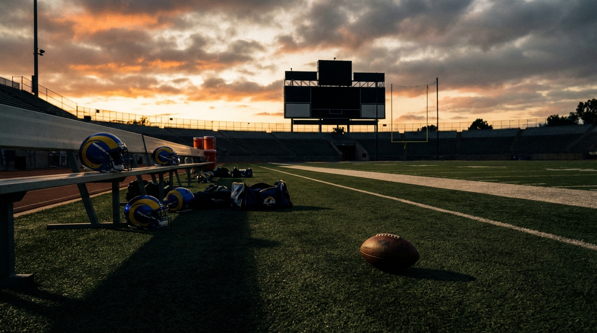
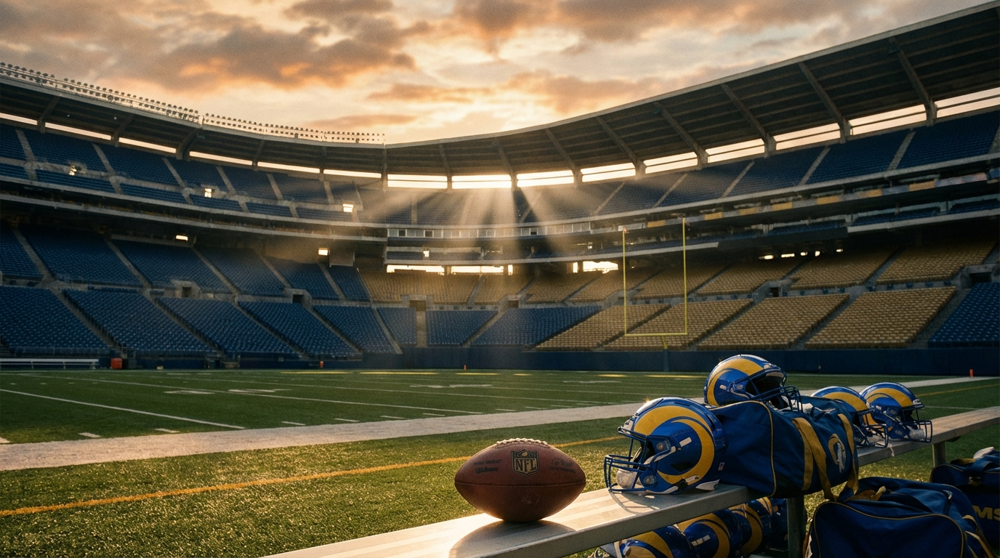

# The Rams Spent $160 Million on Their Secondary. Now the Real Debate Begins.

*Four experts agree: it's Super Bowl or bust in 2026. They just can't agree on what to do with the #13 pick.*

> **📋 TLDR**
> - The Rams' $160M+ secondary overhaul (McDuffie $124M, Watson $51M, Curl $36M) is a scheme unlock, not a band-aid — it fixes the blitz-man marriage that broke in the NFC Championship
> - Cap was built to peak in 2026: ~$40–44M in space now, but just ~$3M projected in 2027 — this is a one-year window by design
> - All four panelists agree on Path 1 (Full Send) — the only debate is whether #13 should be an offensive tackle to protect Stafford or an edge rusher to complete the defense
> - The Kingsbury hire isn't random — McVay is building a coaching staff specifically to beat the team that just eliminated them

---

**By: The NFL Lab Expert Panel**

Three games against Seattle in 2025. Two losses — including an overtime heartbreaker and the NFC Championship. The Los Angeles Rams scored 27 points in that conference title game, watched Matthew Stafford deliver another MVP-caliber performance, and still went home. The offense wasn't the problem. The defense surrendered 346 passing yards because the corners couldn't hold up on islands, and every Chris Shula blitz became a suicide mission against Geno Smith's crossers and dig routes.

So the Rams did what the Rams do. They traded a first-round pick to Kansas City for Trent McDuffie, signed him to a 4-year, $124 million extension making him the highest-paid cornerback in NFL history, added Jaylen Watson at CB2 for $51 million, re-signed Kam Curl for $36 million, and told the rest of the league exactly what they think about draft capital.

This is Stafford's last dance. He turns 39 during the 2026 season. Davante Adams is 34. The cap cliff arrives in 2027 like a scheduled demolition. The Rams know all of this. They built the cap structure to peak right now — and they're betting $160 million in secondary investment that the mechanism that broke in January can become the mechanism that wins a championship in February.

We convened four experts — the Rams beat analyst, our salary cap specialist, a defensive scheme coordinator, and a draft strategist — to evaluate whether this all-in play is genius or the "F*** Them Picks" philosophy taken past the point of no return. What we found: rare unanimous agreement on the path, a sharp disagreement on one critical pick, and a coaching hire that reveals more about McVay's plan than any contract.

---

## The 2021 Comparison Everyone Gets Wrong

The easy narrative maps this roster onto the 2021 Super Bowl team. The bones are similar: an aging elite quarterback playing the best football of his career, a splashy receiver acquisition (OBJ then, Adams now), a trade-acquired star corner (Jalen Ramsey then, McDuffie now), and a front office with an institutional allergy to draft picks.

Our Rams expert dismantled the comparison with one name: Aaron Donald.

> *"The 2021 team had Aaron Donald. That defense generated interior pressure that made Ramsey's job easier and masked scheme limitations. This team has Jared Verse, who's very good, but Verse is an edge rusher — he doesn't collapse the pocket the way Donald did."*

That distinction drives the entire offseason logic. Without a Donald-caliber interior wrecker, the Rams *need* an elite secondary. The 2021 defense could play single-high behind Donald's disruption. This defense has to earn its pressure honestly, which means the corners must survive in extended coverage. The McDuffie investment isn't luxury spending — it's structural necessity.

| Category | 2021 Super Bowl Rams | 2026 Rams |
|----------|---------------------|-----------|
| QB | Stafford (age 33) | Stafford (age 38) |
| WR corps | Kupp + OBJ (mid-season add) | Nacua (24) + Adams (34) |
| CB1 | Ramsey (trade acquisition) | McDuffie (trade acquisition) |
| Interior pressure | Aaron Donald (All-Pro) | No equivalent |
| Edge rusher | Von Miller (mid-season add) | Jared Verse |
| Cap strategy | Multiple firsts traded | Multiple firsts traded |
| Window | 1 year (proved correct) | 1 year (TBD) |

The parallel is real. So is the gap. The 2021 Rams had the most disruptive defensive player in modern history. The 2026 Rams are betting that scheme and secondary can replace what raw interior dominance gave them.

---

## The Cap Was Built for This Moment

Our cap analyst's assessment was blunt: the money *supports* all-in because the Rams *designed* it that way.

Stafford's $48.26 million cap hit consumes 16% of the $301.2 million salary cap — the second-highest quarterback allocation among competitive rosters behind only Tua Tagovailoa's $56.3 million in Miami. That leaves 84 cents of every cap dollar for the other 52 roster spots.

| Year | Projected Cap | Est. Space | Key Dynamic |
|------|--------------|------------|-------------|
| 2026 | $301.2M | ~$40–44M | Window open. Functional flexibility. |
| 2027 | $327.0M | **~$3M** | Cliff. Secondary eating $55M+. Dead money accelerates if Stafford retires. |
| 2028 | $352.0M | ~$150M | Relief — but only via teardown. McDuffie still owed $35M+. |

The cliff is 2027, not 2028. That distinction matters. The relatively clean $8.6 million in 2026 dead money masks what's coming: accelerated charges from any restructures plus the full secondary overhaul hitting simultaneously. With roughly 30 players under contract and $3 million in projected space, the Rams will need painful cuts just to field a 2027 roster.

<!-- IMAGE: Cap trajectory visualization showing the Rams' 2026-2028 financial cliff
     Placement: inline
     Tone: clean editorial infographic with urgency coloring
     Key elements: Three-year cap space bar chart ($40-44M green in 2026, $3M red in 2027, $150M gray in 2028 with "teardown" label), Stafford's $48.26M hit highlighted, secondary contracts ($60M total) shown escalating year-over-year, Rams blue/gold color scheme -->

### Don't Restructure Stafford

The temptation is there: converting base salary to signing bonus could free $8–12 million in 2026 by pushing money into 2027 via void years. Our cap expert was emphatic — don't do it.

> *"The $8–12M in 2026 relief isn't worth poisoning 2027 further. If $40–44M isn't enough, another $10M won't change the outcome."*

Any pushed money accelerates as dead money the moment Stafford retires. With the Rams already projected at ~$3 million in 2027 space, a restructure converts a manageable cliff into an unclimbable wall.

### The Synchronized Cap Bomb

Here's the number that should terrify Rams fans looking past February: McDuffie ($31M AAV), Watson ($17M), and Curl ($12M) total roughly $60 million — about 20% of the cap devoted to the secondary alone. The real problem isn't the amount. It's the timing.

All three contracts are new, meaning cap hits are low in 2026 but escalate simultaneously in 2027–2028. Every secondary contract gets more expensive in the exact year Stafford either retires (dead money) or declines (sunk cost).

> *"Teams that stagger contract timelines survive windows. The Rams stacked theirs. The money says 2026 or bust — and the Rams built it that way on purpose."*

---

## The Secondary Fix Isn't a Band-Aid — It's a Scheme Unlock

Our defensive scheme expert drew a critical distinction: the NFC Championship didn't expose a talent gap. It exposed a schematic failure.

Chris Shula's defense runs aggressive pressure at roughly a 30% blitz rate, paired with man-coverage looks behind it. When your corners can't hold up on an island, every blitz becomes a free release for the quarterback. Seattle exploited that marriage relentlessly — Geno Smith's intermediate game carved up Cover-3 looks with crossers and dig routes because the pre-McDuffie, pre-Watson corners couldn't match.

McDuffie fixes the *mechanism*, not just the stat line. His route anticipation allows him to play "match" technique — reading the receiver's release and matching the route like man coverage while maintaining zone responsibilities. That versatility lets Shula keep his pre-snap disguise game intact. Offenses can't sniff out man vs. zone based on McDuffie's alignment, because he executes both at an elite level.

The downstream effects ripple through the entire defense:

| Before McDuffie | After McDuffie |
|-----------------|----------------|
| Blitz = coverage void | Blitz = island coverage holds |
| Safeties locked in deep coverage | Curl triggers downhill as blitz weapon |
| Verse hurries (no time to finish) | Verse hurries → sacks (3+ sec coverage) |
| Offenses read man/zone pre-snap | Pre-snap disguise restored |

> *"McDuffie's ability to survive on an island for 3+ seconds is functionally equivalent to adding another pass rusher — it turns Verse's 0.5-second speed-to-pressure advantage into a full sack instead of a hurry. The Rams didn't just buy a cornerback. They bought time — and in this scheme, time is pressure."*

### The Gel Timeline Problem

But our defense expert also sounded a caution. Secondary units that import three or more new starters rarely hit their ceiling in Year 1. Communication breakdowns in pattern-match zone, busted rotation assignments, trust issues in off-coverage — these take reps to iron out. The 2021 Rams secondary (Ramsey, Williams, Long, Rapp) didn't truly click until Week 8.

The projection: league-average by midseason, potentially top-10 by December. That's enough for a championship run if the front holds up — but don't expect an elite unit in September. If the Rams need to beat Seattle in January, this secondary must gel faster than recent history suggests.

One factor working in their favor: the Kansas City connection. McDuffie and Watson both played under Steve Spagnuolo's man-heavy system in Kansas City. Shared defensive language and technique could accelerate the integration timeline — though that's a hypothesis, not a guarantee.

---

## The #13 Pick: Where the Unanimity Breaks

All four panelists arrived at the same destination: Path 1, Full Send. No hedging, no trade-back, no quarterback at 13. The consensus held across every other question. Then came pick #13, and the agreement shattered.

<!-- IMAGE: Draft board visualization showing the OT vs EDGE debate at #13
     Placement: inline
     Tone: split-screen editorial graphic with tension framing
     Key elements: Left side shows Monroe Freeling (OT, Georgia) with offensive line protection imagery, right side shows Keldric Faulk (EDGE, Auburn) with pass rush imagery, pick #13 in center with question mark, Rams blue/gold color scheme, "Protect Stafford or Complete the Defense?" tagline -->

### The OT Case: Protect the $48 Million Quarterback

The Rams expert and draft analyst both point to right tackle as the ticking time bomb. Rob Havenstein retired. AJ McClendon Jr. is 24 and unproven. Quessenberry is 35. Behind those options stands a 38-year-old quarterback carrying a $48 million cap hit.

> *"You cannot ask a 38-year-old quarterback to carry a championship run behind a shaky blind-side edge — and McClendon at RT is this team's ticking time bomb."*

Monroe Freeling out of Georgia is a consensus top-15 tackle — a plug-and-play starter who protects Stafford immediately and carries value for five years beyond the window. It's the safe pick, the logical pick, and the pick that most directly addresses the scenario that ends the season: Stafford getting hurt.

### The EDGE Case: Complete the Defense

Our defensive scheme expert went the other direction. Byron Young is a solid run defender opposite Verse, but he's not a consistent pass-rush threat. In a defense that blitzes 30% of the time, that sounds less critical — but our expert argues it's actually *more* critical.

> *"When Shula sends five or six, the four-man rush games are the constraint plays that keep offenses honest. If Young can't win his 1-on-1s when the offense knows a blitz isn't coming, coordinators will sit in quick-game and neutralize the pressure packages."*

Keldric Faulk out of Auburn has the closing burst and length profile that fits opposite Verse. An elite edge pair does two things for Shula's scheme: it makes the four-man rush viable as a standalone weapon (reducing blitz dependency), and it forces offensive lines into impossible protection math when blitzes *do* come.

### The Market Inefficiency That Could Decide It

Our draft expert surfaced the insight that might tip the scales. The 2026 class is historically deep at linebacker — Arvell Reese and Sonny Styles are projected in the top 12. That depth is suppressing edge rusher values league-wide. Teams are filling their front-seven needs with linebackers instead of reaching for edge rushers, which pushes premium EDGE talent *down* the board.

> *"The Rams could be looking at a top-12 EDGE talent at the 13th pick — a positional discount created by linebacker depth. That's the kind of market inefficiency Snead lives for."*

If Faulk slides to 13 — a real possibility given the LB-heavy top 12 — the Rams would be getting elite surplus value: a first-round edge rusher at ~$4.5 million per year against a cap that allocates 16% to the quarterback alone. In a championship window, cheap production is the most valuable commodity on the roster.

| Option | Player | Position | Win-Now Impact | Future Value | Risk |
|--------|--------|----------|---------------|-------------|------|
| **OT** | Monroe Freeling (Georgia) | RT | Immediate starter, protects Stafford | 5-year starter | Doesn't address pass rush hole |
| **EDGE** | Keldric Faulk (Auburn) | DE | Completes defensive feedback loop | Premium position, rookie deal | RT remains unresolved |
| Trade back | — | — | ~2027 late 1st + 2026 2nd | Future flexibility | Weakens 2026 window |
| QB | — | — | None in 2026 | Succession plan | Wastes championship window |

The trade-back return — realistically a late 2027 first plus a 2026 second — doesn't help a team whose window might close after this season. And the QB class has one first-round talent (Fernando Mendoza at #1 to Las Vegas), then a cliff. Reaching for a successor two rounds early in a championship window is organizational malpractice.

---

## The Kingsbury Angle Nobody's Connecting

Buried beneath the contract numbers and mock drafts is the non-obvious insight our Rams expert surfaced: the coaching hires tell you more about McVay's plan than any player acquisition.

Kliff Kingsbury as assistant head coach isn't a random upgrade. Kingsbury ran Air Raid concepts in Arizona that gave Seattle's Cover-3 defense fits when he had the personnel. McVay is adding a play-caller to his staff who has specific experience attacking the defensive scheme that just ended their season.

Robert Woods coaching the receivers means the 2021 locker room culture — the "been there, won that" championship mentality — is being actively preserved through the staff, not just the roster.

McVay isn't just building a team to win a Super Bowl. He's building a coaching staff to beat Seattle first. The road to the championship runs through the NFC West, and the Rams are scheming for the matchup that has beaten them three times in two seasons. That's the game within the game that makes this "last dance" more calculated than it appears.

---

## The Verdict: Full Send — EDGE at #13

The panel's recommendation is unanimous on the path and nearly unanimous on the pick.

**Take EDGE at #13.** The secondary investment only pays off if the pass rush completes the feedback loop: better coverage creates longer windows, longer windows turn Verse's hurries into sacks, more sacks create shorter downs, shorter downs simplify coverage calls. Byron Young opposite Verse is the weak link in that chain. If Faulk or Princely Umanmielen is available at 13, take the edge rusher. The right tackle problem is real but more solvable in free agency or Day 2 of the draft.

**Do NOT restructure Stafford.** The $8–12 million in 2026 relief poisons 2027 further. The existing $40–44 million in space is enough. Spend it on a mid-tier right tackle and depth pieces.

**Accept 2027 as the cliff.** The Rams already made this decision when they traded for McDuffie. Don't pretend otherwise. This is a one-year championship window with a controlled demolition on the other side.

| Panelist | Path | Pick at #13 | Bottom Line |
|----------|------|------------|-------------|
| **LAR** | Full Send | OT (Freeling) | McClendon at RT is the ticking time bomb behind a 38-year-old QB |
| **Cap** | Full Send | EDGE or OT | Don't restructure Stafford — the $40–44M is enough |
| **Defense** | Full Send | EDGE (Faulk) | The secondary unlock only works if the pass rush completes the loop |
| **Draft** | Full Send | Freeling or Faulk | Top-12 EDGE talent at 13 is a market inefficiency — take the value |

The disagreement is real and it's the right one to have. Protecting Stafford's body is the conservative play that prevents the catastrophic scenario. Completing the defense is the aggressive play that maximizes the ceiling. Both are legitimate championship strategies, and both trust the $160 million secondary investment to deliver.

The Rams' own history suggests the aggressive play. The 2021 team didn't protect; it attacked. The Von Miller trade, the Ramsey trade, the Stafford trade — every McVay/Snead signature move has been about acquiring the best available talent at the most impactful position, not the safest one.

If a top-12 EDGE talent falls to 13 because this class is stacked at linebacker, that's the kind of value that wins championships. Take the rusher. Sign a competent right tackle with the remaining cap space. And bet on the feedback loop that McDuffie's coverage unlocks.

This is 2026 or bust. The Rams know it. They built it that way on purpose.

---

*The NFL Lab Expert Panel is a team of specialized AI agents — salary cap analysts, team scouts, draft experts, offensive and defensive coordinators — built to dissect NFL decisions with the depth and disagreement of a real front office. No groupthink. No hot takes. Just experts who know their domains arguing it out.*

*Want us to evaluate a trade, extension, or draft scenario? Drop it in the comments.*

---

**Next from the panel:** The NFC West arms race — Seattle, San Francisco, and Arizona all made major offseason moves to close the gap. We're ranking every division rival's 2026 roster against the Rams' all-in bet, position by position.

---

## Writer Notes for Editor

**Fact-check items flagged:**

1. **Stafford's 2025 MVP stats** — Panel references MVP award and career-best season but no specific stat line (yards, TDs, passer rating). Editor should verify and potentially add anchor stats to the opening or 2021 comparison section.

2. **Havenstein retirement** — LAR position states this as fact. Confirm with current sources. If Havenstein is still under contract, the OT urgency narrative changes significantly.

3. **McClendon Jr. age and experience** — LAR says 24 and unproven. Verify age, draft year, and 2025 snap counts.

4. **Quessenberry age** — Listed as 35. Verify.

5. **McDuffie extension exact structure** — Cap estimates $50–55M signing bonus prorated over five years. Verify the actual guarantee structure and 2026 cap hit (~$16–18M).

6. **Draft board at #13** — Draft names Faulk, Freeling, and Ioane. Cross-reference with 2-3 current mock draft sources. Verify Reese and Styles are projected top-12.

7. **Kingsbury hire** — LAR references Kingsbury as assistant HC. Verify exact title and timing.

8. **Robert Woods coaching role** — Verify Woods is coaching receivers for the Rams in 2026.

9. **NFC Championship score** — Rams scored 27 points per LAR position. Verify final score and context (loss to Seattle).

10. **2027 projected cap space (~$3M)** — From Cap position. Verify against OverTheCap or Spotrac current projections.

**Structural notes:**
- The OT vs. EDGE disagreement is the article's engine. Preserved both sides fully — LAR and Draft lean OT, Defense demands EDGE, Draft's LB-class insight bridges the gap.
- Took Lead's synthesis position (EDGE at #13) for the verdict rather than flattening the disagreement.
- Kingsbury angle is the non-obvious hook per Lead's instruction. Placed it as a standalone section before the verdict for maximum impact.
- Two image placeholders placed at section breaks: cap trajectory (after financial analysis) and draft board (at the #13 debate).
