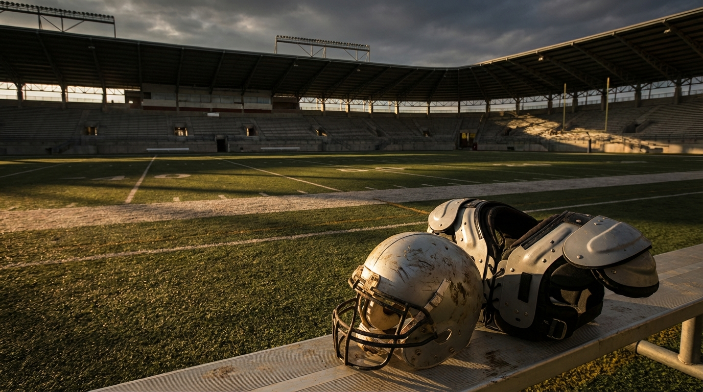
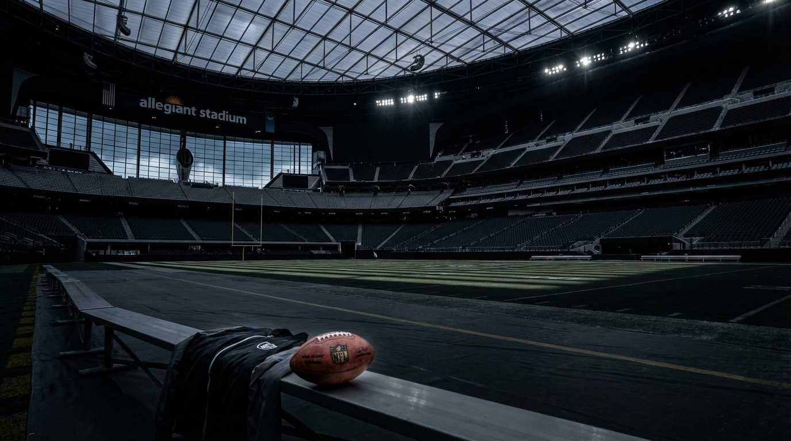

# The Raiders Kept Maxx Crosby. That Might Be the Worst-Case Outcome for Their Rebuild.

*A three-expert NFL Lab panel breaks down the strangest problem in Las Vegas: keeping your best defensive player after you've already spent the offseason replacing him.*

> **📋 TLDR**
> - The Raiders built their 2026 offseason around a completed **Maxx Crosby** trade, then had to unwind the entire plan when the deal voided after his failed physical.
> - The reversal cost Las Vegas roughly **$35.8M in cap relief**, two premium first-round picks, and left the roster carrying **Crosby + Kwity Paye** at roughly **$51.8M** in 2026 edge allocation.
> - **Panel verdict:** Keep Crosby for 2026, restructure him conservatively if needed, draft **Mendoza** at #1, and use the rest of the board to support the quarterback and repair the secondary.
> - **The debate:** Is the double-investment at edge a hidden strength for Rob Leonard's 3-4, or an expensive distraction from the corners and safeties that actually need fixing?

---

**By: The NFL Lab Expert Panel**  
*LV · Cap · Defense*

The easy headline is obvious: the Raiders kept **Maxx Crosby**, therefore the Raiders got good news. That's how most of this story will be framed, because most of the football internet still treats star retention like a universal positive. Keep the jersey-selling player, win the press conference, move on.

But the Raiders didn't enter March as a team merely *considering* a Crosby trade. They built an offseason around the assumption that he was gone. They budgeted the cap room and planned around the extra first-round picks. They signed **Kwity Paye** as the replacement. They reshaped the defense. Then the trade voided after Crosby failed his physical coming off meniscus surgery, and all the consequences snapped back onto Las Vegas's books at once.

That's the paradox. The Raiders are undeniably better at football with Crosby on the roster. They're also in a worse rebuilding position because of it.

And if you're trying to build the 2026 Raiders around presumptive No. 1 pick **Mendoza**, that's the part that matters.

---

## The Offseason They Planned vs. the One They Got

The cleanest way to understand this mess is to compare the two versions of Las Vegas's offseason: the one the front office thought it had completed, and the one it actually has to live in now.

| Category | If Crosby Trade Stands | After Trade Voids |
|----------|------------------------|-------------------|
| 2026 1st-round picks | #1 overall, #14 overall | #1 overall only |
| 2027 1st-round picks | Own + Baltimore's | Own only |
| Crosby 2026 cap hit | Off the books | **$35.8M** |
| Added edge investment | Paye signed as the replacement | **Paye added on top of Crosby** |
| Effective 2026 flexibility | Roughly **$73M workable space** | Tight enough to require cuts/restructures |
| Rebuild posture | QB + extra premium capital | QB + fewer picks + tighter cap |

Cap's framing is the harshest and the most useful:

> *"The voided Crosby trade didn't just cost draft picks. It cost the Raiders roughly $35M in 2026 cap flexibility they had already mentally allocated elsewhere."* — **Cap**

That matters because the lost assets aren't abstract. The Raiders didn't just lose "future flexibility." They lost a very specific version of the rebuild.

With the trade intact, Las Vegas could have taken **Mendoza at #1**, attacked the receiver or secondary market with real money, and still had another first-round pick in hand. Instead, the Raiders are back to one premium pick, a rookie quarterback timeline, and a cap sheet that suddenly has to carry both the old star and the new replacement.

The draft pain is asymmetric, and LV's team analyst nailed why:

> *"The #14 is painful but survivable. The 2027 R1 is the one that stings."* — **LV**

That's the hidden wound here. The 2026 rebuild can still be explained away as a rookie-quarterback development year. The 2027 first-rounder was supposed to be the accelerant — the extra premium asset that lets a franchise go from "interesting" to dangerous once the quarterback has a year in the system and the cap opens up. That pick is gone now. Crosby came back. The future-first did not.

---

## The Cap Problem Isn't Doom. It's Compression.

Let's get specific, because the cap story gets sloppy fast when people start talking in vibes.

The panel's Cap model starts with an OverTheCap baseline of roughly **$37.9M** in 2026 space. Subtract **Paye's $16M** annual value, and the usable room drops to about **$21.9M**. Then layer on the rookie class: roughly **$9.9M** for the No. 1 overall hold and about **$15M** in holds for the remaining eight picks.

That leaves Las Vegas underwater in practical terms before it has solved a single remaining roster problem.

| 2026 Cap Snapshot | Approx. Figure |
|-------------------|----------------|
| OTC baseline cap space | **$37.9M** |
| Less: Kwity Paye 2026 addition | **-$16.0M** |
| Space before rookies | **$21.9M** |
| Less: #1 overall rookie hold | **-$9.9M** |
| Less: remaining draft-pick holds | **-$15.0M** |
| Effective room before season management | **Negative** |

That's why this isn't a "the Raiders can figure it out later" story. They have to figure it out now.

But Cap also pushed back on the panic-sell instinct, and that's where this gets more interesting. The failed physical already repriced Crosby in the market. If Las Vegas turns around and tries to flip him immediately for a second- and third-round package, it locks in the downside twice: first by losing the original two-first structure, then by taking a distressed-asset return on the rebound.

Cap's preferred escape hatch is narrower:

> *"Restructure Crosby conservatively ... but with zero void years. The one move that turns a manageable situation into a structural crisis is a poorly structured restructure that mortgages the 2027 runway."* — **Cap**

That's the key distinction. The Raiders do not need to behave like a contender patching over one bad spring. They need breathing room without burning the years when **Mendoza's rookie contract is supposed to become an advantage**.

So the cap verdict from this panel is not "trade Crosby at any price." It's closer to this:

1. **Don't do a panic trade** from a position of weakness.  
2. **Create 2026 room surgically** if needed by converting salary to bonus.  
3. **Do not use void years** to fake flexibility and hand 2027 a dead-money grenade.  
4. **Keep Paye trade conversations open**, because his contract may be the more movable piece before performance or health noise drags the value down further.

That's not a glamorous solution. It's the adult one.

<!-- IMAGE: A moody, analytical Raiders cap graphic showing Maxx Crosby and Kwity Paye on opposite sides of a scale, with one side weighted by "$35.8M" and the other by "Lost 1sts," illustrating the rebuild paradox rather than celebrating the player return.
     Placement: inline
     Tone: analytical infographic, tense, high-stakes
     Key elements: Raiders silver-and-black palette, cap figures, draft-pick icons, subtle Allegiant Stadium backdrop, balance-scale visual
-->

---

## Crosby Helps the 2026 Team. He Hurts the 2026 Timeline.

Here's where the Raiders-specific lens matters, because a pure spreadsheet answer misses the developmental piece.

LV's position is straightforward: **2026 is about building a functional ecosystem for Mendoza**, not gaming the standings for another ugly season. Crosby helps that. A good defense shortens games. It protects a rookie quarterback from weekly track meets. It lets a first-year staff establish credibility instead of spending four months explaining why progress doesn't show up in the win column.

LV's strongest point isn't "Crosby is a leader," even though he is. It's more structural than that:

> *"The Raiders are better with Crosby on the field and poorer in the draft room because of him. The correct response is to maximize the asset you have, not chase back the capital you lost."* — **LV**

That's why the team expert rejected the idea of dumping Crosby for whatever the market offers now. The picks aren't coming back. The cap relief won't fully replicate the old version either. So the next-best move is to lean into the part that still has value: an elite defender who can anchor the one side of the ball most likely to keep a rookie quarterback out of constant chaos.

And LV's football point is hard to dismiss. Even in a compromised offseason, Mendoza is not walking into an empty cupboard:

- **Brock Bowers** is already the kind of underneath/detached mismatch rookie QBs lean on.
- **Ashton Jeanty** gives the offense a real run-game identity.
- The broader offseason plan also included major offensive-line investment, especially **Tyler Linderbaum**, which at least suggests Las Vegas understands what a rookie quarterback infrastructure is supposed to look like.

That doesn't solve the wide receiver problem. It does mean Mendoza isn't being asked to survive on faith and tunnel screens.

The draft implication is clean:

| Raiders Draft Priorities After #1 | Why It Matters |
|----------------------------------|----------------|
| **QB at #1: Mendoza** | The rebuild still starts here no matter what happened with Crosby |
| **WR at #36 if value exists** | Losing #14 likely costs access to the top receiver tier |
| **CB depth on Day 2/3** | Darien Porter at LCB isn't enough; the room needs volume |
| **Free safety help** | The backend remains a question even if the pass rush improves |

Without the extra first-round pick, the receiver plan changes from "attack a premium talent band" to "take the best available at #36 and live with the imperfection." That's not ideal. It's survivable if the goal is competence around the rookie quarterback rather than immediate stardom.

Where LV pushes hardest is on the competitive floor. A 4-13 season may preserve draft positioning, but it also risks poisoning the first year of the new regime. That's why Crosby's return has genuine value even if it complicates the books. For a rebuilding team, there is a difference between losing because the roster is young and losing because the environment is broken.

The Raiders can survive the first kind. The second kind resets the clock.

---

## The Scheme Case for Keeping Both Edge Rushers Is Real — and Incomplete

This is where the panel had the sharpest disagreement.

LV sees the Crosby/Paye overlap as a blessing disguised as an accounting error. In Rob Leonard's 3-4, the Raiders suddenly have **Crosby, Paye, Malcolm Koonce, and Tyree Wilson** cycling through two edge spots. That's a lot of pass-rush talent for a team that badly needs an identity, and LV argues Crosby may actually be cleaner as a stand-up outside linebacker in this structure than he was in a more traditional 4-3 role.

There's logic there. Most rookie quarterbacks would absolutely take a defense that can steal a game or two by itself.

Defense, though, is where the article stops being a nice story and becomes an uncomfortable one.

Defense's core warning is blunt: pass rush can't cover corners, and overinvesting at edge doesn't solve the back-end problem that actually broke this unit.

The scheme critique is more nuanced than "too much money at one position." Defense's point is that **Leonard's 3-4 asks for different things than a highlight reel of edge sacks suggests**. Outside linebackers in this front aren't just third-down speed merchants. They have to set edges, handle contact, and live in the run game.

That matters for both expensive pieces:

- **Crosby** is coming off January meniscus surgery, and the recovery issue isn't just pass-rush burst. It's lateral explosiveness and absorbing contact at the point of attack.
- **Paye** has been a 4-3 athlete for most of his career. The panel's defense expert is unconvinced the hybrid 3-4 OLB job is a clean translation.

So yes, the Raiders may have four real edge options for two spots. They may also have a depth chart that looks deeper on paper than it feels on snap 37 of a drive when the cornerbacks still have to survive behind it.

Defense's comparison work is useful here:

| Team Model | What Worked | Why Raiders Aren't There Yet |
|------------|-------------|------------------------------|
| **Baltimore dual-edge model** | Premium edges plus top-end corners and secondary infrastructure | Vegas has the edge names, not the backend certainty |
| **San Francisco star-rush model** | Ferocious front until injuries exposed the lack of insulation | A Crosby health setback would stress the whole design |
| **Detroit / Buffalo balanced investment** | Pass rush plus meaningful resources at CB/S/LB | Las Vegas is still too concentrated at one position group |

This is the heart of the disagreement: is the Raiders' edge spending a competitive shortcut, or is it the kind of roster concentration rebuilding teams regret a year later?

The honest answer is both.

The Crosby/Paye pairing can absolutely raise the 2026 defensive floor. It can also be an inefficient way to build a 3-14 roster if the secondary stays thin enough that opposing offenses simply get the ball out and attack the coverage.

That duality is the entire Raiders problem in one paragraph.

---

## Where the Panel Actually Disagrees

The cleanest way to read the discussion is not "who's right?" but "what problem is each expert trying to solve?"

| Expert | Primary Concern | Their Recommendation |
|--------|-----------------|----------------------|
| **LV** | Preserve a functional 2026 environment for Mendoza and the new staff | Keep Crosby, draft QB/WR/secondary help, don't chase sunk costs |
| **Cap** | Avoid turning a bad cap surprise into a multi-year structural mistake | Restructure Crosby carefully, avoid void years, explore Paye trade value |
| **Defense** | Don't confuse pass-rush talent with a complete defense | Keep both for 2026 if you must, but commit to resolving the overlap by 2027 |

That's why all three positions can sound contradictory while still fitting together.

LV is thinking about **culture and quarterback development**.  
Cap is thinking about **cash-flow timing and preserving the 2027 window**.  
Defense is thinking about **allocation efficiency and scheme reality**.

Put those together and the synthesis becomes pretty clear:

- **Do not treat Crosby's return as permission to go half-contender.**
- **Do not force a trade just to make the spreadsheet look cleaner in March.**
- **Do use the 2026 season to get whatever value is still left in the player and the pass rush.**
- **Do make the secondary a priority in the draft, because edge pressure without coverage is just a more expensive way to lose.**
- **Do plan now for one of the two edge contracts to be resolved by 2027.**

That last part is crucial. The Raiders can survive one year of overlap. What they can't survive is convincing themselves overlap equals plan.

<!-- IMAGE: A cinematic Raiders defensive huddle scene built around schematic tension — Crosby standing up on the edge, Paye hand-in-the-dirt, and a translucent secondary behind them with question marks over the corner and safety spots.
     Placement: inline
     Tone: cinematic, strategic, slightly ominous
     Key elements: silver-and-black uniforms, chalkboard-style 3-4 markings, emphasis on edge pressure versus vulnerable secondary, Allegiant lighting
-->

---

## The Verdict: Keep Crosby, But Keep the Rebuild Honest

The temptation here is to choose one clean slogan. **Keep the star. Trade the star. Save the cap. Chase the picks.** The Raiders don't get that luxury anymore. The clean options disappeared when the trade voided.

So the right answer is the least emotionally satisfying one: **keep Crosby for 2026, create breathing room only if you must, draft around Mendoza, and refuse to pretend the voided trade made the rebuild healthier than it is.**

Here's what that plan looks like in practice:

| Timeline | Recommended Move |
|----------|------------------|
| **Before the draft** | Keep Crosby; only restructure if necessary, and only without void years |
| **Round 1** | Draft **Mendoza** at #1 overall |
| **Round 2 and beyond** | Prioritize WR value, CB depth, and free safety help |
| **2026 season** | Let the defense carry the competitive floor while Mendoza develops |
| **By 2027 offseason** | Resolve the Crosby/Paye overlap instead of carrying it forward as permanent architecture |

That's not as fun as celebrating that the Raiders got their star back. It's also closer to reality.

Crosby still matters. He can still set the tone for the defense. He can still make life easier for a rookie quarterback by keeping games within one possession instead of two. On a rebuilding team, that is real value.

But the paradox survives all of that. Las Vegas is a better Sunday product because Crosby is on the roster, and a worse long-term rebuilding operation because the offseason was designed around his exit and never got the benefit it planned to receive from it.

The smartest move now isn't to relitigate the voided trade. It's to stop wasting energy pretending it can be undone cleanly.

Keep the player. Protect the 2027 cap. Draft the quarterback. Fix the secondary. And remember what the panel surfaced before everyone else does:

The Raiders' biggest offseason problem is not that they almost lost Maxx Crosby.

It's that they prepared correctly for life without him — and got him back anyway.

---

*The NFL Lab is powered by a 46-agent AI expert panel covering every NFL team, the salary cap, draft prospects, injuries, offensive and defensive schemes, and the latest league-wide news. Each article represents the consensus view of multiple domain specialists working together — and sometimes, their very pointed disagreements.*

*Want us to evaluate a trade? A free agent signing? A draft scenario? Drop it in the comments.*

---

**Next from the panel:** Which rookie-quarterback infrastructure matters more in 2026 — the Raiders' pass rush, or the protection and receiver help they still haven't finished building around Mendoza?
