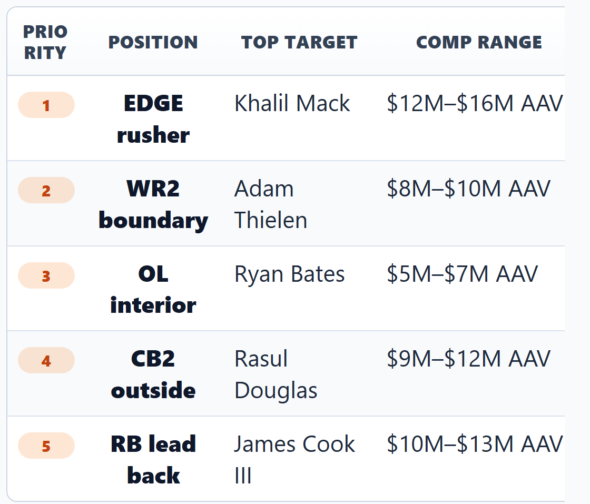
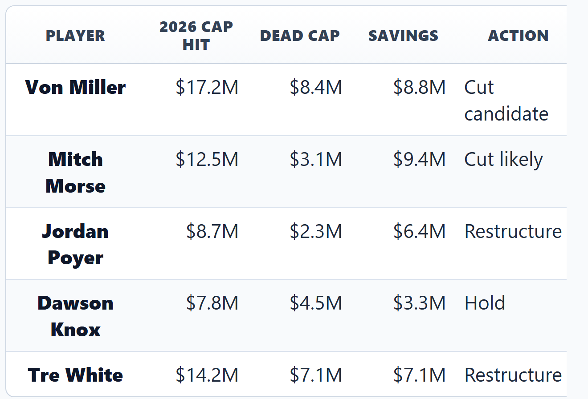
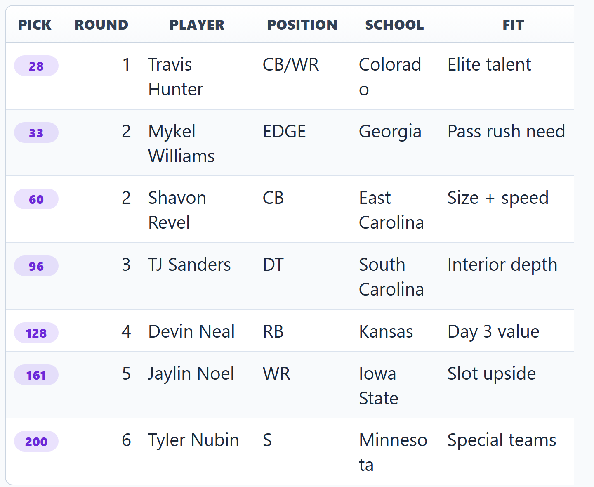
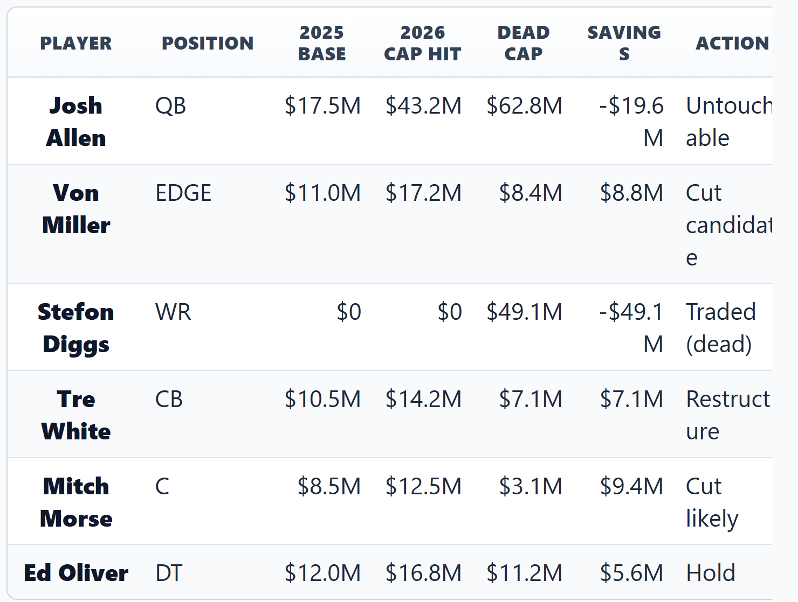
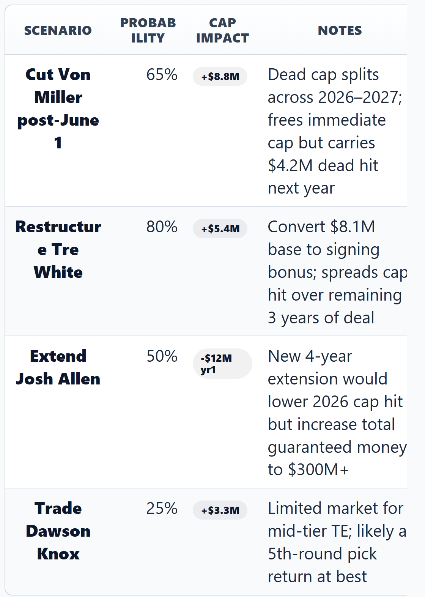

# Mobile Table Rendering — Boundary Validation

Testing dual-render (desktop + mobile PNG) at various table density levels.
Each section below exercises a different column count, density tier, and template type to validate readability at 375px viewport width.

---

## Test 1: Simple 3-Column Table (OK tier — should look fine everywhere)

| Player | Position | Status |
|--------|----------|--------|
| Josh Allen | QB | Franchise |
| Stefon Diggs | WR | Traded |
| Von Miller | EDGE | Restructured |

---

## Test 2: 4-Column Priority List (Borderline tier)

---

## Test 3: 5-Column Cap Comparison (Dense — triggers render)

---

## Test 4: 6-Column Draft Board (High density)

---

## Test 5: 7-Column Dense Financial Table (Maximum density)

---

## Test 6: 4-Column with Long Cell Content (Notes column stress test)

---

## Test 7: 2-Column Label-Value Table (Should always inline — control case)

| Metric | Value |
|--------|-------|
| 2026 Cap Space | $23.5M |
| Dead Cap Committed | $47.2M |
| Players Under Contract | 48 |
| Draft Picks | 8 |
| UFA Count | 14 |

---

## Test 8: 5-Column Comparison with Mixed Content

| Category | Bills (BUF) | Dolphins (MIA) | Jets (NYJ) | Patriots (NE) |
|----------|------------|----------------|------------|---------------|
| 2026 Cap Space | $23.5M | $15.2M | $8.7M | $95.3M |
| QB Situation | Allen locked in | Tua injury risk | Rodgers gone | Rebuilding |
| Draft Capital | 8 picks | 7 picks | 6 picks | 11 picks |
| Window Status | Open now | Closing | Closed | Reset |
| Key FA Need | EDGE, WR2 | OL, LB | Everything | QB of future |

This table is useful for visual testing because the mixed text/number content creates uneven cell widths that challenge mobile readability.
