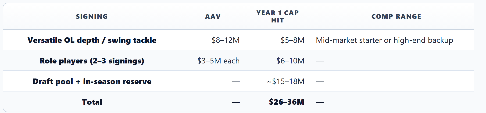
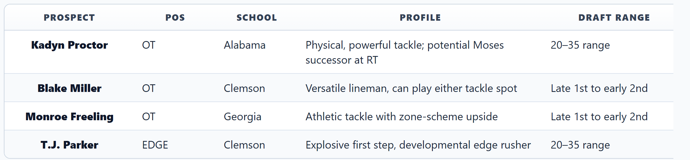

# The Patriots Have ~$44 Million, the #31 Pick, and a Franchise QB on a Rookie Deal. Our Expert Panel Can't Agree on What to Do Next.

*Four NFL specialists — cap, scheme, draft, and team experts — debate how New England should build around Drake Maye before the window closes*

---

**By: The NFL Lab Expert Panel**

> **📋 TLDR**
> - Drake Maye heads into Year 3 coming off an MVP-caliber sophomore season (4,394 yards, 31 TDs, 72.0% completion, 113.5 passer rating) and a Super Bowl loss to Seattle
> - NE has ~$44 million in remaining cap space, the #31 pick, and a coaching staff entering Year 2 under Mike Vrabel
> - Our panel recommends "controlled aggression" — targeted spending on remaining holes (RT, EDGE, WR depth) without mortgaging the 2027 war chest
> - Key debate: How much more to invest in the receiving corps vs. fortifying the trenches for another Super Bowl push

In January 2022, the Cincinnati Bengals went to the Super Bowl. Their formula was simple: surround a young franchise quarterback with weapons, fast. Joe Burrow's first two years coincided with Ja'Marr Chase, Tee Higgins, and an offensive line that finally stopped getting him killed. The Bengals spent the rookie-contract window like it was burning — because it was.

In that same span, the Chicago Bears took the other path. Justin Fields got a revolving door of coordinators, a barren receiver room, and a front office that kept saying "next year." There was no next year. Fields is gone. Chicago is starting over with Caleb Williams.

New England chose the Bengals' path — and it paid off faster than anyone expected. Drake Maye just finished his sophomore campaign where he completed 72.0% of his passes for 4,394 yards and 31 touchdowns — with only 8 interceptions — behind an offensive line that vaulted from dead last in PFF's rankings to approximately sixth. He added 450 rushing yards and 4 rushing touchdowns because the dual-threat ability is real, not just a survival mechanism anymore. His 113.5 passer rating and league-best 77.1 QBR earned him second-team All-Pro honors and legitimate MVP consideration. The arm talent is obvious. The processing has caught up. The question is no longer whether Maye is the guy — it's whether the Patriots can finish the job before the rookie-deal window closes.

They have the tools: approximately $44 million in remaining cap space (per Over The Cap), the #31 overall pick, a coaching staff entering Year 2 under Mike Vrabel with a Super Bowl pedigree, and a franchise quarterback making $10 million against a $301.2 million cap. That's still a rare convergence — even after a 14-3 season and a Super Bowl appearance. The loss to Seattle exposed remaining gaps: a receiving corps that went quiet on the biggest stage, an aging right tackle, and pass rush depth that couldn't sustain four playoff games. What they do with the remaining resources will determine whether Maye gets back to the Super Bowl — or whether the window starts closing.

We put it to our expert panel. They agreed on more than we expected — and disagreed on exactly the things that matter.

---

## The Situation: A Super Bowl Roster With Unfinished Business

Vrabel's coaching philosophy has never been a secret: protect the quarterback, build the trenches, establish an identity. In Year 1, that philosophy met a roster full of holes. In Year 2, the Patriots attacked those holes aggressively — and the results exceeded every projection. But a 29-13 Super Bowl loss to Seattle revealed that "good enough to get there" isn't the same as "good enough to win it." The roster still has unfinished business.

The offensive line transformation was the Year 2 headline. The 2024 unit was a catastrophe — PFF graded it the NFL's worst, with Caedan Wallace and Vederian Lowe proving inadequate protectors for a franchise quarterback. The 2025 response was decisive: Will Campbell, drafted fourth overall, immediately stabilized left tackle. Alijah Vera-Tucker was signed from the Jets to anchor left guard. Rookie Jared Wilson won the center job out of Georgia. Mike Onwenu remains a dominant anchor at right guard. The unit jumped from 32nd to approximately 6th in PFF's rankings — an extraordinary one-year turnaround. But right tackle Morgan Moses is now 35 with no heir apparent, and the Super Bowl exposed what happens when the aging edge of the line faces elite pass rushers in a four-game gauntlet.

> *"The line went from crisis to competent in one year. Now the job is sustaining it — Moses can't play forever, and one injury at RT puts them right back in trouble." — NE*

The receiving corps has been partially addressed. Romeo Doubs was signed from Green Bay on a 4-year, $68 million deal, giving Maye a legitimate boundary weapon. Kayshon Boutte's 2025 breakout provided a credible second option. DeMario Douglas continues to work the slot effectively. But the Super Bowl exposed the lack of a true vertical separator — the kind of target who commands safety help and cracks open the entire route tree. One more dynamic addition still completes the picture.

Here's the updated roster gap analysis, ranked by our NE expert:

| Priority | Position | Current State | Severity |
|----------|----------|--------------|----------|
| 1 | OT — Right tackle succession | Moses (age 35), no developmental backup, Super Bowl exposed the weakness | 🔴 HIGH |
| 2 | EDGE — Pass rush depth | 19th in pass rush win rate; Landry nearing 30, lost Uche and White via trade | 🔴 HIGH |
| 3 | WR — Vertical threat | Doubs is a legit WR1, but no deep separator to complement him | 🟡 MEDIUM-HIGH |
| 4 | CB — Outside depth | Gonzalez is a star, Davis is solid, but thin beyond them | 🟡 MEDIUM |
| 5 | TE — Receiving weapon | Henry (31) on $11.75M, no proven successor behind him | 🟡 MEDIUM |

And then there's the AFC East — which remains as winnable as it's been in a generation. Miami released Tua Tagovailoa in a full franchise reset, absorbing a staggering $99.2 million in dead cap while starting over with Malik Willis and a new coaching staff under Jeff Hafley. The Jets went 3-14 under first-year head coach Aaron Glenn with no franchise quarterback in sight — though they've stockpiled five first-round picks across 2026-27 via the Sauce Gardner and Quinnen Williams trades. Buffalo fired Sean McDermott and hired Joe Brady, adding another team in coaching transition while Josh Allen's window slowly narrows under increasing cap pressure.

> *"The AFC East hasn't been this favorable since the early Brady dynasty. Miami is in year-zero of a rebuild. New York is stockpiling picks. Buffalo is retooling. This is a two-to-three year window to dominate the division." — NE*

The urgency isn't manufactured. It's structural.

---

## The Cap Math: Two Paths, One Melting Ice Cube

Our cap expert doesn't mince words about the financial reality.

> *"Rookie-deal cap surplus is a melting ice cube — spend it before it's water." — Cap*

The numbers: Maye's $10 million cap hit represents 3.3% of the salary cap. A franchise quarterback at market rate commands $45–55 million annually. That delta — roughly **$40–45 million in annual surplus value** — exists for exactly two more years. Once Maye's extension kicks in, the cheat code disappears. Every dollar of cap space unused during this window is a dollar that *could have supported a franchise QB on a discount* and didn't.

New England has already made significant moves this offseason — Doubs ($8.6M Year 1 cap hit), Vera-Tucker ($4.8M), Dre'Mont Jones ($7.2M), Kevin Byard ($9M) — but approximately $44 million in cap space remains. The question is how aggressively to deploy it.

But the cap picture isn't just about this year. There's a $33.7 million dead money anchor on the books — Dugger ($12.2M), Diggs ($9.7M), Peppers ($3M) — eating 11.2% of the cap while producing nothing. The silver lining: nearly all of it evaporates after this season.

Cap modeled two scenarios for the remaining space:

### Scenario A: Aggressive Reinvestment (~$30–40M in Additional Year 1 Commitments)

Restructure Onwenu and Barmore to free ~$12–15M. Address RT and add one more playmaker.

The risk: committed dollars jump to ~$280M+ next year against a projected ~$315–320M cap. And roughly 30% of top-market free agent signings underperform their deals.

### Scenario B: Preserve the War Chest (~$15–25M in Additional Year 1 Commitments)

Address RT through the draft. Sign role players and depth pieces.

The payoff: roll $15–25M into next year, where the dead money cliff gives New England a projected **$92 million in cap space** (per OTC). With rollover, that could push above **$110 million**. That's elite trade acquisition territory *and* Maye extension runway.

### The Hidden War Chest

Here's the non-obvious insight from our cap analysis: the dead money cliff isn't just a future story — it's a *strategic weapon*. That $33.7M in ghosts drops to roughly $10–12M next season. Combined with cap growth, New England could be sitting on $110M+ in space. The Patriots don't just have cap space — they have cap *momentum*. If this year's remaining moves disappoint, they can course-correct. If Maye takes another leap, they can double down.

> *"The dead money cliff is NE's hidden second wave. They have cap momentum, not just cap space." — Cap*

---

## The Scheme Question: What Does Maye Actually Need?

This is where our offensive scheme expert reframes the entire conversation. The Year 2 results validated the scheme philosophy — now the question is refinement, not revolution.

Vrabel's hire of Josh McDaniels as offensive coordinator was the Rosetta Stone. The Patriots installed a modernized Erhardt-Perkins system — concept-based play-calling, heavy pre-snap motion, and a structure that adapts to the quarterback rather than boxing him in. The results in 2025 were emphatic: play-action rates surged from league-worst territory in 2024, bootlegs and designed rollouts became core features, and Maye thrived as a quarterback who can threaten on the move. The system worked. Now it needs fine-tuning.

But our Offense expert argues the next marginal gain isn't another $30 million receiver — it's sustaining the offensive line.

> *"Year 2 proved the concept — Maye with time is an MVP-caliber quarterback. Year 3 is about making sure he always has time. The right tackle is the last piece of asphalt." — Offense*

The logic remains elegant: McDaniels' boot-action and designed movement concepts require athletic linemen who can reach-block on outside zone and sell run fakes at the second level. Campbell delivered exactly that at left tackle. But Moses's declining athleticism at right tackle limits the bootleg concepts to the left side — and defenses have started adjusting. A quarterback with 3.5 seconds in the pocket makes a WR3 look like a WR1; a quarterback with 2.1 seconds makes a WR1 invisible.

The ideal next receiver for this system isn't necessarily the most expensive one. McDaniels wants *layers*: a big-bodied X receiver (Doubs now fills this), a slot separator (Douglas), and a vertical threat to keep safeties honest. One more speed element — not necessarily a top-of-market signing — completes the picture.

And Maye's Year 1 processing concerns? Offense says the 2025 season proved they were environmental, not developmental:

> *"Year 2 was the proof of concept. Give Maye time, give him a system, and the processing takes care of itself. The 72% completion rate and 31 touchdowns weren't an accident — they were the scheme working as designed. Now protect it." — Offense*

This is the insight that reshapes the spending debate: **offensive line investment IS receiver investment.** Better protection creates longer windows, which creates more separation, which creates better quarterback play. It's not either/or — it's sequencing.

---

## The Draft Board: What's Available at #31

The #31 pick is a different animal than picking in the top five. Our draft expert identifies the realistic landscape for a Super Bowl runner-up.

At pick #31, the elite prospects — Bailey (EDGE, Texas Tech), Mauigoa (OT, Miami), Tate (WR, Ohio State), Reese (LB/EDGE, Ohio State) — will be long gone. But late first-rounders on a Super Bowl roster carry a different kind of value: cost-controlled contributors who can start immediately in a winning environment.

But the board only tells half the story. The *class depth* tells the rest:

- **EDGE is the crown jewel group.** Bailey, Reese, R Mason Thomas (Oklahoma), Cashius Howell (Texas A&M), Derrick Moore (Michigan) — rare depth that extends well into round 2. New England can find an impact rusher at #31 or in round 2 without reaching.
- **OT has a cliff.** Mauigoa, Spencer Fano (Utah), and Freeling are the legit first-round tackles. After that, Proctor, Miller, and a few others are viable but less certain — exactly the tier available at #31. New England needs to decide if the available tackles are Day 1 starters or developmental projects.
- **WR is deep in rounds 2–3.** KC Concepcion (Texas A&M), Omar Cooper (Indiana), Makai Lemon (USC), and Denzel Boston (Washington) are all Day 2 targets who could provide the vertical threat Maye needs.

> *"At #31, you're not getting a franchise-altering prospect — you're getting a quality starter on a cost-controlled deal. For a Super Bowl team, that's exactly what you want. The depth at EDGE and WR in this class means NE can address multiple needs across their 11 picks." — Draft*

### The Trade-Up Math

With 11 picks including four sixth-rounders, the Patriots have the capital to move up if a prospect they love slides. Packaging #31 with a Day 2 or Day 3 pick could push into the #18–25 range — where players like Parker or a falling receiver might be available. Conversely, trading back from #31 to accumulate more Day 2 picks could yield two impact starters instead of one.

The kicker: EDGE depth makes staying at #31 viable without sacrificing impact. Take the best OT available, then layer EDGE and WR help on Day 2.

---

## Where the Experts Disagree

This is where it gets interesting. Three fault lines emerged in the panel discussion — and they're the three decisions that will define the Patriots' offseason.

### Debate 1: How Much More to Invest in Weapons?

**Cap says keep spending.** The Doubs signing was a good start, not the finish line. The rookie surplus demands maximizing this window — sign another playmaker, add a vertical threat, don't leave the Super Bowl roster one weapon short.

**Offense says protect the line first.** Doubs plus Boutte plus Douglas is a functional receiver room. The marginal return on another $15M receiver is less than the marginal return on a franchise right tackle. Keep the foundation intact.

**Draft says use the capital.** With 11 picks including late-round ammunition, the draft is where you add the vertical element. Why pay $15M in free agency for a player you can draft at a fraction of the cost?

**NE says be patient.** The mid-season trade market is where real value appears for contenders. Hold cap space, monitor the market, and strike when a WR1-caliber player becomes available from a rebuilding team.

**The gap:** Cap wants to spend now. Everyone else thinks they can add weapons through the draft, patience, or mid-season acquisitions. This is the central resource allocation debate of the offseason.

### Debate 2: Pick #31 — OT vs. EDGE vs. Trade Up

**Offense is emphatic:** Tackle at #31. Proctor or Freeling specifically, as Moses's successor. One more year of Moses is fine, but Year 3 is the transition — the rookie learns behind Moses and takes over in Year 4. Protection is existential.

**Draft offers conditional logic:** If New England signs an RT in free agency, take the best EDGE at #31. If the tackle position isn't addressed, Proctor or Miller is the pick. Alternatively, consider trading up from #31 into the late teens if a premium target slides. Let free agency dictate the draft strategy.

**NE and Cap agree** on flexibility — but NE leans toward offensive tackle and Cap leans toward best player available. Both emphasize that the 11-pick haul gives enough capital to address multiple needs across the weekend.

**The gap:** Offense wants the tackle locked in regardless of free agency. Draft says the pick should be reactive, not predetermined. The OT talent cliff supports a case for taking one early — but at #31, the available tackles are high-upside gambles, not sure-thing franchise starters.

### Debate 3: Is Year 3 Actually Make-or-Break?

**Cap says yes — economically.** The surplus value is depreciating by $40–45M every year you don't capitalize on it. One more year from now, Maye's extension negotiations begin. The window is finite and the clock is loud.

**NE and Offense say no — developmentally.** "Year 3 isn't make-or-break. It's make-or-*refine.*" They made the Super Bowl in Year 2. The franchise tag exists. The cap is expanding. Maye doesn't need a perfect roster in Year 3 — he needs a roster that addresses the specific weaknesses Seattle exploited. Growth doesn't require perfection.

**The gap:** Is there actually a crisis? Cap's math says yes. Everyone else's football judgment says the Super Bowl appearance proves the foundation is sound — now it's about incremental improvement. The truth is probably in the middle — which is exactly where the panel landed.

---

## The Verdict: Controlled Aggression

Despite the disagreements, the panel converges on a clear recommendation: **Path C — Controlled Aggression.** Not a $70M spending spree, not complacency after a Super Bowl appearance. Targeted moves that address the specific weaknesses Seattle exposed without mortgaging the 2027 war chest.

### The Blueprint

| Priority | Action | Target | Budget |
|----------|--------|--------|--------|
| 1 | Draft OT at #31 or early R2 | Proctor, Freeling, or Miller — Moses's successor at RT | Rookie slot |
| 2 | Address EDGE in rounds 2–3 | Parker, Mesidor, or Moore — young complement to Landry/Jones | Draft capital |
| 3 | Add WR depth through draft + patience | Day 2/3 vertical threat; monitor mid-season trade market | Draft capital + held cap |
| 4 | Preserve rollover for the war chest | Keep $15–20M unspent for the dead money cliff | $110M+ projected next year |

### Each Expert's Bottom Line

> *"The Patriots made the Super Bowl. Now the job is getting back and finishing it. The asset portfolio is still the best in the AFC East — convert it." — NE*

> *"Rookie-deal cap surplus is a melting ice cube — spend it before it's water." — Cap*

> *"Year 2 proved the concept. Year 3 is about protecting what works and fixing what doesn't." — Offense*

> *"At #31, you're not drafting a savior — you're drafting a starter. With 11 picks, NE can address three needs in one weekend." — Draft*

### The Synthesis

Cap is right that the rookie surplus demands continued investment — you cannot coast on a Super Bowl appearance. But Offense is right that protection remains the foundation. The answer: **address right tackle through the draft, add pass rush depth on Day 2, preserve cap space for the 2027 mega-haul, and trust the mid-season trade market to provide the receiver upgrade if one appears.**

The Bengals didn't build around Burrow by accident. They spent aggressively *and* strategically — Chase on a rookie deal, offensive line investment after the Super Bowl loss, targeted free agency to fill gaps. After their own Super Bowl loss, the Patriots face the same playbook: double down on what worked, fix what didn't, and trust the process.

New England has better resources than most teams have at this stage. The question was never capability — it was conviction. The panel's answer is clear: **protect your quarterback, reinforce the edges, and trust the math.** The ice cube is still melting. The road still needs paving. But the foundation is built. Drake Maye proved that in Year 2. Year 3 is about finishing the job.

---

The AFC East window is open. The cap math is favorable. The draft board is deep. And somewhere in Foxborough, a 23-year-old quarterback with a cannon arm, a 72% completion rate, and a Super Bowl loss burning in his memory is waiting to find out if this organization will keep building — the way Cincinnati kept building after their Super Bowl loss, not the way teams get complacent after a breakthrough season. The next twelve months will answer that question. Everything else is just numbers on a spreadsheet.

---

*NFL Lab is an expert-panel publication that brings together specialized analysts — cap, scheme, draft, and team experts — to debate the decisions that shape NFL franchises. Each article represents a genuine analytical discussion, not a single voice pretending to know everything. We disagree so you don't have to guess.*

*Want us to evaluate a trade, signing, or draft scenario? Drop it in the comments.*

---

**Next from the panel:** The 2026 Draft's Most Dangerous Pick — why the team selecting at #2 might be making a $250 million mistake.
