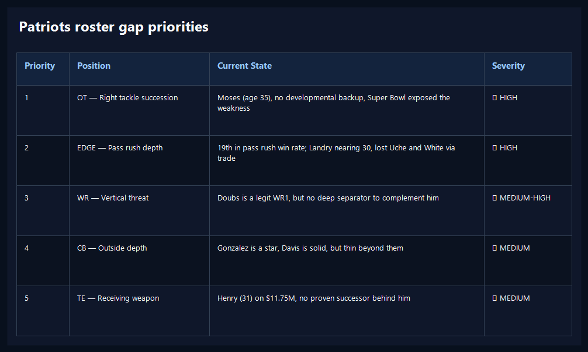
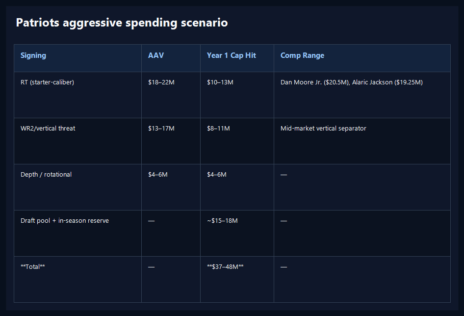

# Substack Table POC: New England's Roster Gaps, Reformatted Three Ways

*A proof of concept using real Patriots offseason tables to compare improved inline formatting against deterministic image rendering*

---

**By: The NFL Lab Expert Panel**

This draft is a formatting proof of concept, not a finished article. It uses two real tables from our New England offseason piece and presents them in multiple Substack-safe formats so we can judge what survives best in the editor, on web, and in email.

---

## Option 1: Improved inline conversion for a priority table

This uses the existing markdown table, but the publisher now converts it into a structured list instead of flattening each row into a single hard-to-scan paragraph.

| Priority | Position | Current State | Severity |
|----------|----------|--------------|----------|
| 1 | OL — Left tackle, center | Worst-graded OL in 2024; LT and C are both critical needs | 🔴 HIGH |
| 2 | WR — No separator | Douglas (slot), thin boundary corps, no vertical threat | 🔴 HIGH |
| 3 | RT succession | Moses (age 35), no developmental backup behind him | 🟡 MEDIUM-HIGH |
| 4 | TE — No receiving weapon | Henry (31), no seam-stretching option for Maye | 🟡 MEDIUM |
| 5 | LB/EDGE depth | Starters solid, thin behind them | 🟢 MEDIUM-LOW |

### Takeaway

For rank-order tables like this one, a list treatment may be good enough. It preserves reading flow and makes labels like `Current State` and `Severity` much more obvious.

---

## Option 2: The same priority table as a rendered image

This keeps the same information in a more editorial, high-impact presentation for readers who are skimming.

<!-- TABLE_IMAGE_PRIORITY -->

**Why this option matters:** it preserves visual hierarchy best, especially for email and mobile readers, without relying on HTML table support.

---

## Option 3: Budget table as an inline converted list

This is a denser cap table from the same New England piece. It is included to see whether list conversion still works when there are more numeric columns.

| Signing | AAV | Year 1 Cap Hit | Comp Range |
|---------|-----|---------------|------------|
| WR1 (top-15 receiver) | $28–32M | $16–20M | Tee Higgins ($28.75M), Amon-Ra St. Brown ($30M) |
| RT (starter-caliber) | $18–22M | $10–13M | Dan Moore Jr. ($20.5M), Alaric Jackson ($19.25M) |
| Depth / rotational | $4–6M | $4–6M | — |
| Draft pool + in-season reserve | — | ~$15–18M | — |
| **Total** | — | **$45–57M** | — |

### Takeaway

This is the kind of table where inline conversion may be acceptable for web, but a rendered image could still carry more impact if we want something that feels closer to a magazine layout.

---

## Option 4: The cap table as a rendered image

<!-- TABLE_IMAGE_CAP -->

**Why this option matters:** this is the clearest test of whether image-backed tables are worth the extra workflow for dense financial summaries.

---

## Preliminary read

The likely long-term answer is mixed:

- use improved inline conversion for short ranking or checklist-style tables
- use rendered images for denser tables where layout and contrast carry meaning
- pair image tables with a one-paragraph takeaway so they remain accessible and skimmable
