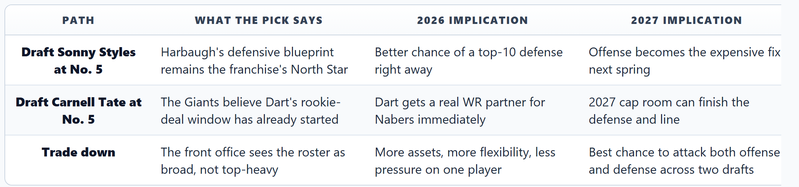
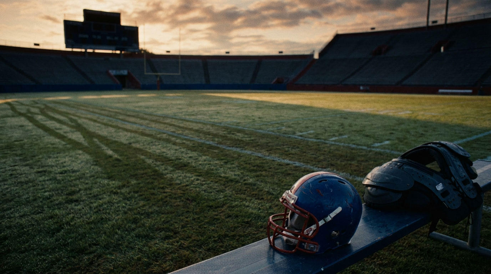
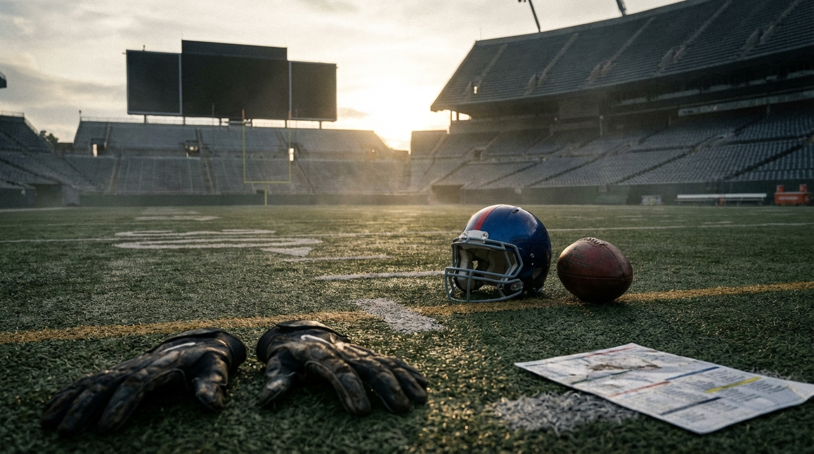
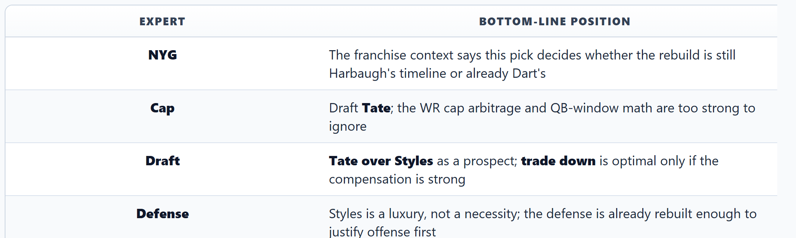

# The Giants Spent March Building Ravens South. The No. 5 Pick Will Tell You if Jaxson Dart Changed the Plan.

*Harbaugh's Giants spent March building Ravens South. Our expert panel thinks the No. 5 pick could waste their most valuable asset.*

---

**By: The NFL Lab Expert Panel**  
*NYG · Cap · Draft · Defense*

> **📋 TLDR**
> - John Harbaugh's first Giants offseason has looked unmistakably Baltimore-coded: Isaiah Likely, Patrick Ricard, Jordan Stout, Ar'Darius Washington, plus major defensive spending on Paulson Adebo, Jevon Holland, Tremaine Edmunds, and Greg Newsome.
> - The cap structure says 2026 is a bridge year and 2027 is the explosion: roughly **$27M raw space now, $103M-$112M+ projected next year**, depending on source and assumptions.
> - The panel's core conclusion: **Sonny Styles is the clean schematic fit, but not the best use of No. 5.** The defense is already rebuilt enough that adding another premium defender looks like diminishing returns.
> - Best outcome: **trade down if a QB-needy team pays a real premium and still leaves New York in range for a receiver.** If the Giants stay at No. 5, the article's verdict is simple: **draft Carnell Tate and accelerate Dart's window.**

---

The easiest way to talk about the Giants' No. 5 pick is to turn it into a prospect debate. **Sonny Styles** versus **Carnell Tate**. Defense versus offense. Harbaugh ball versus modern quarterback development. That framing is clean, television-friendly, and incomplete.

The harder — and more honest — version is that this pick is really a franchise confession. It will tell you whether the Giants believe their first two months under John Harbaugh were the start of a patient Baltimore-style rebuild, or whether **Jaxson Dart's rookie season forced the organization onto a faster timeline than it originally wanted**.

Because Harbaugh's first spring in East Rutherford has not been subtle. The Giants added Baltimore infrastructure pieces like Likely, Ricard, Stout, and Washington. They poured money into defense. They signaled a heavier, tougher, 12-personnel identity. Every breadcrumb says the same thing: build the team first, let the quarterback grow inside it, and let 2027 be the year the real push begins.

And then Dart complicated the script by being better than a bridge-year quarterback is supposed to be.

He didn't just survive 2025. He flashed enough arm talent, movement ability, and live-game creation to make the old plan feel potentially obsolete. That's why this debate matters. The Giants are no longer choosing between two good prospects. They are choosing between **two rebuild timelines**.

---

## The Pick Is Really About Identity, Not Just Talent

Before you even get to the board, the three paths look like this:

That table is the article. Not because the options are equally likely, but because each one exposes a different belief about where New York actually is.

The team expert on our panel kept coming back to the same tension: **the Giants are operating on a different timeline than their rivals, but Dart doesn't know he's supposed to wait.** Washington is spending to win now. Dallas is still acting like the window is open. Philadelphia's baseline is still contender-level. The Giants can absolutely choose patience — but patience inside this division has a cost. If you give everyone else a one-year head start while you wait for your own cap sheet to clear, 2027 stops being "the year you arrive" and starts being "the year you try to catch up."

---

## Harbaugh Already Built the Defensive Foundation He Wanted

This is where the anti-Styles argument gets serious. The Giants are not entering the draft with a broken defense that desperately needs a blue-chip savior. They already used free agency to do the heavy lifting.

| Defensive investment / structure | Why it matters |
|----------------------------------|----------------|
| **Paulson Adebo** | Gives New York a legitimate outside corner investment |
| **Jevon Holland** | Adds a premium coverage/run-support safety piece |
| **Tremaine Edmunds** | Installs a veteran signal-caller in the middle |
| **Greg Newsome** | Improves slot and sub-package flexibility |
| **Brian Burns + Dexter Lawrence + Abdul Carter** | Gives the front a real spine before the draft even begins |
| **Projected 2026 defensive spend: ~$159M** | About a 59/41 defense-over-offense split, per Cap's framework |

That is not the spending profile of a team still searching for its defensive identity. That is the spending profile of a team that thinks it already found it.

Defense's position paper was blunt about the consequence: after $200M+ in defensive and Harbaugh-culture investment, **Styles looks more like a luxury upgrade than a structural necessity**. The Giants' biggest defensive weakness is not "we need one more top-five defender or the whole unit fails." It's depth. It's insurance behind Edmunds. It's edge-rotation reliability. Those are real issues. They are also usually **Day 2 or veteran-market issues**, not No. 5 overall issues.

This is the part of the Styles case that falls apart under scrutiny. On paper, he fits the Harbaugh aesthetic beautifully: versatile, rangy, physical, can live near the box, can handle multiple assignments. In the abstract, he looks like the kind of defender a defense-first coach would love.

But roster-building is not done in the abstract. It is done in the context of what you already bought.

Edmunds just arrived. Holland just arrived. Adebo just arrived. Newsome just arrived. Burns and Lawrence already anchor the unit. If Styles hits, the defense likely goes from "good enough to matter" to "good enough to make everyone feel righteous." That's not nothing. It's also not the same thing as maximizing the most valuable developmental window on the roster.

> *"The defense doesn't need saving. Dart's receiving corps does."* — **Defense**

That line feels harsh until you look at what the offense would actually ask of Dart if Tate is not the pick.

---

## The Cap Sheet Says Wait. The Quarterback Window Says Don't.

Cap's analysis is the cleanest explanation for why this debate feels so split-brained. The numbers really do point in two directions at once.

| Cap reality | 2026 | 2027 |
|-------------|------|------|
| **Raw cap space** | ~$27M | ~$103M-$112M+ projected |
| **After rookie pool + in-season reserve** | Effectively near $0 operating space | Major flexibility returns |
| **Dead money burden** | ~$11.4M | Near-zero by comparison |
| **Strategic read** | Bridge-year constraints | True spending window opens |

If you are building from a spreadsheet, the answer is obvious: draft the defender, survive 2026, and use 2027's cap explosion to attack offense with more freedom and less risk.

That is exactly why Cap's own conclusion is so revealing. After laying out all the reasons the structure *wants* patience, Cap still lands on **Tate**.

Why? Because the quarterback math is more powerful than the cap math.

Dart's 2026 cap hit is tiny for a starting quarterback. The surplus value of a competent or ascending QB on a rookie deal is the single most exploitable asset in the sport. Once that player gets paid, the whole roster-building model changes. You stop buying stars with quarterback savings and start spending half your strategic energy working around quarterback costs.

That is what makes 2026-27 such a fragile window for New York. The Giants are sitting on the rarest kind of roster advantage — a quarterback cheap enough to subsidize aggression — and they are considering using a premium pick on the side of the ball they already spent March rebuilding.

Cap's best framing was that **cap space is a melting ice cube**. In plain English: waiting is not free. Market inflation eats future buying power. Division rivals don't freeze in place. And if Dart takes a real Year 2 leap without the proper support system around him, the Giants could end up doing the dumbest possible thing — proving they have the quarterback and still forcing him to wait for the roster to catch up.

---

## The Styles Case Makes Sense Only if You Think Dart Can Wait

To be fair to the defense-first argument, it is not stupid. It is coherent. It just comes with a hidden assumption.

The case goes like this:

1. **Harbaugh's teams have historically been built through defense, structure, and patience.**
2. **The 2026 Giants are not serious contenders anyway.**
3. **Styles can help complete a top-end defensive identity immediately.**
4. **The 2027 cap surge will be there to finance the offensive catch-up.**

If you believe Dart is still mostly a developmental passer, that logic works. It is especially appealing because it aligns with Harbaugh's professional instincts. Build the defense. Control games. Let the quarterback operate without carrying the franchise before he's ready.

But that last clause is exactly where the panel split. Our NYG expert does not think the Giants can safely assume Dart is on a slow-bake trajectory anymore. Not after a rookie year that changed the tone around the building. Not after veterans like Likely explicitly pointed to the quarterback situation as part of the appeal. Not after the front office watched him produce enough real flashes to make "wait until 2027" feel less like prudence and more like delay.

And Draft's perspective on Styles made the problem sharper. This is not a case where New York would be passing on a messy receiver for a can't-miss defender. Draft's view is that **Tate is the better pure prospect**, and that the positional value gap only widens the more honestly you do the math.

| Prospect question | Sonny Styles | Carnell Tate |
|-------------------|--------------|--------------|
| **Best trait** | Defensive versatility and range | True WR1 profile with NFL-ready polish |
| **Roster fit** | Cleaner fit with Harbaugh's instinct | Cleaner fit with Dart's developmental needs |
| **Positional value** | Good player at a non-premium role | Premium position with huge contract surplus if he hits |
| **Snap/value pressure** | Could become a high-end piece in a crowded unit | Plays directly into QB evaluation every week |

Draft's core argument is not just "take the receiver." It is that **Tate > Styles as a prospect**, independent of the Giants' current needs. Once you add roster context, the argument gets stronger, not weaker.

That matters because it strips away the comfort blanket teams often use in this situation. If New York takes Styles, it won't be because the board forced them there. It will be because the franchise chose its preferred identity over the better offensive bet.

---

## The Trade-Down Is the Cleanest Solution — If the Market Is Real

This is where the panel gets more nuanced than the easy "just draft Tate" answer.

Draft does not think staying at No. 5 is automatically optimal. If a quarterback-needy team wants to jump the line and is willing to pay a real premium, the Giants should listen.

| Trade-down question | Why it appeals |
|---------------------|----------------|
| **Do the Giants have a true top-5 need?** | Not really; WR2, LB depth, and line help all matter |
| **Would extra 2027 capital matter?** | Enormously, given the coming cap explosion |
| **Can they still land a meaningful pass-catcher after moving down?** | If yes, this may be the best overall roster play |
| **What is the minimum return?** | At least a future first or multiple Day 2 assets, per Draft's threshold |

This is the most front-office-sounding answer because it avoids the false purity test. The Giants do not actually have to choose between "Harbaugh defense" and "Dart support" if another team is willing to subsidize their flexibility.

Trade down, add a premium future asset, stay in range for a receiver like Tate or another top pass-catcher, and suddenly the roster becomes wider without giving up the chance to help the quarterback.

The catch is obvious: **trade-down scenarios are only smart when someone else overpays**. Sliding back just to say you slid back is fake sophistication. If New York moves down too far, loses access to the offensive tier it wants, and comes away with abstract pick value instead of a real difference-maker, then it has successfully turned clarity into paperwork.

So the trade-down path is the best *conditional* answer, not the clean default.

---

## Where the Panel Actually Lands

For all the tension in the setup, the panel is closer to consensus than the headline might suggest.

That is not four analysts yelling in different directions. It is four analysts arriving at the same practical conclusion from different lanes:

- The Giants have already done the expensive part of the defensive rebuild.
- The easiest way to waste a rookie-contract quarterback is to make him wait for infrastructure you could have started building now.
- Styles is a justifiable football player, but not the best answer to the Giants' actual leverage point.
- Trade down if the market gifts you flexibility; otherwise, take the receiver and be honest about what your quarterback has earned.

The disagreement, such as it is, is mostly about **how aggressively** New York should act on that realization.

NYG still sees the 2027 cap spike as the true organizational pivot. Cap thinks waiting too long turns fiscal patience into developmental hesitation. Draft wants to monetize the slot if possible. Defense is the most direct: the Giants can solve their remaining defensive issues later, but they cannot keep pretending those issues are bigger than the one staring at them on offense.

---

## The Verdict: If the Giants Stay at No. 5, They Should Draft Carnell Tate

Let's make the answer plain.

### 1. If a team offers a real overpay to move up, trade down.

That means real compensation, not "a nice haul" language. A future first-rounder or a serious Day 2 bundle that still leaves New York in range for a pass-catcher is the standard. If that market appears, take it. The Giants are still broadening a roster, not finishing one.

### 2. If they stay at No. 5, the pick should be Carnell Tate.

Not because defense stopped mattering. Not because Harbaugh's instincts are wrong. Because **the defense has already been funded**, and the offense hasn't. Because Tate is the better offensive bet at a more valuable position. Because pairing him with **Malik Nabers** and **Isaiah Likely** gives Dart an actual ecosystem instead of a hope-and-patience speech.

### 3. Sonny Styles is the "looks right, feels wrong" pick.

He would fit the vibe. He would photograph well in every "Harbaugh is building Ravens South" story. He might even be good. But if the Giants take him, they are effectively telling you one of two things:

- they still don't fully trust Dart, or
- they trust their 2027 flexibility more than the urgency of his 2026-27 window.

Both are defensible beliefs. Neither is the stronger football argument.

The strongest football argument is that the Giants have already done enough on defense to stop drafting for symbolism. This pick should not be about finishing the aesthetic of Harbaugh's first offseason. It should be about maximizing the value of the quarterback they may have found.

The Bengals figured this out when they paired Burrow with Chase. The Bears did not when they asked Justin Fields to wait for support. New York does not need to become Cincinnati overnight, and Dart does not need to become Burrow for the lesson to hold. If your young quarterback shows you something real, your job is to shorten the distance between promise and proof.

That is what Tate does. Styles mostly makes the existing plan look cleaner.

Those are not the same thing.

---

The Giants spent March building Ravens South. That was a rational response to a roster that needed structure, toughness, and credibility.

But April is where they have to answer a more uncomfortable question: did their quarterback just move the schedule up on them?

If the answer is yes, there is only one honest pick at No. 5.

It is not the linebacker.

---

*NFL Lab is an expert-panel publication built on genuine disagreement between specialists — team experts, cap analysts, draft evaluators, and scheme voices working the same question from different angles. No single omniscient narrator. Just domain experts colliding where roster decisions get interesting.*

*Want us to evaluate a draft decision, trade package, or roster-building dilemma? Drop it in the comments.*
