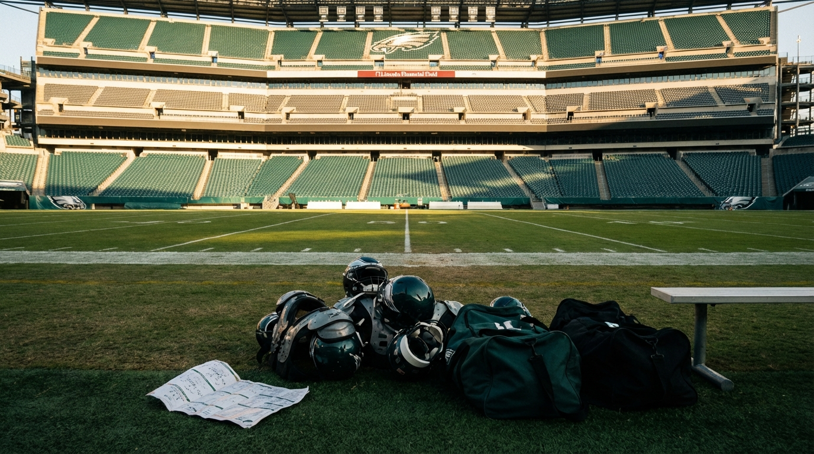
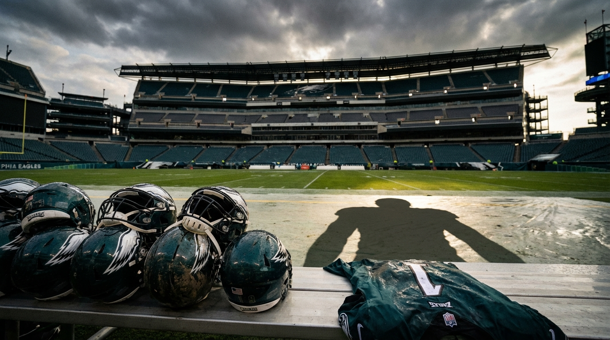

# The Eagles Have Everything Except a Pass Rush. That's Why Trading Jalen Carter Is So Dangerous.

*Our expert panel agrees Philadelphia's EDGE room is a five-alarm problem. The real fight is whether Howie Roseman should solve it by borrowing from 2028 — or by trusting Carter to keep the defense alive long enough for 2027 to save the rest.*

---

**By: The NFL Lab Expert Panel**  
*PHI · Cap · Defense*

> **📋 TLDR**
> - Philadelphia won the NFC East at 11-6, but it enters the 2026 offseason with one of the league's thinnest contender EDGE rooms and only $6.4M in effective cap space
> - The tempting shortcut is obvious: trade Jalen Carter for a premium pick, free cap space, and draft the pass rusher you don't currently have
> - Our panel rejects that path — Carter is the piece that makes Vic Fangio's defense function while the Eagles patch the edge
> - The real debate is not *whether* to keep Carter. It's how aggressively the Eagles should restructure the future to survive 2026

---

The Philadelphia Eagles do not have a normal contender's problem.

Normal contenders are trying to find a third receiver, a rotational corner, maybe one more guard to survive December. The Eagles have the quarterback, the receivers, the offensive line, the corners, the infrastructure, the front office, and the division-winning baseline. What they do **not** have is a reliable way to pressure opposing quarterbacks — and in 2026, that omission is large enough to swallow everything else.

That is why the Jalen Carter trade rumor has real oxygen. If you are staring at a roster with no proven EDGE1, $52 million in dead money, and just $6.4 million in effective cap space, the fantasy sells itself: move Carter, turn one dominant interior player into a blue-chip edge prospect and fresh cap room, and balance the roster in one swing. It is exactly the kind of idea that sounds cleaner from a spreadsheet than it does from a coaching headset.

Our three-person panel — Eagles team expert, salary-cap analyst, and defensive scheme specialist — arrived at the same conclusion from different angles. Philadelphia absolutely has to solve the pass-rush emergency. It just cannot solve it by removing the one player who keeps the rest of the defensive structure from collapsing.

---

## The Roster Is Good Enough to Win the Division. The EDGE Room Isn't Good Enough to Bluff Anyone.

Start with the part Eagles fans already know but maybe haven't fully sat with: this is still a high-end roster around the holes.

| Area | Eagles' 2026 reality | Why it matters |
|------|----------------------|----------------|
| **QB / core offense** | Jalen Hurts, A.J. Brown, DeVonta Smith, Saquon Barkley, elite OL | This is still a playoff-caliber offensive nucleus |
| **Secondary** | Quinyon Mitchell, Cooper DeJean, Riq Woolen, Sydney Brown | Enough coverage talent to survive if the front generates pressure |
| **Interior defense** | Jalen Carter + Jordan Davis | The engine of Fangio's front |
| **Cap flexibility** | $6.4M effective space, $52.0M dead money | Limits quick fixes and magnifies every mistake |
| **EDGE room** | Nolan Smith Jr., Arnold Ebiketie, Jalyx Hunt, Jose Ramirez | No proven full-time starter; no clear double-digit sack threat |
| **Other needs** | TE, safety, punter, WR3 depth | Real issues, but secondary to pass rush |

That last row is the crisis. Jaelan Phillips left for a $120 million deal. Nolan Smith Jr. has just seven career sacks across two seasons. Arnold Ebiketie, signed for one year and $7.3 million, is exactly what his price says he is: a bridge. Jalyx Hunt is still a projection. Jose Ramirez is depth.

PHI's read is ruthless and hard to argue with: the Eagles are not one breakout away from feeling good here. They are one breakout away from feeling merely functional.

> *"Betting the franchise on a Year 3 leap from a player who hasn't shown starter-level consistency is hope dressed as strategy."* — **PHI**

That distinction matters because Philadelphia's window is still open. Hurts is 27. Brown is 28. Smith is 27. The offensive line remains one of the best structures in football. This is not a rebuilding roster looking for developmental answers. It is a contender looking at the one hole that can disqualify it from January football in a division that got more aggressive around it.

Washington has Jayden Daniels on a rookie deal and just added Odafe Oweh. Dallas pushed harder into win-now mode. Even the Giants have new-coach energy with John Harbaugh. Standing still is not a viable Eagles strategy, and pretending this EDGE group can be schemed into legitimacy without help is just another way of standing still.

---

## Why the Carter Trade Idea Is So Tempting

If the Eagles trade Carter, the sales pitch writes itself in four lines:

| Trade-Carter argument | Why it sounds smart |
|-----------------------|---------------------|
| **Create immediate cap relief** | Carter's departure frees about $6.9M in 2026 space |
| **Turn surplus into scarcity** | Move strength at DT to fix the glaring weakness at EDGE |
| **Upgrade the draft slot** | A deal like Cincinnati's rumored No. 10 pick could land a blue-chip pass rusher |
| **Avoid historic DT spending** | Extending Carter alongside Jordan Davis creates uncomfortable long-term math |

Cap is the panelist most willing to admit the logic here. The future spending problem is real. If Carter lands at $50M-plus per year and Davis remains part of the long-term picture, Philadelphia is flirting with a level of defensive-tackle spending the league simply does not do. That's not a fake concern or a lazy anti-DT talking point. It is the kind of structural warning good front offices are supposed to hear early.

> *"The issue is not Carter's contract in isolation — it's Carter + Jordan Davis together."* — **Cap**

That warning is the article's real tension. The Eagles are not choosing between a good option and a bad option. They are choosing between an expensive answer now and a potentially destructive shortcut dressed up as balance.

Because here is the catch: Carter is not a luxury item. He is not the nice-to-have part of the defense you cash out when a roster gets lopsided. He is the piece that lets the rest of Fangio's structure survive an edge room that, right now, would scare nobody in the NFC.

---

## Fangio's Defense Can Hide Average EDGE Play. It Cannot Hide a Missing Interior Star.

Defense's position is the clearest of the three: trading Carter would not just subtract talent. It would remove the mechanism that makes Fangio's defense work with imperfect edges in the first place.

The current formula is simple. Jordan Davis absorbs mass and doubles. Carter penetrates. That interior stress forces quarterbacks off their spot and narrows tackle angles, which gives the outside rushers easier math. It is not the same as having a true EDGE1, but it is how Philadelphia generated 41 sacks in 2025 without a dominant marquee pass rusher on the edge.

| With Carter | Without Carter |
|-------------|----------------|
| Interior pressure forces quarterbacks to climb | Quarterbacks step into clean pockets |
| Tackles have to respect inside-out games and stunts | Tackles can set wider and deeper on outside rushers |
| Delayed blitzes from linebackers have a runway | Extra rushers arrive into space that never collapses |
| A rookie EDGE can be useful without being elite | A rookie EDGE has to become the whole solution immediately |

This is why Defense calls Carter irreplaceable *in this specific ecosystem*. Jordan Davis is a different player. He is a mass-and-anchor nose, not the quick-twitch interior penetrator who ruins timing. A Day 2 defensive tackle does not solve this. A bargain veteran does not solve this. Fangio can disguise coverages, move fronts, and manufacture pressure packages — but all of those answers assume the quarterback feels stress in the A and B gaps first.

> *"Fangio's scheme can mask average edge play — it cannot mask non-existent edge play."* — **Defense**

This is the point where the trade case starts to fall apart. Yes, the Eagles need a premium EDGE talent. Yes, a higher pick would help them chase one. But if the price of that pick is removing the interior force that makes the rest of the pass rush viable, then the defense hasn't been repaired. It's been rearranged into a different failure.

---

## The Dead-Money Problem Is Real. It Just Doesn't Change the Answer.

Cap's best point is also the most uncomfortable one: Philadelphia's biggest 2026 problem is not cap space in the abstract. It is **dead-money velocity**.

The Eagles are paying for old decisions before they can fully finance new ones.

| 2026 cap pressure point | Amount | What it means |
|-------------------------|--------|---------------|
| **Effective cap space** | **$6.37M** | Minimal room for clean additions |
| **Dead money** | **$52.03M** | 8th highest in the league |
| Bryce Huff dead charge | $16.61M | Paid for a miss that's no longer on the roster |
| Darius Slay dead charge | $13.26M | Veteran exit still clogging the sheet |
| James Bradberry dead charge | $7.75M | More sunk cost from old secondary spending |
| **Projected 2027 space** | **$80M-$100M, depending on structure** | The relief valve is coming — just not yet |

That is the backdrop for every "just sign an edge" suggestion. There is no clean money here. There is only cap engineering.

The Eagles can do it. Hurts can be restructured. Brown can be restructured. Carter himself, if extended, can lower his immediate hit versus the future option path. That is why Cap still lands on the keep-Carter side of the argument. The dead money is already a sunk cost. Trading the team's best defender to create marginal relief is solving the wrong part of the equation.

| Path | 2026 effect | 2027 effect | Core football tradeoff |
|------|-------------|-------------|-------------------------|
| **Extend Carter + restructure stars** | Roughly $35M+ workable space after moves | Less future flexibility, more 2028 stress | Keeps defense structurally intact |
| **Trade Carter for premium pick** | Roughly $42M workable space after moves | Cleaner 2027 sheet | Fixes cap optics while weakening Fangio's foundation |

The most honest way to frame it: Philadelphia is choosing leverage, not comfort. Extending Carter and restructuring the stars is a bet that 2027's cap relief — and continued leaguewide cap growth beyond it — will make today's borrowing survivable. Cap hates the long-term elegance of that. But he hates the football consequences of the trade path more.

> *"The trade doesn't solve 2026's pass-rush void — it just shifts the problem from 'no edge rush AND no cap room' to 'no edge rush BUT we have cap room.'"* — **Cap**

---

## The Panel's Real Disagreement: Is 2027 a Weapon or a Warning?

This is where the three experts split in emphasis, even while they agree on the recommendation.

| Expert | What they agree on | What worries them most |
|--------|--------------------|------------------------|
| **PHI** | Extend Carter, draft EDGE at No. 23, use 2027 to finish the build | Wasting a contender's window by chasing fake shortcuts |
| **Defense** | Keep Carter because the scheme depends on him | Believing Fangio can function without elite interior stress |
| **Cap** | Keep Carter because trading him solves the wrong problem | Restructuring Hurts/Brown again and building a 2028 reckoning |

PHI sees the 2027 cap spike as a weapon. The Eagles can accept a transitional edge room for one year, draft the position at No. 23, and come back to the premium market when the dead money clears. That is the Roseman-friendly version of patience: aggressive where you must be, patient where you can be.

Defense agrees in practice, but for a more urgent reason. This is less about cap planning and more about survival. The Eagles can live with a rookie edge who gives them six sacks and disciplined snaps if Carter is wrecking protections inside. They cannot live with a beautifully balanced cap sheet and a defense that no longer has an engine.

Cap, meanwhile, is effectively saying: fine, keep Carter — but don't pretend it is painless. Another Hurts restructure and another Brown restructure are not magic tricks. They are future bills. The Eagles can choose that route, and probably should, but they should do it with their eyes open.

That is a healthy disagreement, not a contradiction. It means the panel found the same answer while respecting the cost of getting there.

---

## So What Should the Eagles Actually Do?

The panel's recommendation is straightforward, even if the path isn't comfortable.

### 1. Extend Jalen Carter.

Not because two-star defensive tackle spending is ideal. Not because the cap is fake. Because Carter is the hardest player on the roster to replace, and Philadelphia's defensive identity becomes much more fragile the second he leaves.

### 2. Use pick No. 23 on the EDGE problem.

If Zion Young, Akheem Mesidor, or another top fit reaches that range, the answer is immediate. Draft the pass rusher, live with the rookie curve, and let Carter + Davis cover some of the developmental lag.

### 3. Treat Ebiketie as a bridge, not a solution.

If he gives competent snaps, that's useful. If Nolan Smith finally jumps, that's gravy. Neither outcome should change the plan. The Eagles still need to behave as if EDGE remains a live problem into 2027.

### 4. Push the TE fix to Day 2.

PHI is right that Dallas Goedert's exit leaves a real receiving void, but it is still the second-order problem. The offense can function around a lesser tight end. The defense cannot function around a non-pass rush.

### 5. Accept that 2026 may be a developmental year for the edge room.

That is the hardest sentence for a contender to say out loud. But it is better than pretending one trade can fix everything. The Eagles do not need a perfect pass rush in September. They need a credible one by December — and they need to get there without blowing up the part of the roster that already works.

| Recommended Eagles plan | Why it wins the argument |
|-------------------------|--------------------------|
| **Extend Carter now** | Protects the defense's foundation |
| **Restructure Hurts/Brown as needed** | Creates operating room without surrendering core talent |
| **Draft EDGE at No. 23** | Addresses the biggest roster hole with the cleanest asset |
| **Draft TE on Day 2** | Solves a real need without distorting priorities |
| **Save major EDGE spending for 2027 if necessary** | Uses the coming cap relief where it matters most |

---

## The Verdict

The Eagles have a pass-rush emergency. That part is not debatable. What is debatable is whether the fastest-looking answer is actually the smart one.

Our panel says no.

Trading Jalen Carter to fix the edge room is the kind of move that makes a roster look tidier on paper while making a defense worse on Sundays. Carter is not just an elite player; he is the specific player who allows Vic Fangio to survive without elite edges while Philadelphia develops or acquires them. Remove him, and the Eagles are no longer solving one problem. They are creating two.

The right path is less dramatic and more uncomfortable: extend Carter, borrow just enough from the future to survive 2026, draft the edge rusher at No. 23, and trust that the real financial relief arrives in 2027. That path does not promise a finished pass rush by Week 1. It does preserve the defensive core well enough for the rest of the roster — still good enough to win the division — to matter.

Philadelphia does not need a perfect offseason. It needs to avoid the one move that turns a fixable roster flaw into a structural collapse.

In this case, the dangerous trade is the obvious one.

---

*NFL Lab is an expert-panel publication built on disagreement done honestly — team analysts, cap specialists, and scheme experts arguing through the decisions NFL teams actually face. No single omniscient voice. Just specialists staying in their lanes and colliding where the roster gets interesting.*

*Want us to evaluate a trade, extension, or draft scenario? Drop it in the comments.*

---

**Next from the panel:** Washington's spending spree around Jayden Daniels is forcing the rest of the NFC East into uncomfortable choices. We'll break down whether the Commanders' aggression is sustainable — or exactly the window play Philadelphia should fear.
