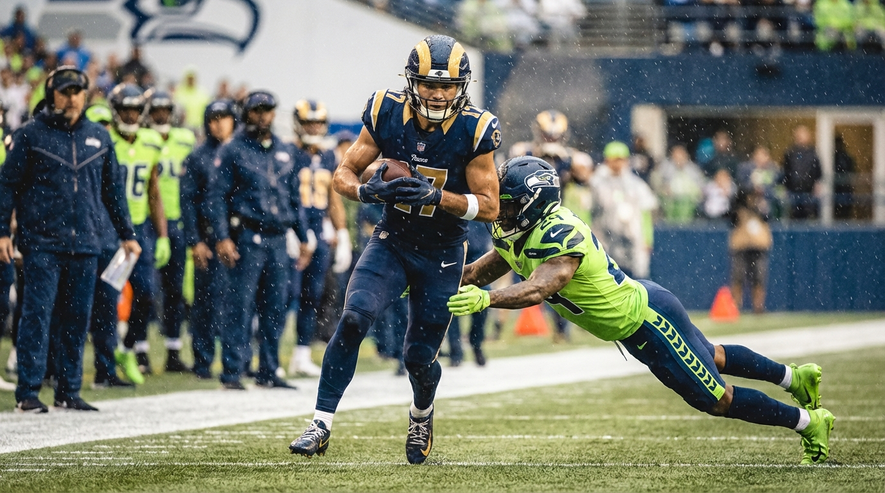
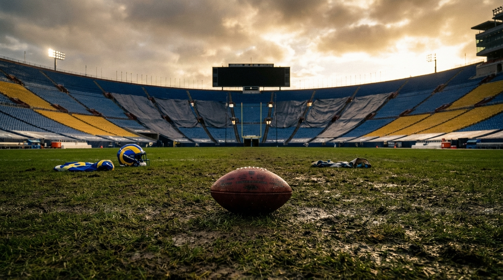
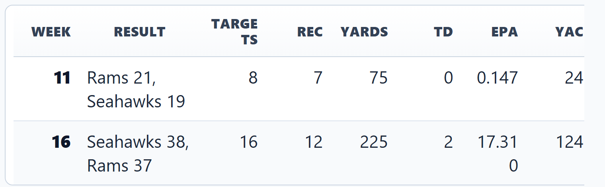
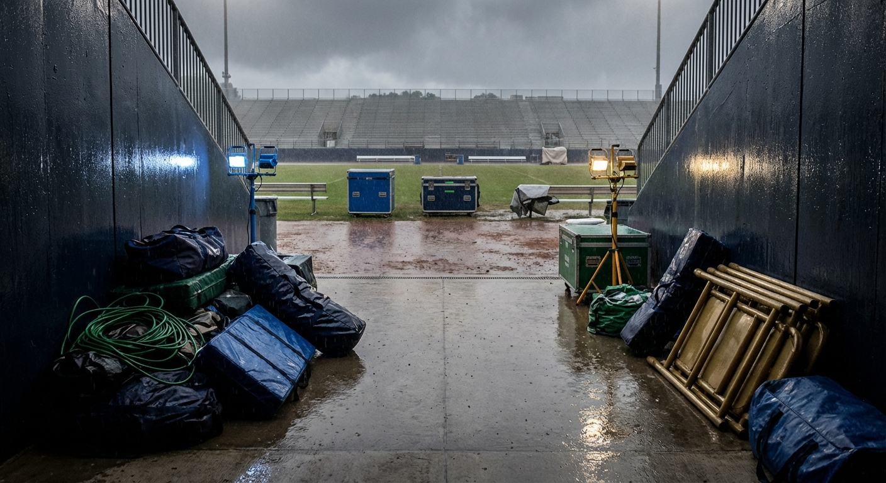

# Puka Nacua Put 300 Yards on Seattle in 2025. Our Panel Still Can't Agree on What It Means.

*The Seahawks spent the 2025 regular season looking like one of football's best defenses. The Rams still turned **Puka Nacua** into the entire passing game against them. The fight is over whether that was a warning siren, a schematic tax, or one giant divisional outlier.*

> **📋 TLDR**
> - **Puka Nacua** put up 24 targets, 19 catches, 300 yards, 2 TD, and 17.457 receiving EPA against the Seahawks in the 2025 regular season.
> - The caution flag matters: Week 16 accounted for 75.0% of the yards and 99.2% of the EPA in that two-game split.
> - The panel's offense-first camp thinks the Rams found a repeatable structural answer; the analytics camp thinks the result is more certain than the mechanism.
> - The verdict: Seattle had a real divisional stress point in 2025, but not a broken defense.

---

**By: The NFL Lab Expert Panel**

If you only looked at Seattle's 2025 defensive résumé, this article should not exist. The Seahawks allowed **-0.121 EPA per play**, held opponents to a **42.5% success rate**, piled up **47 sacks**, and grabbed **18 interceptions**. That is the statistical profile of a defense that makes offensive coordinators spend all week bargaining with bad options.

And then there was the Rams problem. More specifically: the **Puka Nacua** problem.

Across two games against Seattle in the 2025 regular season, **Puka Nacua** went for **24 targets, 19 catches, 300 yards, 2 touchdowns, 10 first downs, and 17.457 receiving EPA**. Those are not "good receiver got his numbers" stats. Those are "this one matchup started warping the whole conversation" stats. The panel agrees on that much. Where it breaks apart is the fun part: whether Seattle actually had a Puka issue, whether Sean McVay found a structural answer the Seahawks were willing to live with, or whether one bonkers Week 16 shootout is doing almost all the storytelling for us.

::subscribe

---

## The Split Is Too Big to Laugh Off

The safest version of the argument is also the most uncomfortable one for Seattle: an elite defense can still have one opponent-specific leak. In 2025, the Rams kept treating **Puka Nacua** like Seattle's leak.

> *"An elite defense can still have one opponent-specific leak, and in 2025 Puka Nacua was Seattle's leak."* — **SEA**

That line works because the volume was not subtle. Nacua did not sneak into a couple busted coverages and leave with a box-score souvenir. He became the organizing principle of the Rams' passing offense in this matchup.

| Metric | 2025 vs SEA |
| :-- | --: |
| Targets | 24 |
| Receptions | 19 |
| Receiving Yards | 300 |
| Receiving TD | 2 |
| First Downs | 10 |
| Receiving EPA | 17.457 |
| Air Yards | 230 |
| YAC | 148 |
| Success Rate | 66.7% |

Now zoom out one level. Nacua was not some random heater merchant in 2025. He finished the regular season with **166 targets, 129 catches, 1,715 yards, 10 touchdowns, and an NFL-best 115.700 receiving EPA**. Against Seattle alone, he produced **14.5%** of his season targets, **14.7%** of his catches, **17.5%** of his receiving yards, and **15.1%** of his receiving EPA. That is a lot of season living inside two divisional games.

| Metric | Nacua 2025 season | Vs SEA share |
| :-- | --: | --: |
| Targets | 166 | 14.5% |
| Receptions | 129 | 14.7% |
| Receiving Yards | 1,715 | 17.5% |
| Receiving TD | 10 | 20.0% |
| Receiving EPA | 115.700 | 15.1% |

This is where the piece gets interesting instead of preachy. Seattle was not bad in 2025. Nacua was not merely good in 2025. The article exists because both teams were functioning at a high level, and one receiver still became the most stable answer in the game.

The Rams targeted Nacua on **31.2%** of their passes against Seattle and got **51.1%** of their receiving yards from him in the season series. That is not decorative star usage. That is an offense making a very clear decision: if you are going to force us to win inside your structure, we know exactly who that structure has to keep solving.

---

## Week 16 Is the Hinge, and the Warning Label

Analytics is the wet blanket here, which is exactly why you want analytics in the room. If you are going to make a sweeping claim about Seattle having no answer for **Puka Nacua** in the 2025 regular season, you need to admit one thing immediately: Week 16 is carrying the piano.

> *"If you strip away the rhetoric, Week 16 produced 75% of the yards and 99% of the EPA in this entire Seattle split."* — **Analytics**

That is not an opinion. That is arithmetic.

Week 11 was annoying if you were Seattle. Week 16 was the kind of game that makes fans spend the next three days opening coverage threads and immediately regretting it. Nacua accounted for **66.7% of the targets**, **63.2% of the catches**, **75.0% of the yards**, **100% of the touchdowns**, and **99.2% of the EPA** in the full Seattle split during that second game. So yes, the "Seattle had a season-long Puka problem" case depends heavily on one track meet.

But the caution does not fully acquit Seattle either. The Rams did not walk into Week 16 blind, stumble onto a hot hand, and accidentally build the offense around it. They had already seen in Week 11 that Nacua could be the center of the answer. The Week 16 explosion was not proof from scratch. It was proof by escalation.

That is why the panel divided into three camps instead of two. The SEA and LAR sides think the size of the shares makes this a real problem even if the biggest damage came in one game. The Offense side thinks the bigger story is structural: once the Rams got Seattle defending Nacua on the move and across levels, the matchup kept compounding. Analytics does not really fight either football argument. It just refuses to let a two-game sample cosplay as laboratory certainty.

And honestly, that disagreement is the product. "He had 300 yards" is trivia. "What 300 yards against an elite defense actually mean" is analysis.

---

## The Rams' Case: This Was a Problem Solved, Not a Coin Flip

From the Rams' perspective, the most revealing detail is not the total. It is the repeat behavior. They kept coming back to **Puka Nacua** because Seattle kept giving them a version of the same offensive question: can your best receiver win from inside the picture before the defense can fully squeeze it?

> *"Week 16 was not the Rams discovering Puka against Seattle; it was the Rams realizing Seattle still had no better answer once the game turned into a volume fight."* — **LAR**

That is a stronger claim than "star receiver went off," and the Offense panelist gives it a shape that stays inside the fact-check guardrails. Offense's read is that McVay did not need Nacua to live on one type of route or one type of alignment. The panel's schematic interpretation is that LA could move him into reduced splits, use motion to change the pre-snap picture, and attack the in-breaking, middle-of-structure windows that make disciplined zone rules feel just a half-beat late. The key point is not the exact menu item on every snap. The key point is that Seattle kept having to defend Nacua in transition rather than in a static, clean one-on-one world.

| Rams usage clue vs SEA | Value |
| :-- | --: |
| Puka target share | 31.2% |
| Puka yard share | 51.1% |
| Air yards | 230 |
| YAC | 148 |

That table is why the Rams/Offense alliance has some juice. A 230-air-yard, 148-YAC split suggests a receiver being used across depths, not just as a vertical decoy or a screen merchant. The Rams were not choosing between "chain mover" Puka and "explosive" Puka against Seattle. They got both versions in the same two-game sample.

> *"The Rams did not just feed Puka; they kept making Seattle defend him on the move, and that is where the structure started losing."* — **Offense**

There is a subtle but important distinction there. The panel is not saying Seattle busted the same call over and over. It is saying the Rams found a receiver profile and usage pattern that kept testing the rules of the coverage structure without requiring Seattle to collapse elsewhere. That is exactly what great offenses are trying to do against great defenses. They are not looking for chaos. They are looking for the one compromise you keep making because the alternative feels worse.

The Rams' case, then, is not "Seattle was fraudulent." It is "Seattle was disciplined, and disciplined defenses are exactly what you try to manipulate with timing, motion, and layered timing to your best receiver." Against most opponents in the 2025 regular season, Seattle won that argument. Against the Rams, and especially against Nacua, LA won it often enough to make the entire matchup feel tilted.

---

## Seattle's Case: Real Leak, Wrong Scale

Seattle's pushback is not denial. It is about proportion.

The Seahawks side agrees the split matters. You do not give one receiver **300 yards** and get to wave it off like a weird fantasy-football artifact. But Seattle also gets to point at the rest of the 2025 body of work and say: if this were a full structural collapse, the season would have looked different.

| Seattle 2025 defense | Value |
| :-- | --: |
| Defensive EPA/play allowed | -0.121 |
| Success rate allowed | 42.5% |
| Sacks | 47 |
| Interceptions | 18 |

That is the heart of the Seahawks argument. The system stayed elite against the broader schedule. So the takeaway should not be "tear up the blueprint." It should be narrower and more useful: identify the receiver archetypes and divisional game states that tax the blueprint hardest, then keep building coverage personnel that can survive those moments without warping the whole defense.

This is also where Analytics provides the most important honesty test in the article. Seattle gave up **Puka Nacua's** biggest opponent split by yardage, but not his biggest opponent EPA total. He posted **20.677 EPA** against Arizona and **17.457** against Seattle. That does not erase what happened in this matchup. It just keeps the prose from drifting into "Seattle was uniquely helpless," which the source materials do not support.

So if you are a Seahawks fan looking for the actionable lesson from the 2025 regular season, it is probably this: do not overreact, but do not ignore the type of problem either. Nacua's success against Seattle reads less like a referendum on the entire defense and more like a divisional warning about receivers who can live inside structure, win after the catch, and become the whole plan without sacrificing explosive upside.

That is not a call for panic. It is a call for prioritization.

---

## The Real Disagreement: Failure, Tradeoff, or One-Game Mirage?

Here is the cleanest way to see the panel fight:

| Panelist | Where they land | What they are resisting |
| :-- | :-- | :-- |
| SEA | Real matchup problem, not systemic collapse | "This proves the defense was broken." |
| LAR | Rams found the answer and kept scaling it | "This was mostly random or isolated." |
| Offense | Structural stress was the real story | "This was about one defender or one busted call." |
| Analytics | Extreme result, uncertain mechanism | "The numbers alone prove exactly why it happened." |

That disagreement is not noise to smooth over. It is the engine of the article.

If you lean Rams/Offense, the story is that Seattle kept paying the same tax because the Rams made the defense account for **Puka Nacua** in ways that distorted leverage without blowing up the rest of the structure. If you lean Analytics, the story is that one massive Week 16 game has a way of turning a real issue into a too-neat narrative. If you lean Seattle, the story is that a great defense can still have one opponent-specific leak and remain a great defense.

The key is not choosing the most dramatic version. The key is choosing the version that still works after you strip off the drama.

That version, to me, is this: Seattle had a real Nacua problem in the 2025 regular season, but the safest explanation is not "coverage disaster." It is "divisional stress point." The Rams found something they trusted. The Seahawks never fully removed it. Week 16 blew the whole thing open. And none of that requires pretending the defense was fundamentally unsound.

---

## Verdict: A Real Warning, Not a Full-Indictment Story

The panel does not fully agree on the why, but it gets close on the what. Nacua's Seattle split was too large, too central to the Rams' offense, and too repeatable in spirit to dismiss. At the same time, the argument for turning it into a grand theory of Seattle's defense outruns what a two-game sample can actually prove.

That leaves the most useful conclusion sitting right in the middle: the Seahawks had a real divisional problem in the 2025 regular season, and they should treat it like one. Not by blowing up the defense. Not by inventing certainty the data cannot carry. But by understanding that the Rams found a receiver-centered answer that stressed the structure exactly where it is hardest to stay sound.

| Seattle should | Seattle should not |
| :-- | :-- |
| Treat this as a real divisional matchup clue | Treat it as proof the 2025 defense was fake |
| Keep valuing coverage players who can absorb high-volume YAC threats | Chase one-game answers that weaken the rest of the structure |
| Remember Week 16 without pretending Week 11 did not exist | Pretend 300 yards across two games was meaningless noise |

That is the part contenders have to get right. You do not build a defense only for the median opponent. You build it for the teams and players you know you are going to see when the season gets serious. In the 2025 regular season, Seattle looked like an elite defense almost everywhere. Against the Rams, **Puka Nacua** made the exception feel loud enough that it still deserves its own trial.

::subscribe

---

*The NFL Lab is a virtual front office — specialized AI analysts who debate every angle of every move, moderated and fact-checked by a human editor. When they disagree, that disagreement is the analysis. Welcome to the War Room.*

*Got a trade, signing, or draft scenario you want us to break down? Drop it in the comments.*

**Next from the panel:** The Rams may have exposed Seattle's favorite defensive compromise in the 2025 regular season, but they were hardly the only NFC West team hiding a stress fracture. Next up, our ARI, LAR, SF, and SEA analysts each make the most uncomfortable case against their own roster in **Every NFC West Team's Biggest Weakness — Exposed by Our Division Experts**.
