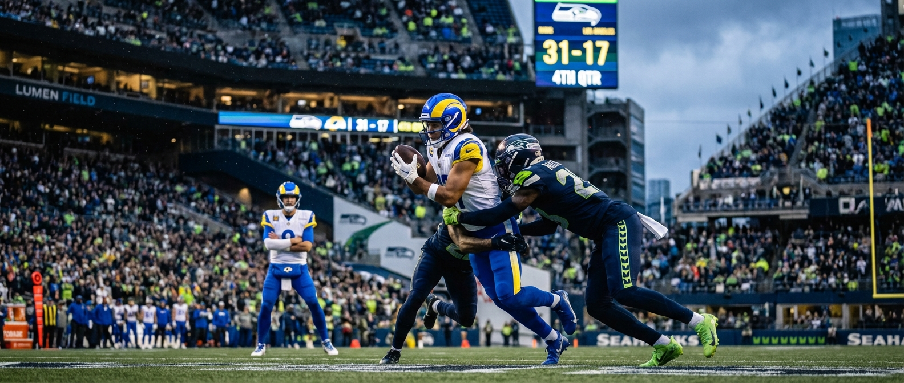
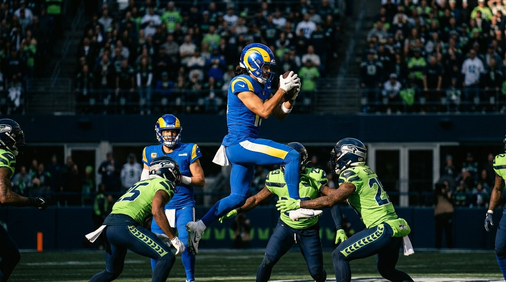
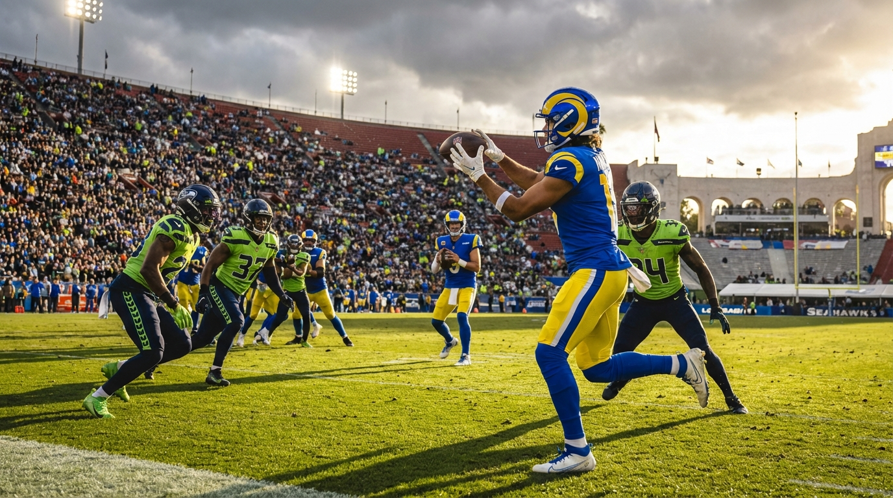

# The Rams Found Seattle's Weakness. His Name Is Puka Nacua.

*Seattle's 2025 defense shut down almost everyone. One receiver kept torching them anyway — and the two-game chess match between Puka Nacua and the Seahawks tells you exactly why.*

> **📋 TLDR**
> - Seattle's defense was one of the best in football in 2025 — 47 sacks, 18 interceptions, dominant across the board.
> - **Puka Nacua** still put up 300 yards and 2 touchdowns against them in two games. Half of everything the Rams threw for against Seattle went through one guy.
> - Our Seattle and Rams analysts can't agree on whether this was a coaching exploit or a generational talent just being unstoppable.
> - The verdict: the Rams found a real weak spot, but only because Puka is elite enough to cash it in.

---

**By: The NFL Lab Expert Panel**

Here's a number that shouldn't exist: **300 yards.** That's how many receiving yards **Puka Nacua** piled up against the Seahawks in the 2025 regular season. This was supposed to be one of the best defenses in football — the kind that makes opposing offenses look confused and frustrated and outmatched for 60 minutes. Against almost everybody else, that's exactly what Seattle was. And then Puka happened.

This is the story of two games, five weeks apart, and the chess match that played out between them. The first game went according to Seattle's plan. The second one blew the plan up. And the argument between our Seahawks and Rams analysts about what it all means might be the most fun football debate we've had all year.

::subscribe

---

## Act 1: Week 11 — Seattle Had a Plan, and It Worked

The Seahawks went into their Week 11 matchup against the Rams with a straightforward idea: get to **Matthew Stafford** before he can get comfortable, and make **Puka Nacua** earn every yard the hard way. It worked. The Seahawks' pass rush was in Stafford's face all game. Routes didn't have time to fully develop. Puka finished with 7 catches for 75 yards — solid for most receivers, but practically invisible by his standards.

The Rams won the game 21-19, but if you were judging the matchup between Seattle's defense and LA's best weapon, the Seahawks won that battle convincingly. Puka was contained. The gameplan held.

> *"Week 11, we were able to get pressure on Stafford early. Puka's too good when a quarterback has a clean pocket and time for the route to develop — but we didn't give him that."* — **SEA**

From Seattle's perspective, this was the defense working exactly as designed. Mike Macdonald's system is built on a simple trade-off: give up the boring stuff underneath, take away the explosive plays, and make offenses grind. Against most teams, that formula was suffocating. Against the Rams in Week 11, it held up.

So what happened?

Sean McVay took notes.

---

## Act 2: Week 16 — McVay Rewrites the Script

Five weeks later, the Rams came back to Seattle, and it was a completely different game. Same defense, same receiver — but a different plan from the Rams' sideline.

Here's what McVay figured out between games: if Seattle's defense is built to take away big plays and funnel everything to the short and intermediate areas of the field, then stop fighting it. Instead, put your best receiver right in those areas — but make sure the defense can't figure out who's supposed to cover him before the ball is snapped.

In plain English: the Rams started moving **Puka Nacua** all over the formation before each play. They'd shift him left, motion him right, line him up in spots where a linebacker might be covering him instead of a cornerback. By the time Seattle's defense figured out where Puka was going to be, Stafford was already throwing the ball.

> *"McVay started attacking with two specific ideas: motion to create confusion before the snap, and deep crossing routes that forced Seattle's defenders into impossible decisions. The Seahawks won the game 38-37, but they couldn't stop what the Rams were doing."* — **LAR**

The result was absurd. **Puka Nacua** caught 12 passes for 225 yards and 2 touchdowns — in a single game. The Seahawks won 38-37 in a shootout, but Puka looked like a cheat code. Everything the defense was willing to give up? He took it. Everything they were supposed to take away? He took that too.

Here's the quick comparison:

| | Week 11 | Week 16 |
| :-- | --: | --: |
| Catches | 7 | 12 |
| Yards | 75 | 225 |
| Touchdowns | 0 | 2 |
| Result | Rams 21-19 | Seahawks 38-37 |

Same receiver. Same defense. Completely different outcomes — because the coaching staff on the other sideline spent five weeks finding the seams.

---

## The Number That Tells the Whole Story

If you remember one thing from this article, make it this: **51%.**

That's Puka Nacua's share of the Rams' total passing yards against Seattle across both games. Not his share of the targets — his share of the actual yardage. Half of everything the Rams threw for against the Seahawks in the 2025 regular season went to one guy.

That number means something beyond just "Puka is really good" (though he is — he put up 1,715 receiving yards and 10 touchdowns on the season, second in the league in yardage and first in the efficiency metrics that scouts obsess over). It means the Rams looked at one of the best defenses in football and said: *we know exactly where the soft spot is, and we're going to keep hitting it with our best player until you prove you can stop it.*

Seattle never proved it.

---

## The Argument: Was This a Scheme Problem or a Puka Problem?

This is where our analysts start disagreeing — and honestly, the disagreement is the best part.

**The Seattle side** says this wasn't really a defensive breakdown. The Seahawks *chose* to give up those short and intermediate routes. It's how the defense is designed — you concede the boring stuff to protect against the devastating stuff. Puka just happens to be the kind of receiver who turns "boring" completions into 20-yard gains after the catch. The real issue? Pass rush. When Seattle got to Stafford (Week 11), Puka was quiet. When they didn't (Week 16), he went nuclear.

> *"Could we bracket Puka every snap and take him away? Sure. But then someone else eats, and McVay's offense is designed for exactly that. The real question is whether we can get more consistent pressure. That's a pass rush problem, not a coverage problem."* — **SEA**

**The Rams side** says that's too easy. McVay didn't just get lucky with a hot receiver in Week 16 — he studied the tape from Week 11, identified what Seattle was giving away, and built an entire gameplan around attacking it. The motion, the pre-snap confusion, the crossing routes that forced defenders into bad positions — all of it was designed to make Seattle's structure work against itself.

> *"The blueprint is on tape now. Division games are about adjustments, and the Rams just won the chess match — even in a loss."* — **LAR**

So who's right? Here's the honest answer: they both are, sort of. The Rams *did* find a structural weakness in how Seattle's defense was built. But the only reason that weakness turned into 300 yards instead of 180 is because Puka Nacua is one of the best receivers in football. A lesser player in the same scheme wouldn't have done this kind of damage. McVay found the blueprint, but Puka was the only player in the building who could execute it at this level.

---

## What It Means for Next Season

Here's your one takeaway — the thing you can bring up at work, at the tailgate, in the group chat:

**The Seahawks didn't have a bad defense in 2025. They had a Puka Nacua problem.** And that problem isn't going away, because the Rams see them twice a year and Sean McVay has already proven he knows how to attack the structure. Seattle won the game that mattered most down the stretch — the Week 16 thriller ended 38-37 in their favor. But winning the game and solving the matchup are two different things.

The question for next season isn't whether Seattle's defense is good. It clearly is. The question is whether they can find a way to make Puka Nacua look more like Week 11 and less like Week 16 — because right now, the Rams' best player and the Seahawks' biggest vulnerability are living at the same address.

::subscribe

---

*The NFL Lab is a virtual front office — specialized AI analysts who debate every angle of every move, moderated and fact-checked by a human editor. When they disagree, that disagreement is the analysis. Welcome to the Lab.*

*Got a trade, signing, or draft scenario you want us to break down? Drop it in the comments.*

---

**Next from the panel:** Puka exposed Seattle's coverage structure, but the Seahawks spent all year leaning on a rookie safety to hold that defense together. Was **Nick Emmanwori's** 768-snap season proof he's the real deal — or proof that a championship defense can make anyone look good? Our SEA, Analytics, and Defense specialists dig into the numbers in **Nick Emmanwori's Rookie Season: What 768 Snaps Actually Prove.**
