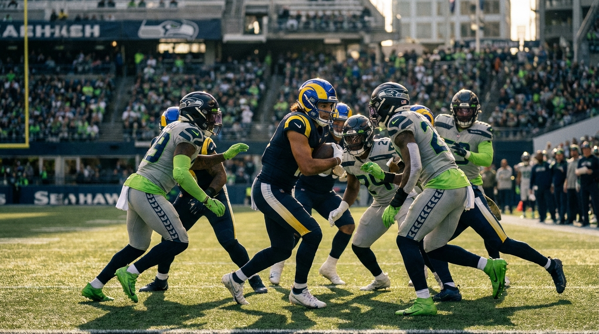
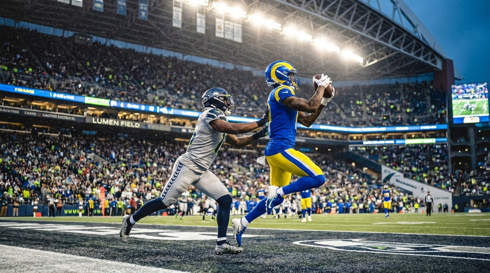

# Puka Nacua Put 300 Yards on Seattle's Elite Defense. Our Panel Can't Agree on Why — and That's the Point.

*Five experts dissected how the NFL's most productive receiver torched a championship-caliber secondary. The disagreement is the analysis.*

> **📋 TLDR**
> - Puka Nacua posted 300 yards and 17.457 EPA across two games against Seattle's top-five defense in 2025 — but 99.2% of that EPA came in one game
> - Our five-agent panel split 4-1 on the cause: four say McVay schemed Seattle's zone apart between games; one says the data proves it was just volume at Puka's normal rate
> - All five agree the real vulnerability is safety Nick Emmanwori (74.2% comp% allowed, 94.9 passer rating) — not the corners
> - The central question: Did McVay find a structural exploit, or did he just order double at the going rate?

---

**By: The NFL Lab Expert Panel**

Three hundred yards. Two games. One receiver.

Puka Nacua walked into two divisional matchups against Seattle's defense — a unit that allowed -0.121 EPA per play, racked up 47 sacks and 18 interceptions, and spent most of 2025 making quarterbacks regret their pre-snap reads — and came out the other side with 19 catches, 300 yards, 2 touchdowns, and 17.457 EPA. For context, that two-game EPA total would rank as a good *month* for most receivers.

The number demands an explanation. We asked five experts to provide one. They couldn't agree. That's where it gets interesting.

::subscribe

---

## The Two-Game Story Is Really a One-Game Story

Before the 300-yard number triggers a defensive restructuring conversation, look at how it actually happened.

| | Targets | Rec | Yards | TD | EPA | EPA/Target |
|---|---------|-----|-------|-----|------|------------|
| **Week 11** | 8 | 7 | 75 | 0 | 0.147 | 0.018 |
| **Week 16** | 16 | 12 | 225 | 2 | 17.310 | 1.082 |
| **Combined** | 24 | 19 | 300 | 2 | 17.457 | 0.727 |

Week 11 was containment. Seven catches, 75 yards, a near-zero EPA — the kind of performance defensive coordinators put on the film projector and say *that's the standard*. Whatever Seattle ran in November worked. Puka Nacua, the league's leading receiver in EPA (115.70, twenty-five points clear of the next man), was held to replacement-level production.

Five weeks later, he put up 225 yards and two touchdowns in a Week 16 shootout. The EPA went from 0.147 to 17.310 — a 117-fold increase. Week 16 accounted for 99.2% of the two-game EPA total.

Something changed between those games. The question is *what*, and the answer depends on which expert you ask.

---

## The Argument: Structural Exploit or Just the Puka Tax?

This is the engine of the piece — a genuine disagreement between four panelists who see a coaching chess match and one who sees a stat line being misread.

### The Scheme Camp (4 of 5 Panelists)

Four of our five experts — the Seattle specialist, the Rams specialist, and both our offensive and defensive scheme analysts — endorse the same core argument: Sean McVay identified a structural vulnerability in Seattle's zone-match coverage between Week 11 and Week 16, and he exploited it deliberately.

> *"McVay showed a different test. Seattle handed in the same answer sheet."* — **Defense Panel**

The argument runs like this: In Week 11, McVay treated Seattle's zone the way he treats most zone defenses. Puka aligned primarily at boundary X, ran standard mesh and drive concepts, and Stafford operated within his 2.82-second time-to-throw window. The results were functional but schematically predictable — 75 yards, contested catches, short completions.

By Week 16, film suggests McVay changed the *presentation*, not the route tree. He shifted Puka into field alignments, bunch formations, and pre-snap motion sequences that forced Seattle's zone defenders to declare coverage responsibilities before the snap — then attacked the handoff points where one defender's zone ended and another's began.

> *"The yardage nearly tripled, but the route concepts were the same. The presentation changed everything."* — **Rams Panel**

The between-game adjustment wasn't a total schematic overhaul. It was targeted. McVay had five weeks of film showing exactly how Seattle's pattern-match rules processed Puka through motion, and he added wrinkles — consistent with his tendencies toward multi-receiver motion sequences — that overloaded those processing rules.

### The Data Camp (1 of 5 Panelists)

Then there's the dissent. Our Analytics panel ran the numbers and arrived at a fundamentally different conclusion:

> *"The honest headline: McVay chose to feed Puka volume against Seattle, and Puka converted at almost exactly his season rate. The data doesn't say Seattle broke. It says Seattle paid the going rate and McVay ordered double."* — **Analytics Panel**

The core finding: Puka's per-target EPA against Seattle (0.727) was only 4.3% above his season average (0.697). That's barely a rounding error. Compare it to his other big splits:

| Opponent | Targets | Total EPA | EPA/Target | vs. Season Avg |
|----------|--------:|----------:|-----------:|---------------:|
| DET | 11 | 15.827 | **1.439** | +106% |
| ARI | 22 | 20.677 | **0.940** | +35% |
| **SEA** | **24** | **17.457** | **0.727** | **+4.3%** |
| Season | 166 | 115.700 | 0.697 | baseline |

Detroit allowed nearly *double* the per-target EPA that Seattle did. Arizona was 35% above Puka's baseline. Seattle? Barely above the mean. The 300-yard headline is a volume story: McVay threw Puka the ball 24 times (23% above the per-game average), and Puka converted at his normal rate.

The scheme camp says McVay found a schematic key. Analytics says he found the "order more" button.

---

## The Resolution Nobody Expected: Both Sides Are Right

Here's where the analysis earns its depth. The scheme camp and the data camp aren't actually contradicting each other — they're measuring different things.

Analytics is correct on the rate. Per-target EPA was barely above baseline, which means Seattle wasn't uniquely terrible at defending individual Puka targets. On a per-rep basis, Seattle was *better* against Puka than Detroit and Arizona.

But the scheme camp is asking a different question: *why was McVay able to escalate volume without paying a rate penalty?* Most defenses can throttle volume — double-cover the primary receiver, bracket him, force the quarterback to go elsewhere. Seattle couldn't. Or more precisely, Seattle's zone-match structure *wouldn't*, because the coverage rules that made this defense elite against 30 other offenses were the same rules that gave McVay unlimited access to the intermediate window.

The best framing came from our Lead's synthesis: **McVay found he could order unlimited servings at the going rate because the zone structure never made him pay for concentration.**

That's not a defensive collapse. It's a structural limitation exposed by the one offensive coordinator with the right schematic toolkit and the right receiver to exploit it.

---

## The Emmanwori Layer: Where All Five Experts Agree

For all the disagreement about cause, every panelist — including Analytics — converges on the same structural finding. The vulnerability isn't at cornerback. It's at safety.

| Defender | Pos | Comp% Allowed | Passer Rating | Snaps | Snap % |
|----------|-----|:------------:|:------------:|------:|-------:|
| Jobe | CB | 49.5% | 75.8 | 818 | 76.9% |
| Woolen | CB | 54.9% | 72.0 | — | — |
| Witherspoon | CB | 69.5% | 86.6 | 721 | 93.2% |
| Coby Bryant | S | 59.0% | 81.0 | 977 | 96.0% |
| **Emmanwori** | **S** | **74.2%** | **94.9** | **768** | **84.9%** |

Look at those numbers and find the outlier. The corners — Jobe at 49.5% and Woolen at 54.9% — were good to excellent in coverage. Even Witherspoon's 69.5% and 86.6 passer rating, while not shutdown, were competent. Coby Bryant at safety was the defense's Swiss Army knife: 59.0% completion rate, 4 interceptions, on the field for 96% of defensive snaps.

Then there's Emmanwori: 74.2% completion rate, 94.9 passer rating allowed. The worst coverage marks among any Seattle defensive back who played 700+ snaps.

> *"The corners weren't the problem. The structural failure was the Emmanwori layer — a big-nickel hybrid asked to execute Tier 3 coverage rotations against the NFL's most productive route-runner in the zone where his completion rate says he's vulnerable."* — **Defense Panel**

Here's how it works mechanically. In Seattle's Fangio-tree zone-match system, the big-nickel safety — Emmanwori's role — is the pattern-match player. He reads motion, re-routes after the snap, and provides bracket help over zone defenders who are watching the quarterback. Against McVay's pre-snap motion, Emmanwori was consistently a step late in those exchanges.

> *"Against 31 other offenses, that player can be adequate. Against McVay's motion rate and Stafford's 2.82-second time to throw, it's a structural ask that exceeds Emmanwori's current processing speed."* — **Seattle Panel**

When Puka aligned at boundary X and motioned to the field slot, Seattle's coverage rules handed him off — the boundary corner released, and the field-side nickel or safety picked him up based on his new alignment. That handoff is the vulnerability. The moment Puka entered the slot, his route options expanded to shallow crosses, digs, choice routes, and seams. The defender who just inherited him didn't have the pre-snap leverage to defend all four.

Our Offense panel located the damage in the specific yardage layer:

> *"The damage happens in front of the safeties, in the 7-12 yard layer, before anyone rotates. When the defense can eliminate an entire dimension of the offense and still can't cover the primary receiver in the intermediate window, the coverage architecture has a design flaw."* — **Offense Panel**

This is the 7-12 yard intermediate window — exactly where Stafford's 7.3 average completed air yards profile lives, exactly where McVay's levels-cross-dig route combinations create binary coverage conflicts, and exactly where Emmanwori's zone-match responsibilities put him in structural jeopardy.

---

## The Dead Run Game: Seattle Knew and Still Couldn't Stop It

There's a data point in the Rams' offensive profile that makes the structural argument harder to dismiss, even for the Analytics camp.

LA's rush EPA per play in 2025: **-0.009**. Essentially zero. A dead run game.

| LA Offensive Splits | EPA/Play |
|---------------------|:--------:|
| **Pass** | **+0.252** |
| **Rush** | **-0.009** |
| Overall success rate | 53.6% |

Every defense in the league knew the Rams were going to throw. Stafford attempted 597 passes, completed 388, and threw 46 touchdowns en route to a 150.454 passing EPA (QB2 in the league). This wasn't a balanced attack that surprised Seattle with play-action. This was a one-dimensional passing offense that *told you what was coming* and dared you to stop it.

Seattle couldn't. Not because the players weren't good enough — the defense posted -0.121 EPA per play and a 42.5% success rate against the rest of the league. But because the zone-match structure that made them elite against balanced offenses was the same structure that gave McVay's motion-heavy, pass-first scheme unlimited access to the intermediate window.

> *"McVay had functionally no run game. Seattle knew the pass was coming, ran their zone accordingly, and Puka still posted 300 yards. That's the structural indictment."* — **Offense Panel**

---

## The Generational Receiver in the Room

Any honest analysis has to acknowledge the human at the center of this. Puka Nacua's 2025 season wasn't just good — it was historically elite.

| Stat | Puka 2025 | Rank |
|------|:---------:|:----:|
| Receiving EPA | 115.70 | **WR1** |
| Targets | 166 | — |
| Receptions | 129 | — |
| Yards | 1,715 | — |
| TDs | 10 | — |
| Target Share | 30.1% | — |
| Air Yards Share | 33.7% | — |
| RACR | 1.187 | — |

That 1.187 RACR is the quiet killer. It means Puka turns air yards into *more* yards — every intermediate throw gains yardage after the catch, compounding the coverage failure. His comp table reads like a decade's worth of All-Pro campaigns:

| Comp | Season | Similarity Score |
|------|:------:|:----------------:|
| CeeDee Lamb | 2023 | 0.491 |
| Stefon Diggs | 2020 | 0.377 |
| Tyreek Hill | 2023 | 0.341 |
| Davante Adams | 2021 | 0.325 |
| Justin Jefferson | 2022 | 0.324 |

Four different route-running archetypes collapsed into one player. He catches the short-to-intermediate ball like Lamb, generates yards after contact like Diggs, and commands target volume like Hill. When that profile meets a structural coverage opening in the intermediate layer, the damage compounds.

The scheme camp says McVay found the opening. Analytics says the opening didn't matter — Puka converts at this rate against everyone. The truth is probably that McVay found a way to *guarantee* access to a receiver who didn't need extra help converting. The zone gave him the reps. Puka did what Puka does.

---

## The 2026 Question: The Lock Is Changing, and Not in Seattle's Favor

Here's where the analysis tilts from retrospective to predictive, and where the panel's implications get uncomfortable for Seattle fans.

Coby Bryant — 59.0% completion rate, 4 interceptions, 977 snaps at 96% participation — is expected to depart in free agency. He was the safety who could compensate for Emmanwori's coverage limitations, the defender whose bracket help made the zone-match system function against motion-heavy offenses. His expected departure doesn't just lose a player. It removes the secondary's compensating mechanism against exactly the kind of offense that exposed the Emmanwori layer in 2025.

> *"Bryant masked it. Bryant is gone. That's the hole, and it's not at corner."* — **Seattle Panel**

Tariq Woolen (54.9% completion rate, 72.0 passer rating allowed) is also expected to leave via free agency. Woolen's 6'4" frame disrupted timing routes on the boundary — the one alignment where Puka *didn't* get free in Week 11. Without Woolen's length opposite Witherspoon, and without Bryant's bracket coverage behind Emmanwori, the 2026 secondary projects as Witherspoon-Jobe-Emmanwori plus younger pieces with less ability to compensate for any single absence.

The scheme camp's prescription splits into two schools:

**Roster-construction fix (Seattle Panel):** Draft a cornerback at #32 or #64 who can play outside and free Witherspoon into a shadow role against elite receivers. Fixes the corner depth, doesn't directly address the Emmanwori layer.

**Scheme-level fix (Defense and Offense Panels):** Reclassify Puka as a safety-rotation problem. Build the game plan from the back end forward — man-match Witherspoon on Puka through motion, rotate the safety bracket over Puka's alignment, and accept the coverage cost elsewhere.

> *"You don't solve this by drafting a better corner — you solve it by changing how you process route combinations in the 7-12 yard layer against motion-heavy formations."* — **Offense Panel**

The uncomfortable reality: both fixes address different parts of the problem, and neither fully solves it. A new corner helps the depth chart survive Bryant and Woolen's departures but doesn't close the intermediate window. A scheme adjustment closes the window against Puka but creates vulnerability elsewhere. Macdonald's challenge in 2026 is sequencing both — and doing it before McVay gets a third look at the same answers.

---

## The Verdict: Not Broken, But Solved

Here's where we land.

Seattle's defense in 2025 was genuinely elite. The -0.121 EPA per play, 47 sacks, and 18 interceptions weren't illusory. Against 30 of 31 opponents, the zone-match architecture worked exactly as designed. The problem is that opponent No. 31 had the specific combination of offensive coordinator, scheme, and receiver to exploit the system's one structural limitation — and that opponent plays in the same division, twice a year, with five weeks of film study between meetings.

Analytics is right that the per-target numbers don't justify panic. Seattle defended individual Puka targets better than Detroit and Arizona did. The rate was baseline. But the scheme camp is right that the *volume access* is the alarm — McVay found that he could concentrate 24 targets on his best weapon without the zone structure ever forcing him to look elsewhere. In a league where great defenses win by taking away the opponent's primary option, Seattle's zone let McVay keep ordering.

The panel's consensus: **the vulnerability is real, it lives at the Emmanwori layer, and the 2026 secondary — post-Bryant, post-Woolen — has fewer tools to compensate than the 2025 unit did.**

The question isn't whether McVay has the schematic blueprint. He does. The question is whether Macdonald can change the lock before the next meeting — and whether the draft and free agency give him the materials to do it.

Week 11 proved Seattle *can* contain Puka Nacua. Week 16 proved they can't do it on autopilot. The margin between those two outcomes is coaching, and in the NFC West, coaching chess matches don't end with the regular season.

::subscribe

---

*The NFL Lab is a virtual front office — specialized AI analysts who debate every angle of every move, moderated and fact-checked by a human editor. When they disagree, that disagreement is the analysis. Welcome to the Lab.*

*Got a trade, signing, or scheme question you want the panel to break down? Drop it in the comments.*

---

**Next from the panel:** Seattle's secondary lost Bryant and Woolen. The draft board at #32 has three cornerbacks and an argument. *Our panel breaks the pick.*
