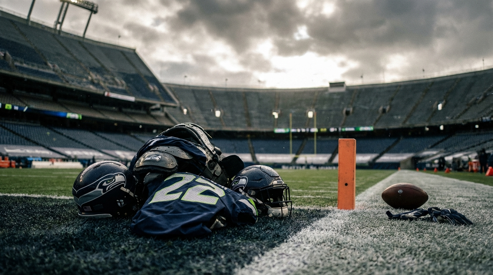
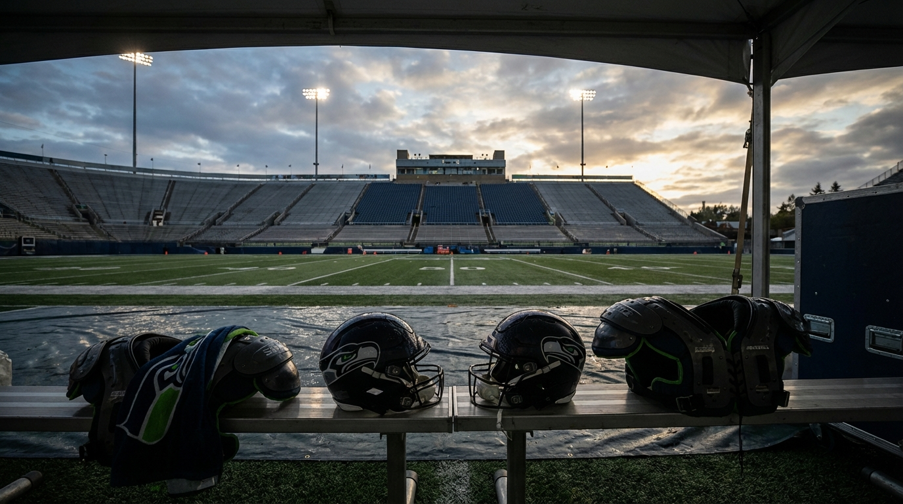
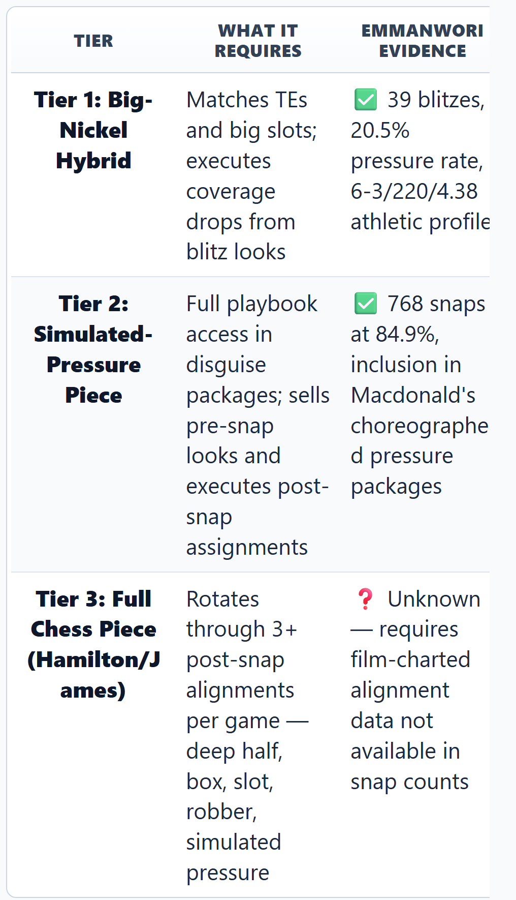
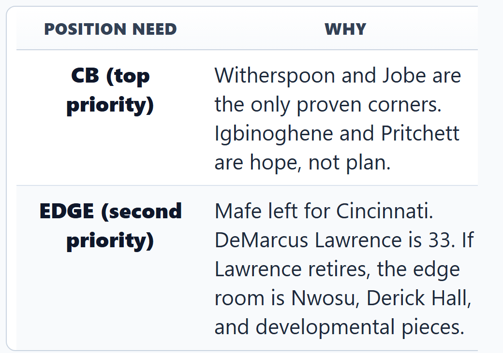

# Nick Emmanwori Played 768 Snaps on Seattle's Championship Defense. Here's What That Actually Proves.

*Three analysts disagree on what "chess piece" means — and the answer changes Seattle's entire draft board.*

> **📋 TLDR**
> - Nick Emmanwori logged 768 defensive snaps (84.9%) as a rookie on a defense that allowed -0.121 EPA/play — 6th-highest snap share on the unit
> - Seattle lost Woolen, Bryant, and Mafe this offseason — the secondary has two proven starters left (Witherspoon and Jobe)
> - Panel verdict: Emmanwori earned real scheme trust, but the "chess piece" label outruns the evidence — he's proven at two deployment tiers, not three
> - The debate: Is 768 snaps on an elite defense proof of a building block, or a system-sheltered number that doesn't survive without Witherspoon?

---

**By: The NFL Lab Expert Panel**

The Seahawks won a Super Bowl and then watched half their secondary walk out the door. **Tariq Woolen** signed with Philadelphia on a 1yr / $15M deal. **Coby Bryant** left for Chicago on a 3-year, $40M deal. **Boye Mafe** — technically an edge rusher, but his departure ripples into every defensive alignment — took $60M from Cincinnati. What's left is Devon Witherspoon, Josh Jobe, Quandre Diggs' replacement at free safety in Julian Love, and a 23-year-old second-round pick who played more snaps than anyone expected.

**Nick Emmanwori** didn't just survive his rookie season. He played 768 defensive snaps at 84.9% — sixth on the entire defense. On a unit that posted -0.121 EPA/play, generated 47 sacks and 18 interceptions, and carried Seattle to a championship, the Round 2 pick from South Carolina wasn't rotational. He was a fixture.

Now comes the question nobody in the building can afford to get wrong: Was that production real, or was it the natural byproduct of playing next to Witherspoon on the best defense in football?

The answer changes everything about Seattle's draft board at #32 and #64.

::subscribe

---

## The Secondary After the Exodus

Before evaluating what Emmanwori proved, you have to understand what Seattle lost — because the context makes his Year 2 role exponentially more important.

| Departure | Destination | Contract | Position |
|:----------|:------------|----------:|:---------|
| Tariq Woolen | Philadelphia | 1yr / $15M | CB |
| Coby Bryant | Chicago | 3yr / $40M | S |
| Boye Mafe | Cincinnati | $60M | EDGE |

The remaining secondary depth chart:

| Player | Position | Status |
|:-------|:---------|:-------|
| Devon Witherspoon | CB1 | Franchise cornerstone — extension talks pending |
| Josh Jobe | CB2 | Re-signed at 3yr/$24M |
| Julian Love | FS | Starter |
| Nick Emmanwori | SS / Big-Nickel | Entering Year 2 |
| Noah Igbinoghene | CB | Reclamation project |
| Nehemiah Pritchett | CB | Unproven |
| Ty Okada | Nickel/S | Tweener |
| Rodney Thomas II | S | Signed from Indianapolis for depth |

That's it. Behind Witherspoon and Jobe, Seattle is running on developmental pieces and free-agent depth. Emmanwori isn't competing for a roster spot — he owns one. The question is whether the coaching staff can build around what he showed in Year 1, or whether the 2026 draft needs to hedge.

---

## The Numbers: What 768 Snaps Actually Looked Like

Our Analytics expert pulled every available metric from Emmanwori's rookie season. The picture is more complicated than the snap count suggests.

### Nick Emmanwori — 2025 On-Ball Production

| Metric | Value |
|:-------|------:|
| Defensive Snaps | 768 |
| Snap Share | 84.9% |
| Tackles | 93 |
| Missed Tackles | 10 |
| Tackle Efficiency | 90.3% |
| Targets Against | 81 |
| Comp% Allowed | 70.4% |
| Yards Allowed | 488 |
| Yards/Target | 6.0 |
| Passer Rating Allowed | 84.7 |
| aDOT Allowed | 6.0 |
| YAC Allowed | 323 (66.2% of total yards) |
| Blitzes | 39 |
| Pressures (on blitz) | 8 |
| Sacks | 2.5 |
| Blitz Pressure Rate | 20.5% |

*Source: nflverse pfr_defense, snap_counts datasets (2025 regular season)*

Two things jump off the table. The tackle efficiency — 90.3% across 103 opportunities — is legitimately good. And the blitz profile — 39 blitzes, 20.5% pressure rate, 2.5 sacks — confirms Macdonald trusted him in simulated-pressure packages, not just zone coverage.

But then there's the coverage column. A 70.4% completion rate allowed and 84.7 passer rating aren't numbers that stop scrolling. The 6.0 aDOT tells you quarterbacks were throwing short routes against him. And here's the number that should keep the front office honest: **66.2% of Emmanwori's yards allowed came after the catch** — 323 of 488 total yards. That's either late arrival to the catch point or a tackling-in-space problem on short completions, and the data can't tell you which.

> *"The tackle efficiency and blitz deployment are concrete positives. The coverage picture — 70.4% comp allowed, 84.7 passer rating, 66.2% of yards as YAC — is mediocre in isolation, partially explained by short-target assignment profile, and impossible to evaluate without alignment data."* — **Analytics**

### How Does He Compare? The Round 2 Safety Benchmark

Since 2015, 29 safeties have been drafted in Round 2. The results aren't encouraging as a base rate.

| Metric | Value |
|:-------|------:|
| Picks (n) | 29 |
| Avg Career AV | 23.4 |
| Median Career AV | 24.0 |
| Starter+ Rate (AV ≥ 30) | 27.6% |

The hits include Xavier McKinney (AV 39), Landon Collins (42), and Minkah Fitzpatrick (34). The misses include T.J. Green (6) and Terrell Edmunds (17). Roughly **7 in 10** Round 2 safeties since 2015 have not become starters.

Emmanwori's Year 1 AV of 4 is a single data point that tells us almost nothing about his career trajectory. AV accrues over 3–4 seasons. But the base rate matters: projecting a positive outcome from one year of production on an elite defense is working against the odds, not with them.

---

## The Reframe: Why the Short aDOT Might Be the Hardest Assignment

This is where our Defense expert flipped the entire analysis on its head — and it's the most counter-intuitive point in the panel.

The default reading of Emmanwori's 6.0 aDOT allowed goes like this: Seattle kept him on short assignments because they didn't trust him deep. That's the "system shelter" narrative. Analytics flagged it as ambiguous — the data is silent on whether it's sheltering or deterrence.

Defense says both readings miss the point.

> *"In Macdonald's scheme, where Witherspoon anchors the deep third and the pass rush generates 47 sacks, putting your rookie hybrid in the contested middle of the field is the harder assignment, not the sheltered one."* — **Defense**

Here's the argument: Macdonald's big-nickel personnel grouping isn't a niche sub-package — it's a primary defensive look. Emmanwori's 6-3, 220-pound frame at 4.38 speed slots into the hybrid role designed to match tight ends and big slot receivers that traditional nickel corners can't handle. In a defense that already has Witherspoon erasing the opponent's top option and a pass rush collapsing the pocket in under three seconds, the short-to-intermediate window is where the remaining offensive value lives. Macdonald stationed his rookie there because that's where the schematic leverage is — not because he was hiding him.

The 39 blitzes and 20.5% pressure rate support this reading. Macdonald's simulated-pressure packages are choreographed deception: show five or six rushers pre-snap, send four, and drop the extra body into a zone window. Including a rookie in those packages means the coaching staff trusted him to sell the blitz look, read the post-snap key, and execute the coverage drop on time.

> *"That's full playbook access. A static 'stand here, cover that' assignment doesn't generate 39 blitz reps."* — **Defense**

This reframe doesn't erase the mediocre coverage numbers. But it changes what they mean. If Emmanwori was running Macdonald's full simulated-pressure playbook while covering the contested middle of the field, the 70.4% comp% and 84.7 passer rating look different than if he was parked in a deep zone watching the play develop.

---

## The Central Disagreement: What Does "Chess Piece" Actually Mean?

This is where the panel splits — and the split is the story.

> *"768 snaps at 84.9% on an elite defense isn't sheltered — it's earned. Macdonald doesn't hand that workload to a rookie as a favor. The 90.3% tackle efficiency, blitz deployment, and snap share rank show coaching trust. Seattle should treat Emmanwori as a secondary building block."* — **SEA**

> *"The chess-piece label is conditionally earned — validated at the big-nickel tier, unproven at the full Hamilton/James archetype."* — **Defense**

> *"One year on an elite defense, where the base rate for Round 2 safeties reaching starter-plus is only 27.6%, does not warrant treating the S2 question as settled."* — **Analytics**

The disagreement isn't about whether Emmanwori was good. All three panelists agree the snap workload was earned, the blitz deployment shows real trust, and CB/EDGE are the draft priorities. The disagreement is about **what tier of "chess piece" Year 1 actually proved.**

### The Two-Tier / Three-Tier Framework

Defense drew the sharpest line in the panel, and it gives the debate its structure:

A true chess piece — Kyle Hamilton in Baltimore, Derwin James in his prime — rotates through all three tiers game to game. Emmanwori demonstrated Tiers 1 and 2. Whether he executed meaningful post-snap rotations from a pre-snap two-high shell into single-high or robber assignments — Macdonald's signature schematic wrinkle — is the open question that no publicly available dataset can answer.

**Both "big-nickel hybrid who earned real reps" and "genuine chess piece who operates at all three levels" are valuable players.** Only the latter justifies the Hamilton comp family that the "chess piece" label implies.

---

## The Witherspoon Variable Nobody's Talking About

SEA raised the point that neither Analytics nor Defense fully engaged, and it might be the most important variable in the entire evaluation.

Everything in Seattle's secondary flows through Devon Witherspoon. Emmanwori's coverage metrics — the 6.0 aDOT, the manageable target volume, the big-nickel deployment — exist inside an ecosystem where Witherspoon erases the opponent's best receiver and a 47-sack pass rush collapses the pocket before routes develop. Take Witherspoon out of that equation, and the math changes completely.

> *"The Witherspoon extension isn't just about paying a CB1 — it's about preserving the ecosystem that makes Emmanwori's role viable."* — **SEA**

If the extension stalls or Witherspoon misses time, Emmanwori's Year 2 test gets dramatically harder. He'd face more targets, deeper routes, and better receivers — the exact situations Year 1 didn't test. This isn't a knock on Emmanwori. It's an acknowledgment that evaluating any defensive back in isolation from the system around him is incomplete, and Seattle's system has a single point of failure at CB1.

---

## The Draft Fork: What the Evaluation Means for #32 and #64

Here's where the analysis becomes actionable. Seattle has four picks: #32, #64, #96, and roughly #188. No Round 4 or 5. Every selection carries amplified opportunity cost.

All three panelists — even Analytics, the most cautious voice — agree on the draft conclusion:

The fork is binary:

**If you trust Year 1** → Spend #32 and #64 on CB and EDGE. The secondary has its hybrid piece. Build around the holes the departures actually created.

**If you doubt Year 1** → Burn one of those premium picks on secondary insurance — a versatile DB or safety — and accept that one of CB or EDGE goes unaddressed until #96, where the talent drop-off is real.

The panel's consensus, despite disagreeing on *how much* to trust Year 1: draft CB and EDGE. The Emmanwori evidence — even at its most conservative reading — is strong enough to avoid spending premium capital on safety insurance. The coverage concerns (YAC rate, system dependency) are real, but they're Year 2 questions, not draft-day questions.

---

## The Verdict: Earned With Conditions

The panel lands on a modified Path 1 — closest to Defense's framing of "conditionally earned."

The evidence, ranked by strength:

1. **The blitz deployment is real.** 39 blitzes at a 20.5% pressure rate with 2.5 sacks means Macdonald trusted Emmanwori in the most schematically complex packages the defense runs. This is the strongest individual signal in the evaluation.

2. **The snap volume is earned, not inherited.** Macdonald had rotational options — Okada, Finley, Bryant before he left — and chose Emmanwori for 768 snaps. Coaches on championship-caliber defenses don't burn snaps on passengers.

3. **The "chess piece" label needs a tier, not a blanket.** Emmanwori proved big-nickel hybrid and simulated-pressure competence. The full Hamilton/James archetype — three-plus post-snap alignments per game — is projected, not confirmed. That's fine. Both tiers are valuable.

4. **The coverage metrics are a question mark, not a red flag.** 70.4% comp% and 84.7 passer rating are mediocre in isolation but gain context through Defense's deployment reframe. The 66.2% YAC rate is the specific metric that Year 2 needs to answer.

5. **The Witherspoon ecosystem is the hidden variable.** Emmanwori's path from "conditionally earned" to "confirmed building block" runs directly through the Witherspoon extension. If Seattle locks up its CB1, it preserves the environment where Emmanwori's development can continue on schedule. If it doesn't, every evaluation from Year 1 gets re-tested under harder conditions.

Nick Emmanwori didn't answer every question in Year 1. No rookie safety does — the base rate says 7 in 10 Round 2 safeties never become starters. But he answered enough of them to change what Seattle should do with its draft capital, and that's the only evaluation that matters in March.

Draft CB. Draft EDGE. Let Year 2 be the confirmation, not the audition.

::subscribe

---

*The NFL Lab is a virtual front office — specialized AI analysts who debate every angle of every move, moderated and fact-checked by a human editor. When they disagree, that disagreement is the analysis. Welcome to the Lab.*

*Got a trade, signing, or draft scenario you want us to break down? Drop it in the comments.*

---

**Next from the panel:** Emmanwori earned enough trust for Seattle to spend #32 on a cornerback instead of secondary insurance. But which one? We ran every CB in the draft through Macdonald's scheme requirements, Seattle's cap constraints, and the depth chart — and the board is shorter than you think. The Seahawks' Round 1 CB target list drops next.
