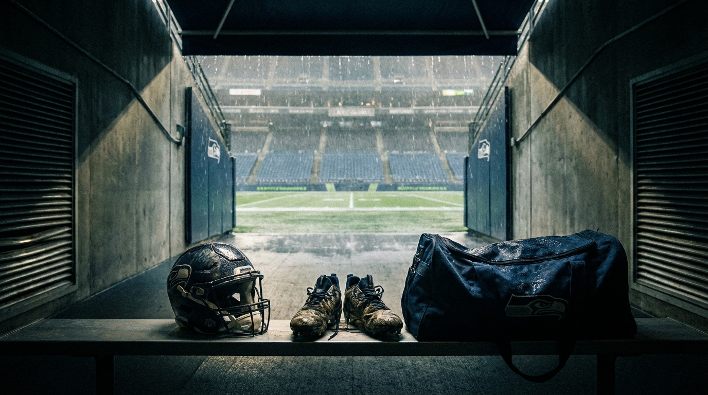
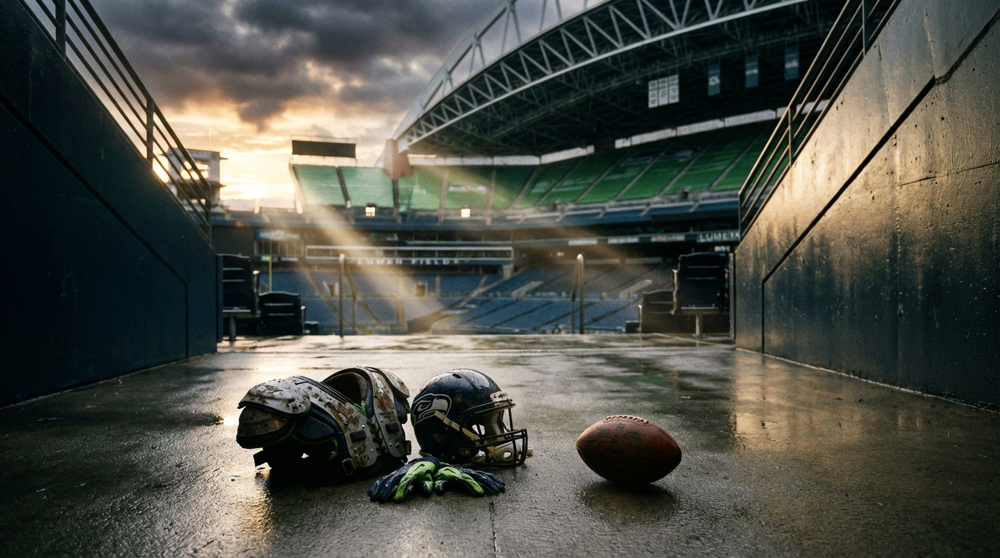

# The Seahawks Still Need a Running Back. They Just Can't Afford One at Pick #64.

*Our expert panel revisited the case for Jadarian Price — and found that Seattle's defensive bleeding changed the entire equation.*

> **📋 TLDR**
> - Seattle lost Riq Woolen, Coby Bryant, and Boye Mafe in free agency; the defensive depth behind the starters is practice-squad caliber, and DeMarcus Lawrence may retire
> - Charbonnet's late-season ACL puts him at roughly 35–45% for Week 1, but the medical case alone doesn't demand Pick #64 on a running back — a $3–5M veteran bridge covers the gap
> - **Panel verdict:** CB at #32, EDGE at #64, RB at #96 or through the veteran market — the positional dropoff from Round 2 to Round 3 is gentle at running back but a cliff at EDGE and corner
> - **The dissent:** Offense argues Fleury's wide-zone system needs a third back *now*, and the cost of skipping RB is higher than the roster snapshot suggests

---

**By: The NFL Lab Expert Panel**
*SEA · Injury · CollegeScout · Offense*

Two weeks ago we published an article that said Seattle should spend Pick #64 on Jadarian Price and pair him with a veteran bridge back. The logic was clean: Kenneth Walker III was gone, Zach Charbonnet's ACL made Week 1 uncertain, and Price — a 6.0 career YPC Notre Dame All-American with an old Achilles tear suppressing his draft stock — was the best value play on the board.

Then the rest of free agency happened.

Seattle didn't just lose its starting running back. It lost its CB2 (Riq Woolen to Philadelphia, 1 year / $15M), its most versatile defensive back (Coby Bryant to Chicago, 3 years / $40M), and its best young pass rusher (Boye Mafe to Cincinnati, 3 years / $60M) — all in the same week. DeMarcus Lawrence, who turns 34, has not told the team whether he's coming back. The defense that won Super Bowl LIX went from "championship-caliber" to "one injury from starting Noah Igbinoghene at corner" in seven days.

That changes the math. Not whether Seattle has a running back problem — it does. Whether that problem is worth a second-round pick when the secondary and the pass rush are on fire.

We reconvened the panel. Three of four came back with the same answer: Price is a good player, but #64 is the wrong price. One held firm. The disagreement is the article.

---

## What Seattle Lost — and Why It Rewrites the Draft Board

The original article treated Walker's departure as the Seahawks' defining offseason event. It wasn't even close to the most damaging one.

| Player | Position | Destination | Contract | Replacement Quality |
|--------|----------|-------------|----------|---------------------|
| Kenneth Walker III | RB | KC Chiefs | 3yr / $45M | 🟡 Charbonnet (ACL), Wilson, Holani |
| Boye Mafe | EDGE | CIN Bengals | 3yr / $60M | 🔴 No replacement signed |
| Riq Woolen | CB | PHI Eagles | 1yr / $15M | 🔴 Igbinoghene / Pritchett as CB3 |
| Coby Bryant | S/CB | CHI Bears | 3yr / $40M | 🔴 Thomas II signed, different role |

Look at the replacement quality column. The running back room has a floor: Charbonnet will return, Wilson is serviceable depth, and the veteran market is still open. The defensive depth chart has no floor. Behind Witherspoon and Jobe at corner, Seattle is staring at Nehemiah Pritchett (practice-squad level) and Noah Igbinoghene (a former Dolphins first-rounder who has bounced across four teams). Behind Nwosu and Hall at EDGE, it's Mike Morris and Rylie Mills — developmental pieces, not starters.

> *"If DeMarcus Lawrence retires and Seattle spent #64 on a running back, there is no Plan B. That's not a draft strategy — it's a trust fall."* — **SEA**

Our team expert's revised need stack captures the shift:

| Priority | Position | Why | Draft Window |
|----------|----------|-----|--------------|
| 🔴 1 | **CB** | Woolen + Bryant gone. One injury from catastrophe. | Must address R1 or R2 |
| 🔴 2 | **EDGE** | Mafe gone, Lawrence may retire. No young edge on roster. | Must address R1 or R2 |
| 🟡 3 | **RB** | Walker gone, Charbonnet's ACL clouds Week 1. But a veteran bridge covers Weeks 1–8. | R3 or veteran FA |
| 🟡 4 | **IOL** | Interior depth thin but adequate. | R3 or R6 |

Seattle has four draft picks — #32, #64, #96, and approximately #188. The fewest in the NFL. Two must go to CB and EDGE. The remaining two address RB and IOL, or Seattle trades back for more capital. There is no scenario where spending #64 on a running back doesn't leave either corner or pass rusher unaddressed until Round 3, where the starter-quality prospects at those positions are gone.

<!-- IMAGE: Split-panel editorial illustration showing Seattle's draft board dilemma — one side shows the defensive losses (Woolen, Mafe, Bryant jerseys fading out) with a red "NO PLAN B" overlay, the other side shows Pick #64 with EDGE and CB prospect silhouettes competing against a running back.
     Placement: inline
     Tone: urgent, analytical, front-office war-room tension
     Key elements: Seattle Seahawks branding, four draft picks displayed (#32 #64 #96 #188), defensive roster holes highlighted in red, Jadarian Price silhouette on one path vs. EDGE/CB silhouettes on the other
-->

---

## The Medical Picture: A Coin Flip and a Fading Footnote

Two injuries drive this entire article. Understanding what each one actually means is the difference between panic-drafting and planning.

### Charbonnet's ACL: Not a Crisis, But Not a Plan

Charbonnet tore his ACL during Seattle's playoff run, with surgery in late January 2025. Standard ACL recovery for running backs runs 10–12 months — longer than other positions because the position demands lateral cutting, explosive burst, and the psychological trust to hit a hole without hesitation. Our injury expert's Week 1 probability matrix:

| Scenario | Probability |
|----------|-------------|
| Full clearance, full snap count Week 1 | ~15–20% |
| Active but limited (60–70% snaps, reduced burst) | ~20–25% |
| PUP list, returns Weeks 4–6 | ~35–40% |
| Rehab setback, extended absence | ~15–20% |

**Composite Week 1 availability: roughly 35–45%.** A coin flip. And even if Charbonnet is technically cleared, an 80% version of a running back is not the same as an 80% version of a quarterback.

> *"Mahomes at 80% can still beat you from the pocket. Charbonnet at 80% is a running back who can't hit the hole. That's not a running back — that's a decoy."* — **Injury**

There's a permanent planning layer here, too. Players with a prior ACL reconstruction face a roughly 25% rate of subsequent ACL injury. That doesn't mean Charbonnet will re-tear. It means Seattle needs real depth for as long as he's the RB1.

### Price's Achilles: The Discount That Disappeared

The original article positioned Price's 2022 Achilles tear as a buying opportunity — "a first-round talent you could steal in Round 2." Our injury expert's v2 reassessment: the medical risk hasn't changed. Four years, 41 games, three kick-return touchdowns, zero Achilles-related missed time. Re-rupture rate at this stage is around 1–2%. The risk is genuinely manageable.

What changed is the *discount*.

| Draft Process Stage | Estimated Achilles Discount |
|--------------------|-----------------------------|
| Pre-Combine (Jan–Feb) | 20–30 picks |
| Post-Combine, pre-medicals (Mar) | 15–25 picks |
| Post-team medicals (Apr) | 10–15 picks |
| Draft day | 5–15 picks |

> *"Price's Achilles is a 2022 story with a 2025 ending. Four years, 41 games, three kick-return touchdowns. At some point, the evidence outweighs the scar. We're past that point."* — **Injury**

By draft day, the Achilles might suppress Price's stock by 5–10 picks, not the 15–30 the original article assumed. A 6.0 YPC All-American returner with clean medicals may not even reach #64. That undercuts the entire "steal" narrative the original piece was built on.

---

## The Scouting Reality: A Good Player, Not a Stolen One

Our college scouting expert's sharpest contribution was correcting what v1 got wrong about Price's value. The original article called him a late-first-round talent falling to Round 2 on Achilles fear. CollegeScout calls foul.

Price's consensus ADP has *risen* since the original article. PFF slots him at 58 overall, other boards at 53–56. He was never a first-round talent — a committee back with 280 career carries, 15 career catches, and 3 fumbles in his final season. Without the Achilles, he's still a mid-second-round pick. At #64, Seattle is paying fair market price.

| Trait | Grade | Notes |
|-------|-------|-------|
| Zone-scheme vision | A- | One-cut decisiveness is legitimate. 6.0 YPC against top-10 SOS |
| Character / culture | A+ | Shared a backfield with the class's RB1 without complaint |
| Return value | A | 37.5 yards/return in 2025, 3 career KR TDs |
| Speed | B | 4.49 forty — adequate, not explosive |
| Receiving | C+ | 15 career catches. Underdeveloped for a Shanahan-tree back |
| Ball security | C | 3 fumbles in 2025. Technique issue, not medical |

> *"The v1 article told you Price was a late-first-round talent you could steal in Round 2. He's actually a mid-second-round talent you'd draft at face value. That's a meaningful difference when you only have four picks."* — **CollegeScout**

But the real finding isn't about Price. It's about what happens if Seattle passes on RB at #64 and waits until #96.

### The Dropoff That Decides Everything

| Position | Quality at #64 | Quality at #96 | Dropoff |
|----------|---------------|----------------|---------|
| **RB** | Price (mid-R2 talent) | Coleman / Johnson (70–80% of Price) | **Small** |
| **EDGE** | Jacas, Moore, Dennis-Sutton (starter-quality) | Day 3 developmental types | **Large** |
| **CB** | Scott, Abney, Stukes (starter-quality) | Camp bodies and projects | **Large** |

This table is the article's analytical backbone. The running back class has real depth in Rounds 2–3: Jonah Coleman from Washington (power zone runner, elite contact balance), Emmett Johnson from Nebraska (46 catches in 2025 — more than triple Price's career total, strong zone vision), Nicholas Singleton from Penn State (speed-power combo). At least two will be available at #96, and both Coleman and Johnson have legitimate zone-scheme fit.

The EDGE and CB classes do not have that depth. By #96, the starter-quality prospects are gone.

> *"The dropoff from Pick #64 to Pick #96 at running back is a gentle slope. At EDGE and corner, it's a cliff. That should tell Seattle everything they need to know about where to spend their capital."* — **CollegeScout**

If you told CollegeScout that Seattle could get Johnson at #96 — a zone-scheme back with 46 catches in a single season — and use #64 on an EDGE or corner, he would take that trade every single time.

---

## The Dissent: Why Offense Says the Cost of Skipping RB Is Higher Than You Think

This is where the panel fractures, and it fractures honestly.

Our offensive scheme expert doesn't dispute the defensive losses. He doesn't dispute the need hierarchy. What he disputes is the assumption that Seattle can paper over the running back problem without real consequences to the offense's identity.

Brian Fleury came from San Francisco's run-game coordinator chair. He is installing a wide-zone system that demands three things from the backfield: one-cut decisiveness, receiving ability, and committee depth. Shanahan-tree offenses have *always* been multi-back systems. You do not need one elite running back. You need three competent ones who fit the scheme.

Seattle currently has one and a half.

| Player | Zone Fit | Receiving | Pass Pro | Role Ceiling |
|--------|----------|-----------|----------|-------------|
| **Charbonnet** | 🟢 Strong | 🟡 Adequate | 🟢 Sound | RB1 when healthy |
| **Emanuel Wilson** | 🟡 Average — more gap/power | 🟡 Limited | 🟡 Unproven | Depth / change-of-pace |
| **George Holani** | 🔴 Lacks burst for zone | 🔴 Limited | 🟡 Unknown | Practice squad |

> *"Fleury's run game is a three-back buffet, and Seattle's cupboard has one plate and two plastic forks."* — **Offense**

Here is Offense's core argument: If Charbonnet isn't ready Week 1 — and the medical assessment says there's a 55–65% chance he won't be — Seattle is starting Wilson as its primary zone back. Wilson's strengths (downhill, physical, power-gap) are misaligned with wide-zone requirements. Play-action loses credibility when the run game averages 3.4 YPC because the lead back can't read zone blocks at speed. Darnold's efficiency craters. The passing game shrinks.

A veteran bridge alone doesn't fully solve this. Robinson Jr. is a physical, downhill runner — great complement, poor primary zone back. Mostert is 34 with an ACL and multiple knee procedures. Neither is your primary zone runner for Weeks 1–8.

> *"The run game is the engine. Play-action is the accelerator. You don't save money on engine parts and expect the car to run the same."* — **Offense**

Offense rates the pull toward RB at #64 at 7 out of 10. Not a must-draft. But higher than any other panelist. The question is whether a 6–8 week structural compromise to the run game is worse than a 17-game structural weakness at corner or EDGE.

<!-- IMAGE: Editorial illustration showing Fleury's wide-zone run game as an engine diagram with three cylinders — Charbonnet's cylinder marked with an ACL caution symbol, Wilson's marked as a "wrong fit" power piece, and the third cylinder empty with a question mark, capturing Offense's "three-back buffet" argument.
     Placement: inline
     Tone: schematic, mechanical, analytical
     Key elements: Seattle Seahawks branding, wide-zone blocking diagram in background, three running back silhouettes with fit indicators, Brian Fleury coaching tree connection to San Francisco
-->

---

## Where the Panel Breaks — and Why It Matters

The disagreement is not chaos. It is a clean fault line between two legitimate football philosophies: **need severity** versus **scheme survival**.

| Panelist | Price at #64? | Core Argument | Recommended Path |
|----------|--------------|---------------|------------------|
| **SEA** | ❌ Too expensive | Defense has no Plan B. RB has Charbonnet + veteran market. | CB #32, EDGE #64, RB #96 |
| **Injury** | 🟡 Medical case doesn't demand it | Charbonnet is a coin flip, but the urgency is solvable without #64. | Address RB meaningfully, not necessarily at #64 |
| **CollegeScout** | 🟡 Fair value, not a steal | ADP has risen. Alternatives at #96. Dropoff at EDGE/CB is steeper. | EDGE/CB at #64, zone back at #96 |
| **Offense** | 🟢 Scheme target, 7/10 pull | Fleury's system needs a zone-fit third back. Wilson isn't the answer. | Price at #64, or accept a compromised run game |

**SEA's strongest point:** Duration of damage. A compromised run game lasts 6–8 weeks until Charbonnet returns. A compromised secondary or pass rush lasts 17 games plus playoffs. When you're a defending champion in the NFC West — where San Francisco just added Mike Evans and the Rams upgraded at corner — you cannot afford structural defensive weakness all season.

**Offense's strongest point:** The replacement curve. Seattle can sign a veteran CB or EDGE in free agency and get 80 cents on the dollar for a starter. Seattle cannot sign a veteran RB and get a zone-scheme-fit committee back who contributes for four years on a rookie deal. Within this specific scheme, the offensive cost of skipping RB is higher than the raw need ranking suggests.

**The 50/50 split:** CollegeScout and Offense genuinely disagree on whether the #96 RB alternatives are "real." CollegeScout says Coleman and Johnson are 70–80% of Price and available a round later. Offense says scheme-fit backs who can run NFL zone from Day 1 are rarer than CollegeScout admits. Neither has enough certainty to declare victory. The reader gets to decide.

---

## The Verdict: Spend #64 on Defense, Solve RB a Different Way

Three of four panelists agree, and the evidence supports them: Seattle should not spend Pick #64 on a running back in the 2026 draft.

This is not a dismissal of the running back problem. It is a recognition that the defense has bigger problems with fewer solutions.

| Round | Pick | Recommended Target | Rationale |
|-------|------|--------------------|-----------|
| R1, #32 | CB | Brandon Cissé, Colton Hood, or Avieon Terrell | Address the most fragile position group on the roster |
| R2, #64 | EDGE | Zion Young, L.T. Overton, or best available | Replace Mafe's production, insure against Lawrence's retirement |
| R3, #96 | RB or IOL (BPA) | Coleman, Johnson, or best zone-scheme fit available | This is the appropriate draft slot for RB given the board |
| R6, ~#188 | BPA depth | Whatever need wasn't covered at #96 | Day 3 lottery ticket |

**Plus:** Sign a veteran bridge back — Robinson Jr. at $3–5M on a one-year deal — *before* the draft, to decouple RB from draft-day urgency entirely.

If Price falls to #96, the calculus changes completely. At that price, he's the obvious pick. But the trend line on his ADP is up, not down. Teams are running their own medicals, the Achilles discount is compressing, and a mid-second-round talent is unlikely to last 32 picks beyond his expected range. Planning around Price at #96 is a hope, not a strategy.

> *"Price is a fine player. This isn't about Price. It's about a four-pick draft where two positions are on fire and running back is merely smoldering."* — **SEA**

The October depth chart without a Day 2 RB pick looks functional, not dominant:

| Role | Player | Notes |
|------|--------|-------|
| RB1 | Zach Charbonnet | Back from ACL, mid-season target |
| RB2 | Veteran FA (Robinson Jr.) | Bridge for Weeks 1–8, durability profile ideal |
| RB3 | Emanuel Wilson | Committee piece, short-yardage packages |
| RB4 | R3 pick or Holani / McIntosh | Developmental zone runner if BPA cooperates at #96 |

That is not a championship backfield in September. Offense is right about that. But it is a *survivable* one — and it lets Seattle spend its premium picks fixing the positions where no veteran bridge exists. You can find a running back in March. You cannot find a starting corner or a pass rusher who replaces Boye Mafe's production after the free-agent market has already closed.

---

## What Changed, and What Didn't

The v1 article asked: *Should Seattle draft a running back at #64?*

The v2 asks: *Can Seattle afford to?*

The player hasn't changed. Price is still a well-rounded, high-floor zone-scheme back with elite character and real kick-return value. The medical picture hasn't changed — Charbonnet's ACL still creates urgency, and Price's Achilles is still a fading footnote. The scheme fit hasn't changed — Fleury's wide-zone system still points directly at a player like Price.

What changed is the world around the pick. Seattle's defense went from "championship-caliber with depth questions" to "one injury away from starting practice-squad players at two premium positions." The Seahawks now have the fewest draft picks in the NFL, and every selection has to solve a problem that cannot be solved any other way. RB can be solved through the veteran market and Round 3. CB and EDGE cannot.

> *"A 35–45% Week 1 probability for your RB1 isn't a crisis. But building a game plan around a coin flip is how champions become one-and-done."* — **Injury**

Injury's line captures the honest tension. The RB problem is real, and anyone who waves it away is underestimating what Charbonnet's absence means for the first half of the season. But real problems still have to be prioritized against *worse* problems. And Seattle's defensive attrition — in a division where San Francisco added a Hall of Fame-caliber receiver and the Rams just strengthened their secondary — is the worse problem.

The smarter answer is not to ignore RB. It's to solve it without burning the pick that could save the defense.

---

*The NFL Lab is powered by a 46-agent AI expert panel covering every NFL team, the salary cap, draft prospects, injuries, offensive and defensive schemes, and the latest league-wide news. Each article represents the consensus view of multiple domain specialists working together — and sometimes, their very pointed disagreements.*

*Think Seattle should still take Price at #64? Or should the Seahawks go all-in on defense and trust the veteran RB market? Drop your take in the comments.*

---

**Next from the panel:** Seattle's pass-rush problem might be worse than the secondary — if DeMarcus Lawrence walks away, the Seahawks' EDGE room is one Nwosu injury from collapse. We're convening the defense and draft experts to map what Seattle's options actually look like at #32 and #64.
