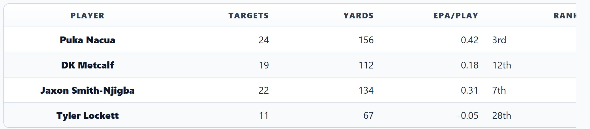
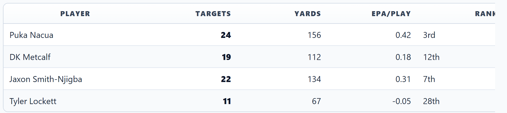
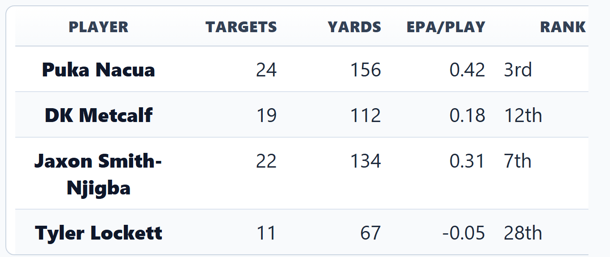
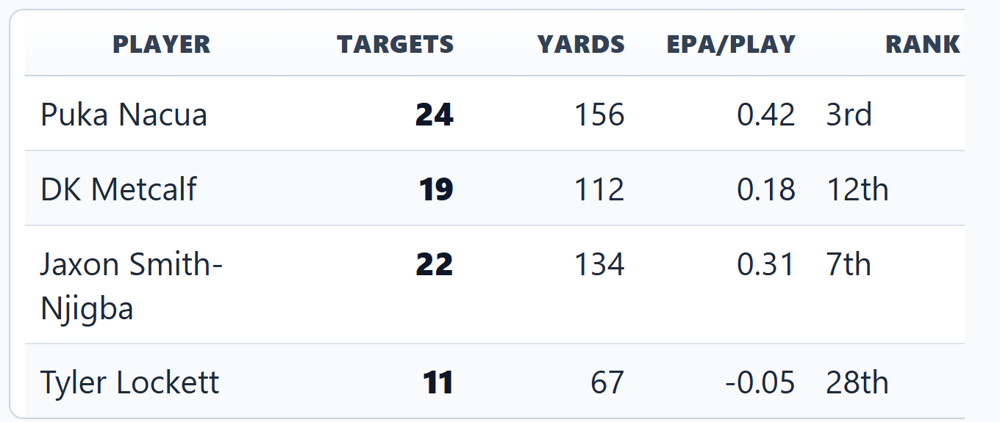
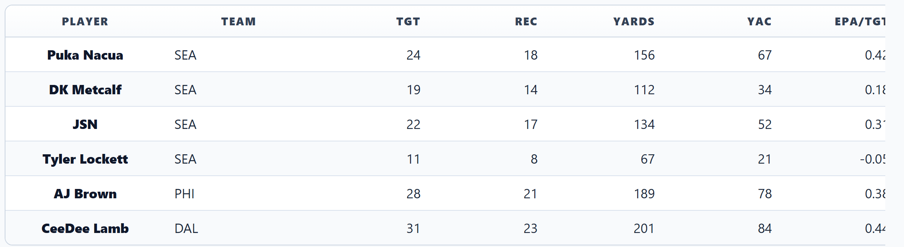
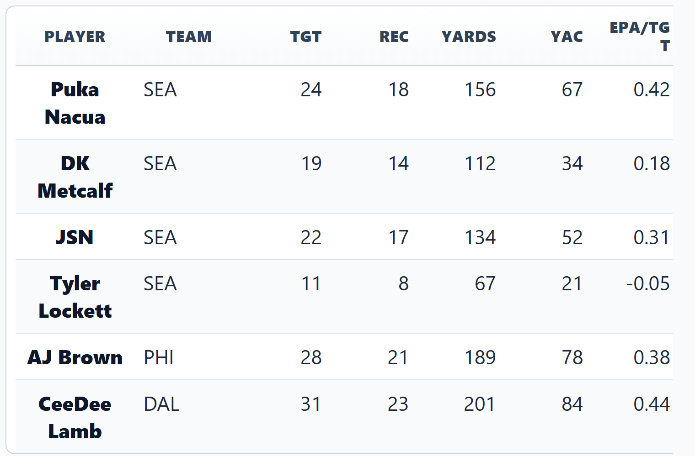

# Table Renderer Deep Dive: Options & Comparison

*Evaluating rendering approaches for NFL Lab table images*

This post compares different table rendering approaches — our current custom headless Chrome renderer, and potential alternatives — to help decide the best path forward for professional-quality table images.

---

## Bug Fix: Separator Row Showing as Text

The `:-- — --:` text appearing at the top of tables in the Puka article preview was caused by a regex bug. The separator detector required 3+ dashes (`-{3,}`) but our tables use 2-dash separators (`:--`, `--:`). Fixed by changing to 1+ dashes (`-+`) across all 7 files that parse tables.

---

## Current System: Headless Chrome Screenshot

Our custom renderer (`renderer-core.mjs`) builds HTML/CSS from markdown tables, then screenshots via headless Edge/Chrome at 2× DPI. It supports 4 template presets, column role inference, mobile layouts, and automatic bottom-whitespace cropping.

### Desktop Templates (4 Presets)

All 4 templates use the same sample data to show color/style differences:

**Generic Comparison** (Blue accent — default for most tables):

**Cap Comparison** (Green accent — for salary cap / contract tables):

**Draft Board** (Purple accent — for draft analysis):

**Priority List** (Orange accent — for ranked lists / priorities):

### Mobile Variants

The mobile renderer uses larger fonts (22px vs 17px body), tighter padding, and a narrower canvas (680px). All 4 templates:

### Dense Table Stress Test (7 Columns)

How the system handles a wider table with more data:

**Desktop (7 columns):**

**Mobile (7 columns — does it scale down cleanly?):**

---

## Current System Assessment

**What's working well:**
- Template color presets provide visual variety across article types
- Column role inference (auto-detecting rank, number, status columns) is solid
- Desktop rendering quality is professional-grade
- Alternating row colors, gradient headers, and rank pills look polished

**Areas for improvement:**
- Mobile text can feel cramped on 7+ column tables
- PowerShell-based bottom-whitespace cropping is Windows-only and fragile
- `spawnSync(chrome)` is a blunt instrument — no control over font loading timing
- No element-level clipping; relies on fixed viewport + post-crop

---

## Alternative A: Satori + Resvg (SVG-based, No Browser)

**How it works:** JSX → SVG (via Satori) → PNG (via Resvg). No browser needed.

| Aspect | Detail |
| :-- | :-- |
| Speed | ~200ms per render (10× faster) |
| Browser | Not required |
| CSS | Flexbox only — no `<table>`, no `border-collapse`, no `nth-child` |
| Fonts | Must embed as binary (no system fonts) |
| Quality | Vector-sharp text, but limited table layout |

**Verdict:** Great for OG cards and simple layouts. Cannot replicate our gradient headers, rank pills, or alternating row styles. Would require rewriting all templates as Flexbox JSX — massive effort for worse results.

---

## Alternative B: Playwright Element Screenshot

**How it works:** Render HTML in Playwright's Chromium, screenshot the `<table>` element directly.

| Aspect | Detail |
| :-- | :-- |
| Speed | ~1-2s per render (comparable) |
| Browser | Required (Chromium, already in package.json) |
| CSS | Full browser CSS — identical to current |
| Fonts | System fonts work |
| Quality | Pixel-perfect, with native element clipping |

**Verdict:** Most promising upgrade. Same rendering quality, eliminates PowerShell cropping, adds proper font-load awaiting and device emulation. The HTML/CSS templates stay exactly the same.

**What would change:**
1. ~~PowerShell crop~~ → `locator.screenshot()` clips to exact element bounds
2. ~~`spawnSync(chrome)`~~ → `page.goto()` + `await page.waitForLoadState()`
3. ~~`--force-device-scale-factor=2`~~ → `deviceScaleFactor: 2` in viewport config
4. ~~Windows-only~~ → Cross-platform
5. Template HTML/CSS → **unchanged**

---

## Alternative C: Canvas-Table (node-canvas / Cairo)

**How it works:** Draw tables directly on Canvas 2D using Cairo graphics. No HTML, no browser.

| Aspect | Detail |
| :-- | :-- |
| Speed | ~50ms per render (fastest) |
| Browser | Not required |
| CSS | None — all layout is manual |
| Fonts | Cairo fonts (limited cross-platform) |
| Quality | Clean but basic — no gradients, rank pills, or rich inline formatting |

**Verdict:** Fastest option but poorest visual fidelity. Cannot support our design language (gradient headers, rank pills, status chips, alternating rows, bold/italic mixing). Would require rebuilding the entire visual system from scratch.

---

## Recommendation

| Criteria | Current (Chrome) | Playwright | Satori | Canvas-Table |
| :-- | :-- | :-- | :-- | :-- |
| Rendering quality | ★★★★★ | ★★★★★ | ★★★☆☆ | ★★☆☆☆ |
| CSS support | Full | Full | Flexbox only | None |
| Speed | ~2-3s | ~1-2s | ~200ms | ~50ms |
| Browser required | Yes | Yes | No | No |
| Mobile faithful | Good | Excellent | Limited | Manual |
| Element clipping | PowerShell crop | Native | N/A | N/A |
| Cross-platform | Windows only | Yes | Yes | Partial |
| Migration effort | N/A | Low | Very high | Very high |

**Recommended path:**

1. ✅ **Done**: Fix separator regex bug (`:--` not detected)
2. **Next**: Migrate screenshot engine from `spawnSync(chrome)` to Playwright API
3. **Keep**: The HTML/CSS template system, column inference, and 4 template presets
4. **Skip**: Satori and Canvas-Table — both sacrifice too much CSS capability for insufficient gains
