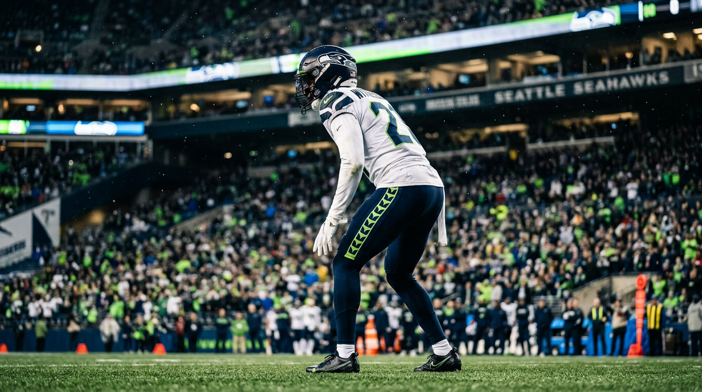
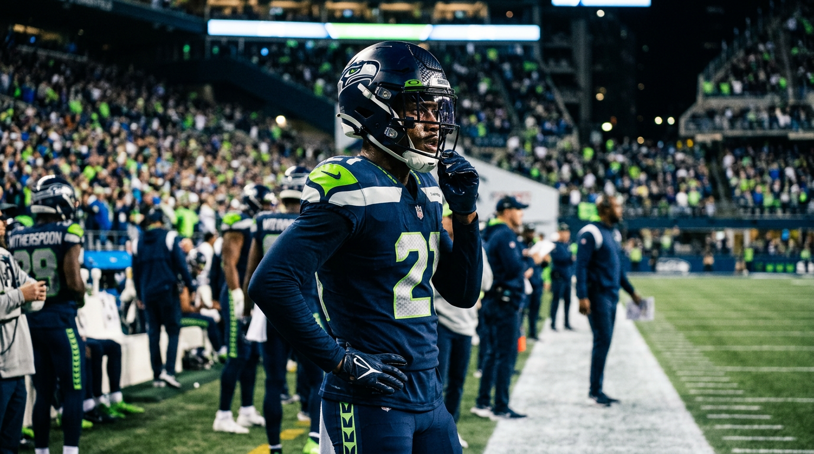

# Cap Says $27M. The Agent Demands $33M. Here's Why They're Both Right About Devon Witherspoon.

*The NFL Lab expert panel re-examines Seattle's most important negotiation — and finds the two sides closer than they think.*

---

**By: The NFL Lab Expert Panel (Cap · PlayerRep · SEA)**

> **📋 TLDR**
> - Trent McDuffie's $31 million extension effectively erased any realistic path to a $27 million outcome, but that does not make $33 million the smart number for Seattle.
> - Devon Witherspoon is not merely Seattle's best corner; he is Mike Macdonald's schematic hinge, and the Seahawks' post-free-agency secondary is too thin to flirt with delay.
> - The real fight is not average annual value. It's whether the fully guaranteed number starts with a 6 or a 7.
> - Our verdict: Seattle should stop negotiating with ghost numbers and close this at roughly 4 years, $126 million new money, $66 million fully guaranteed, and about $96 million in total guarantees.

A month after Super Bowl LIX, the most important snap in Seattle might be one that never happens.

It is not a third-and-8 in January. It is not a red-zone rep in camp. It is the moment John Schneider decides whether to stop treating Devon Witherspoon's extension like a negotiation exercise and start treating it like what it really is: a championship-maintenance decision. Witherspoon just finished the 2025 season as PFF's top-graded cornerback in football. He has made three straight Pro Bowls. He was the defensive hero of Seattle's title run. And he is still sitting on the final year of a rookie contract.

That creates the kind of disagreement front offices actually care about. Cap looks at the whole board: Jaxon Smith-Njigba's extension is coming, the pass rush still needs a legitimate veteran answer, safety cannot be patched together forever, and one emotional overpay can quietly become two years of roster compression. PlayerRep looks at a much simpler set of facts: Trent McDuffie just got $31 million per year without a PFF #1 season, so a number beginning with 2 is not a "discount." It's an insult.

The interesting part is that both sides are making rational arguments from the same evidence. Seattle is not debating whether Witherspoon is elite. Seattle is debating whether elite should be priced as a market reset or as a championship fit. That's a much narrower fight — and much more solvable — than the headline suggests.

---

## The Setup

Seattle's team analyst did not bury the lede: this is the Seahawks' No. 1 offseason priority because the defense around Witherspoon has already thinned out.

Riq Woolen left for Philadelphia on a deal worth $15 million per year. Coby Bryant went to Chicago for 3 years and $40 million. Josh Jobe was re-signed, which matters, but "valuable returning starter" and "credible CB1 insurance" are not the same thing. Nick Emmanwori is a fascinating chess piece, not an answer to every secondary problem. At CB4, Seattle has a blank space where a depth chart line should be.

| Role | Player | Reality Check |
|------|--------|---------------|
| CB1 | Devon Witherspoon | Elite. PFF #1. Final year of rookie deal. |
| CB2 | Josh Jobe | Solid. Re-signed 3yr/$24M. Not a CB1. |
| Nickel | Nick Emmanwori | Versatile big nickel. Limited outside reps. |
| CB4 | ??? | Nobody. |

That matters more in Seattle than it would in a static four-man-front, spot-drop defense. Macdonald's entire system is built on ambiguity: late rotation, disguise, overload pressure, corners who can change jobs after the snap, and defensive backs who can survive in multiple body types and alignments without telegraphing the coverage. Witherspoon is the one corner on the roster who lets the whole thing stay disguised instead of merely complicated.

| Metric | Value | Context |
|--------|-------|---------|
| PFF Overall Grade | 90.1 | #1 among all CBs |
| PFF Pass Rush Grade | 91.8 | As a cornerback |
| PFF Run Defense Grade | 86.7 | 2nd among all CBs |
| Pro Bowls | 3 | Consecutive (2023–2025) |
| All-Pro | 1 (2nd Team) | 2025 |
| SB LIX Stats | 4 TKL, 1 SK, 3 QBH, 1 FF | Forced game-sealing turnover |

The Seahawks' internal priority stack reflects that reality:

| Rank | Priority | Why it sits there |
|------|----------|-------------------|
| 1 | Witherspoon extension | The defense is built around his versatility |
| 2 | EDGE rusher | Seattle still needs credible four-man pressure |
| 3 | Starting safety | The back end cannot be all projection |
| 4 | JSN extension | Essential, but more sequenceable than CB1 |

> *"This is less a true valuation divide than two sides framing the same inevitable deal. Pay him like the defense depends on him, because it does." — SEA*

That quote gets at the real football point. Without Witherspoon, Seattle is not simply replacing a star. It is changing the menu. Jobe gets promoted into a role he has never been asked to carry for a full season. Emmanwori gets dragged away from the big-nickel role that makes him dangerous. The defense becomes easier to identify and easier to attack. You can survive injuries around the edges of a championship roster. You do not casually test the load-bearing wall.

---

## The CB Market

This negotiation starts with one uncomfortable truth for Seattle: the cornerback market moved faster than the team's original model.

| Player | Team | Year Signed | AAV | Fully GTD | Total GTD |
|--------|------|-------------|-----|-----------|-----------|
| Trent McDuffie | LAR | Mar 2026 | $31.0M | ~$100M | $100M |
| Sauce Gardner | IND | Jul 2025 | $30.1M | $40.5M | $85.7M |
| Derek Stingley Jr. | HOU | Mar 2025 | $30.0M | $48.0M | $89.0M |
| Jaycee Horn | CAR | 2025 | $25.0M | $46.7M | $70.0M |
| Pat Surtain II | DEN | Sep 2024 | $24.0M | $40.7M | $77.5M |
| DaRon Bland | DAL | 2025 | $23.0M | $36.3M | $50.0M |

There are two ways to read that table, which is exactly why the negotiation is so interesting.

**PlayerRep's reading:** McDuffie's $31 million AAV is now the floor for any elite young corner negotiating after him. Witherspoon just finished a season McDuffie has never had: PFF's No. 1 overall grade at the position, plus the signature playoff run that turns national attention into leverage. If McDuffie can reset the market, Witherspoon can absolutely demand to beat it.

**Cap's reading:** the market moved, yes — but the guarantee structures are all over the map. McDuffie's ~$100 million fully guaranteed number is an outlier. Gardner and Stingley prove that AAV can sit at or above $30 million without the fully guaranteed money following it all the way to the moon. So Seattle does not need to concede every lever just because the headline number starts with a 3.

That distinction is critical. In NFL negotiations, the last big deal tends to set the public narrative. But the back half of the contract — full guarantees, vesting schedules, cash flow, practical exits — is where teams preserve flexibility and agents bank real wins. Seattle cannot plausibly argue that Witherspoon belongs in the Jaycee Horn tier. It can argue that McDuffie's guarantee structure should not be treated as a mandatory template.

One more thing: McDuffie's deal did not just move the market. It moved the psychology. If Seattle comes in at $27 million, it is not negotiating off the current board; it is asking the player to pretend the current board does not exist.

---

## What Cap Says

Cap's refreshed position is more realistic than the original sticker price. The recommendation is still to extend now, but at the low end of the overlap: roughly **4 years, $122 million new money, $30.5 million AAV, and $58–62 million fully guaranteed**.

The logic is less about what Witherspoon deserves in a vacuum and more about what Seattle's 2026–2029 roster has to absorb after this deal gets signed.

| Year | Age | Cap Hit | % of Projected Cap |
|------|-----|---------|-------------------|
| 2026 | 26 | $16.9M | 5.6% |
| 2027 | 27 | $23.0M | 7.0% |
| 2028 | 28 | $27.5M | 7.8% |
| 2029 | 29 | $30.5M | 8.1% |
| 2030 | 30 | $34.2M | 8.5% |

That model tells you what Seattle is buying: a star corner whose cap hit stays below 8.5% of the cap every year, a manageable 2027 number instead of a clunky fifth-year option bridge, and room to carry the rest of the defense without turning other needs into bargain-bin emergencies.

Cap's case becomes more persuasive when you place the Witherspoon file next to the JSN file instead of analyzing it alone. Seattle is not managing one extension. It is sequencing two foundational ones.

| 2026 Funding Question | Amount |
|-----------------------|--------|
| Darnold restructure | +$16.0M |
| Williams restructure | +$9.6M |
| Gross space created | +$25.6M |
| Witherspoon extension bump | ~+$6.8M |
| JSN extension bump | ~+$13.0M |
| Combined extension delta | ~+$19.8M |

That is the cleanest version of the cap argument. Seattle does not need a miracle to do both deals now. It needs discipline. The restructures cover the incremental cost of both extensions, leaving enough operational space to keep chasing a veteran EDGE and credible safety help. At Cap's preferred pricing, the two stars project to roughly $33 million combined against the cap in 2026, about $50 million in 2027, and around $57–58 million in 2028. That's expensive. It is also functional.

Push Witherspoon toward $33 million while JSN lands in the mid-$30s, and the pair start eating roughly one-fifth of the cap by 2029 before Seattle has solved quarterback succession, pass-rush maintenance, and normal injury-reserve life. That is how a healthy title-defense budget becomes an annual exercise in cap triage.

> *"Devon Witherspoon at $30 million a year keeps the championship window open. At $33 million, you're choosing between your corner and your pass rush — and championship defenses don't make that choice." — Cap*

Cap's argument is not that Witherspoon lacks the résumé for bigger money. It is that Seattle's title odds are best served when this contract is expensive but not performative. The Seahawks do not need to win the press conference. They need to keep the rest of the lineup from hollowing out behind the stars.

---

## What the Agent Demands

PlayerRep's opening frame is ruthless and, on the merits, hard to dismiss: **$27 million is below the market floor.**

If McDuffie got $31 million without a PFF No. 1 season, the agent's first task is not to be reasonable. It is to establish that Witherspoon belongs above the last elite comp, not below it. That's why the opening ask lands where it does: **4 years, $136–140 million, $34–35 million AAV, and $80–90 million fully guaranteed**. That is not the likely finish line. It is the pressure tactic that forces Seattle to negotiate on the correct shelf.

The McDuffie comparison is exactly why the agent can push so hard. McDuffie has the stronger All-Pro résumé. Witherspoon has the stronger "what just happened" case: three straight Pro Bowls, the 2025 PFF No. 1 season, and the kind of Super Bowl stage performance agents love to replay in the room. The player's side is not arguing that McDuffie is undeserving. It is arguing that McDuffie's contract already proved the elite-corner shelf starts above $30 million, and Witherspoon's most recent season gives him a legitimate premium case on top of that.

| Player leverage point | Why it matters |
|-----------------------|----------------|
| McDuffie at $31.0M AAV | Establishes a new elite-market floor |
| Three straight Pro Bowls | Sustained recognition, not one hot year |
| PFF #1 CB season in 2025 | Gives the agent a "best at the position" argument |
| Super Bowl LIX heroics | Adds signature-stage leverage |
| Projected 2028 UFA value of $37.5–40M AAV | Makes waiting a credible threat |

PlayerRep's real projection is narrower and more revealing: **4 years, $128–132 million, $32–33 million AAV, and $70–80 million fully guaranteed at signing**. That is why the panel keeps returning to the same conclusion: the loudest disagreement is about optics; the actual disagreement is about irreversible money.

The agent also has a leverage point most teams hate admitting out loud: the fifth-year option does not corner the player nearly as much as fans assume it does.

| Season | Contract status | Guaranteed money |
|--------|-----------------|-----------------|
| 2026 | Final rookie year | $10.1M |
| 2027 | Fifth-year option | $21.16M |
| Bridge total before UFA | Two fully controlled years | $31.26M |

That is not chump change. It is a guaranteed bridge to age-28 free agency. Which means Witherspoon does not have to panic into signing a team-friendly deal simply because Seattle can exercise one more year of control. The option gives the team time, yes. But it also gives the player enough guaranteed money to wait for the market to get even louder.

That is where the injury-protection argument comes in. From the player's side, front-loaded guarantees are not vanity. They are the point. Corners age on explosiveness and twitch; all it takes is one lower-body injury or one lost step for future "practical guarantees" to become soft promises. Signing bonus money and fully guaranteed early cash are the only parts of the contract immune to depth-chart churn, coaching changes, or performance drift.

> *"$27 million isn't a hometown discount. It's a market miss. If the number doesn't start with 3 and the fully guaranteed money doesn't start with 7, keep walking." — PlayerRep*

The walk-away scenario is not the likeliest outcome, but it is credible enough to matter. Witherspoon already has the ring. He does not have the usual "unfinished business" leverage working against him. He reaches the market at 28 if Seattle delays too long. That is not a bluff the team should invite him to test.

---

## The Fight

Once you strip away the opening rhetoric, the disagreement gets very specific.

| Element | Cap's Model | PlayerRep's Projection | Gap |
|---------|-----------|----------------------|-----|
| AAV | $30.5M | $32.5M | $2M/yr |
| Fully Guaranteed | $60M | $75M | $15M |
| Total Guarantees | $92M | $105M | $13M |
| Total Value | $122M | $130M | $8M |

That table is the whole negotiation in miniature. The average annual value gap is real, but it is no longer existential. Two million per year is serious money, but it is a closing gap, not a philosophical canyon. The fully guaranteed gap is where the blood gets drawn.

Here's the cleanest way to frame it:

| Debate point | Mostly theater or real? | Why |
|--------------|-------------------------|-----|
| $27M vs. $33M headlines | Mostly theater | Both sides know the deal lives in the overlap |
| AAV landing zone | Real, but manageable | The market floor starts around McDuffie's $31M |
| Fully guaranteed money | Very real | This is the irreversible risk transfer |
| Timing of the extension | Not a real debate | All three panelists say extend now |
| Front-loaded cash flow | Not a real debate | Both sides want early cash for different reasons |

This is why "both sides are right" is not a dodge. Cap is right that Seattle cannot treat one contract as a separate kingdom when JSN, EDGE, and safety all need funding inside the same championship window. PlayerRep is right that the market has already invalidated any offer that attempts to price Witherspoon beneath the elite tier. One side is defending roster architecture. The other is defending market logic. Those are not contradictory truths.

The most useful synthesis from the panel may be the least intuitive one: **the fifth-year option strengthens Witherspoon's hand more than Seattle's**. Conventional wisdom says the option is team leverage because it delays free agency. In practice, it gives the player a guaranteed $31.26 million runway to the open market. If Seattle's offer is light, he has enough security to wait. That makes lowballing more dangerous, not safer.

So what is the actual negotiation battlefield?

- **Seattle wants the AAV to begin with 30 and the fully guaranteed number to stay in the 60s.**
- **The player wants the AAV to begin with 32 and the fully guaranteed number to begin with 7.**
- **Both sides want early cash, front-loaded structure, and a clean path that avoids the option-year theater.**

In other words: the fight is not whether there is a deal. The fight is which side gets to claim the symbolic win on guarantees.

---

## The Verdict

The panel convergence is strong enough that ducking the conclusion would be silly. Seattle should extend Witherspoon now, and it should do it **closer to the middle than to either headline extreme**.

| Element | Panel Projection |
|---------|------------------|
| AAV landing zone | $31–32M |
| Fully guaranteed | $62–70M |
| Total guarantees | $92–100M |
| Total value | $124–128M |
| Structure | Front-loaded signing bonus ($34–38M), manageable 2027 number, cap rises into bigger years |

Our recommended number: **4 years, $126 million in new money ($31.5M AAV), $66 million fully guaranteed at signing, and roughly $96 million in total guarantees with a heavy front-loaded bonus.**

That is a real player win. It clearly beats the original cap-only model. It acknowledges McDuffie's effect on the market. It recognizes that Witherspoon is not a generic top-10 corner but a uniquely valuable scheme piece on a reigning champion. And it still protects Seattle from the mistake of turning one negotiation into a roster-wide squeeze.

Just as important, it puts the symbolic fight in the right place. Seattle should not waste time pretending $27 million is alive. The agent should not expect Seattle to pay full record-setting freight while also funding the spine of a title defense. The clean compromise is to give Witherspoon elite-tier AAV, strong early cash, and a guarantee package that feels serious without copying the most aggressive outlier on the board.

Here is where the three experts ultimately land:

> *"Devon Witherspoon at $30 million a year keeps the championship window open." — Cap*

> *"If the number doesn't start with 3 and the fully guaranteed money doesn't start with 7, keep walking." — PlayerRep*

> *"Pay him like the defense depends on him, because it does." — SEA*

Our position is that Seattle should lean slightly toward the football truth without losing the cap plot. That means paying more than the pure spreadsheet wants, because Witherspoon is more important than a generic corner comp. But it also means resisting the temptation to turn this into a market-reset vanity project when Seattle's entire edge under Macdonald has been team-wide multiplicity, not star isolation.

So yes: pay him. Pay him now. Pay him above the old model. Then move immediately to the next file.

---

## Closing

This is what smart championship maintenance looks like. You do not nickel-and-dime the player who lets your defensive identity exist. You also do not hand out a victory-lap contract that forces cheaper answers at EDGE, safety, and eventually wide receiver. The job is not to "win" the negotiation. The job is to preserve the 2026–2029 window Seattle has earned.

And that window is very real. Arizona is retooling. San Francisco looks older, pricier, and less forgiving than it did two years ago. The Rams already spent their splash money at corner. Seattle just won the Super Bowl and still has its structural core intact. The point of a title is not to admire it. The point is to make the next one easier to reach.

Witherspoon is one of the rare players whose value extends beyond his stat line because he changes how every snap around him can be called. That is worth elite money. Just not performative money.

Call it $31.5 million. Call it $66 million fully guaranteed. Call it the cost of keeping the disguise machine alive. Whatever label Seattle uses, the assignment is obvious now: stop debating fake endpoints and sign the deal sitting in the overlap.

---

*The NFL Lab expert panel combines team-specific reporting, cap modeling, player-market analysis, and scheme evaluation to pressure-test every major NFL decision from multiple angles. The disagreements are the point: they surface where the real leverage, risk, and opportunity actually live.*

*Think Seattle should push harder on guarantees? Or do you side with the cap model and spend the difference on pass rush? Drop your take in the comments and tell us which number you'd sign today.*

**Next from the panel:** Seattle's next money fight may be even trickier — how to sequence a JSN extension, veteran EDGE spending, and safety help without turning a Super Bowl roster into a top-heavy one.
